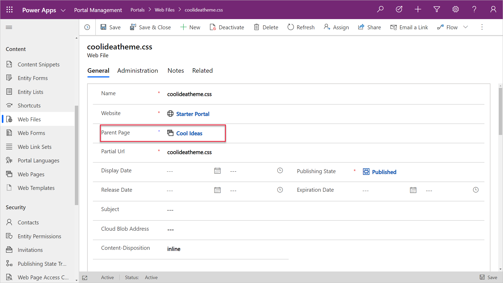
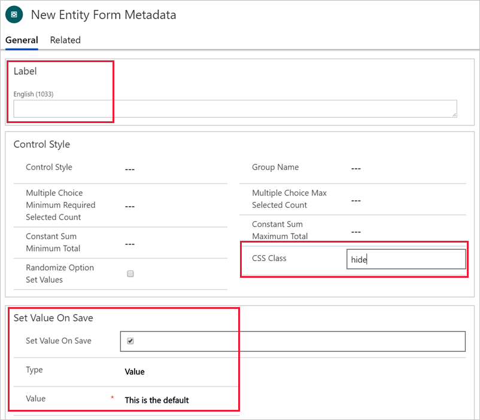

Cascading Style Sheets (CSS) is a language that determines the style of a webpage by describing how its HTML elements are to be displayed, including text, fonts, colors, backgrounds borders, and margins.

Making changes to the style of your portal pages can be as simple as applying CSS statements directly to a page in the **Custom CSS** column. For example, if you need to increase the height of the navigation bar at the top of a home page to fit a logo, you can edit the page properties and add a custom CSS statement.

```css
.navbar-static-top.navbar { min-height: 100px; }
```

> [!NOTE]
> CSS statements that are added directly to a webpage will apply to that webpage only.

This approach works for small adjustments on a single page, but a better approach is to record customizations in one or more CSS files and then apply them to the entire portal or parts of it.

## Portal themes

Portals use the [Bootstrap front-end framework](http://getbootstrap.com/?azure-portal=true) to control the design and layout of the website. Bootstrap is a package of HTML and CSS design templates for typography, forms, buttons, navigation, and other elements, including optional JavaScript extensions. One appealing feature of Bootstrap is that it offers responsive layout out of the box; it automatically adjusts your website so that it has a pleasing appearance on all devices from small phones to large desktops.

A theme determines the appearance of all webpages in your portal to ensure visual consistency. It controls the navigational structure, the banner, colors and fonts, and other visual elements of a webpage.

The web templates that are included in a starter portal are implemented by using standard Bootstrap components with minimal additional custom styles. As a result, you can take advantage of the customization options that are provided by Bootstrap to tailor the theme in a way that's applied consistently to the entire portal.

## Upload custom CSS

Any starter portal has two files already included as child web files of the home page: `bootstrap.min.css` and `theme.css`. These files define the default styles and theme for your entire portal. You can upload and edit additional stylesheets in portals Studio by using the **Themes** section on the tool belt.

> [!div class="mx-imgBorder"]
> [](../media/css-edit.png#lightbox)

Make sure that you consider how you want to approach style modifications for your portal, such as:

- Creating complete styling for the entire site and then replacing the content of the .css file. This method works well if you have access to skilled designers who can ensure that all relevant elements are defined. This approach creates centrally controlled styling and ensures consistency throughout the portal.
- Redefining only the elements that require modifications, such as colors and font size. Create and upload the CSS file that contains only these incremental adjustments. This method works well if your target design is close to the starter portal design and only minor styling modifications are required. This approach allows incremental modifications that can be undone.

> [!WARNING]
> If you decide to overwrite `bootstrap.min.css` or `theme.css` files, make sure that you download a backup copy of these files prior to replacing them. If your replacement CSS is invalid or incomplete, you will not be able to undo the replacement. Consequently, you will have to restore the content of these files, potentially using a Power Apps portals app if the portal is rendered non-functional.

## Apply customizations to specific portal areas

You can add customizations to specific pages or sections of your portal by adding a **Web File** record by using the Portal Management app with an attachment to a CSS file. You will need to specify the parent page in the **Web File** record so that the theme will be applied to the parent page and all descendants of that page. This approach makes it possible for you to build fully customized sections of your site.

> [!div class="mx-imgBorder"]
> [](../media/custom-theme-section.png#lightbox)

> [!IMPORTANT]
> The partial URL must end in **.css** for the portal to recognize it and apply it to the webpage and its child pages.

### Customize Bootstrap

The standard way to create a custom version of Bootstrap is [through the official Bootstrap site](http://getbootstrap.com/customize/#less-variables/?azure-portal=true). However, due to the popularity of Bootstrap, many other sites have also been created for this purpose. These sites might provide a user-friendly interface for Bootstrap customization or predesigned versions of Bootstrap for you to download. [The official Bootstrap customizer](http://getbootstrap.com/customize/?azure-portal=true) site has more information about Bootstrap customization.

> [!TIP]
> When you are customizing Bootstrap, only select elements that require modification. For example, if you want to replace the standard fonts with your corporate standard fonts, select the **Typography** component of Bootstrap. This approach will help reduce the chances of accidentally rewriting other CSS elements.

After you have customized Bootstrap, it will generate one or more files that you would want to upload as web files. Unless your intent is to completely *replace* the original styles, make sure that you avoid using `bootstrap.css`, `bootstrap.min.css`, `theme.css`, or `theme.min.css` files in your partial URLs because of how the portal handles multiple CSS files.

### Background images

When you are starting portal customizations, one of the most common requests that you might have is to replace the background images. These images are applied by using CSS, but they can be replaced without changing CSS. Look for .jpg web files under the portal's home page, for example `homehero.jpg`. Your only requirement is to replace the attachments of these web files with your own images. Make sure that the size of the new images is compatible to maintain consistent layout.

### CSS for simple adjustments

CSS is often overlooked when simple adjustments are required, such as hiding the element or adjusting margins to fit a wide label. Bootstrap framework is the foundation of the styling in Power Apps portals, and it defines many styles that control appearance and multi-column responsive layout. For example, if you want to hide a particular column and submit a default value instead of collecting the user input, you can use **Table Form Metadata** for the column and then define the following parameters:

- Set **Label** to a single space.
- Set **CSS Class** to **hide**.
- Set the default value as required.

> [!div class="mx-imgBorder"]
> [](../media/hide-default.png#lightbox)

Instead of resorting to JavaScript, you can accomplish this task by using configuration only. Using CSS, where possible, has certain advantages:

- CSS applies on load; it's faster because you don't have to wait for the document to finish loading.
- CSS is always on and continues to apply to the relevant elements, even if JavaScript changes the document structure and adds or removes the elements.
- For certain tasks that are related to an element's visibility and responsive layout, CSS can be simpler to use than JavaScript, meaning less maintenance and less room for error.
