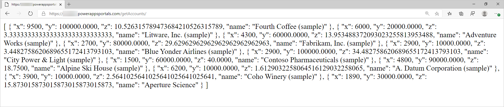
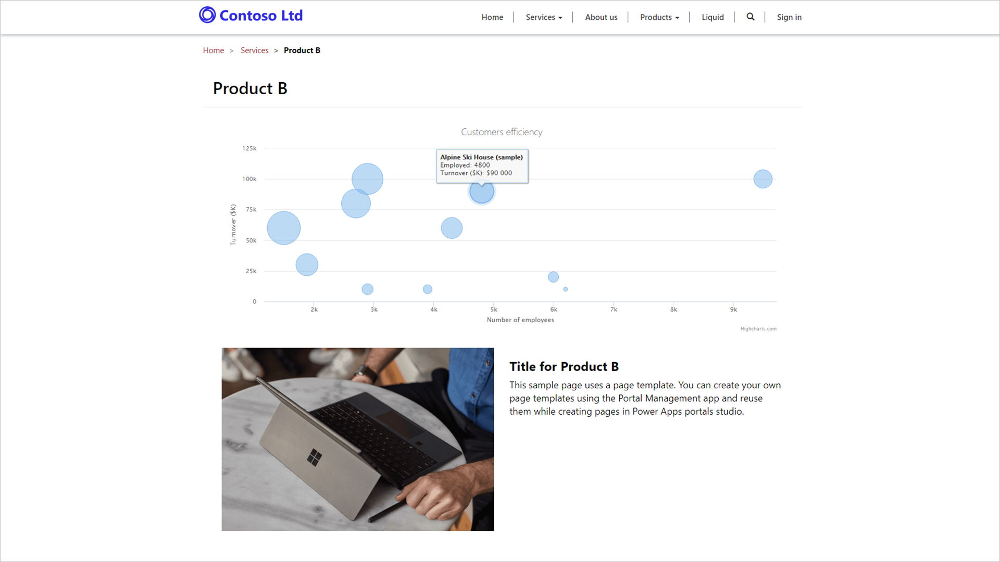

The purpose of this hands-on-lab is to demonstrate adding JavaScript code to a page to render data from Common Data Service as a chart using an 3rd-party charting library. The data is retrieved from Common Data Service using a web template acting as a REST API endpoint.

The exercises work best when you have some sample data to work with. Depending on the environment, you are working with, you may want to install some sample data to assist with exercises. Power Platform does provide the ability to add sample data as needed. If the environment you are working in does not have any sample data installed, follow steps in [Add or remove sample data](https://docs.microsoft.com/power-platform/admin/add-remove-sample-data/?azure-portal=true) to install the sample data into your environment.

## Learning objectives

At the end of these exercises, you will be able to accomplish the following:

* Build a web page that acts as a REST endpoint returning data from Common Data Service
* Add inline code to a content web page to retrieve the data using the endpoint
* Use an external JavaScript library to consume the data retrieved

**Estimated time to complete this exercise**: 15 to 20 minutes

## Before we begin

### Prerequisites

For this exercise you will need to have the following in your environment:

* A Power Apps portal provisioned. If you do not have a Power Apps portal available, follow [Create Portal](https://docs.microsoft.com/powerapps/maker/portals/create-portal) instructions to create one.
* Access to the Power Apps maker portal.

### High-level steps

To finish the exercise you need to complete the following tasks:

1. Create a Web Template with Liquid code to retrieve data about accounts in the Common Data Service and return the data in JSON format.
1. Add Page Template and Web Page records that use the Web Template above.
1. Open a content page and add JavaScript code retrieving the data above.
1. Add a charting library to the page and JavaScript code using the library to build a graph using the data retrieved.

### Detailed steps

#### Create web template

1. Open [Dynamics 365 Home](https://home.dynamics.com/?azure-portal=true).
1. Select the Portals Management app.
1. Select **Web Templates**.
1. Press **+ New**.
1. Enter the following values:
   * **Name**: getAccounts
   * **Website**: Select your current website
   * **Source**: enter the following content
   * **MIME Type**: application/json

    ```twig
    
    <fetch>
      <entity name="account">
        <attribute name="name" />
        <attribute name="numberofemployees" />
        <attribute name="revenue" />
      </entity>
    </fetch>
    
    [
    
      {
        "x": {{ account.numberofemployees }},
        "y": {{ account.revenue }},
        "z": {{ account.revenue | divided_by: account.numberofemployees }},
        "name": "{{ account.name }}"
      },
    
    ]
    ```

1. Press **Save & Close**.

This Liquid code retrieves the list of accounts and then generates a data structure in JSON format. The data structure is already prepared for plotting by assigning appropriate labels to data points:

* **name**: company name
* **x**: number of employees
* **y**: company revenue in $1,000s
* **z**: revenue per employee (calculated)

#### Create page template and web page

1. Select **Page Templates**.
1. Press **+ New**.
1. Enter the following values:
    * **Name**: getAccounts
    * **Website**: Select your current website
    * **Type**: Select **Web Template**
    * **Web Template**: Select **getAccounts**
    * **Use Website Header and Footer**: Clear the checkbox
1. Press **Save & Close**.
1. Select **Web Pages**.
1. Press **+ New**.
1. Enter the following values:
    * **Name**: getAccounts
    * **Website**: Select your current website
    * **Parent Page**: Select **Home**
    * **Partial URL**: getAccounts
    * **Page Template**: getAccounts
    * **Publishing State**: Published
1. Press **Save & Close**.

> [!IMPORTANT]
> If you have not configured entity permissions for account entity previously, your API page will return an empty array. Complete the next task to set up the permissions if you have not done so previously.

#### Add entity permissions

1. Switch to Portal Management app.
1. Select **Entity Permissions**.
1. Press **+ New**.
1. Enter the following values:
    * **Name**: Account Directory
    * **Entity Name**: Select account entity
    * **Website**: Select your current website
    * **Scope**: Select Global
    * **Privileges**: Select Read
1. Press **Save**.
1. Scroll to **Web Roles** subgrid.
1. Press **Add Existing Web Role**.
1. Locate and select **Anonymous users** and **Authenticated users**.
1. Press **Add**.

#### Test the REST web page

1. Navigate to `https://yourportal.powerappsportals.com/getAccounts`.
2. Your output should look like the following:

    > [!div class="mx-imgBorder"]
    > [](../media/rest-data.png#lightbox)

#### Add code to retrieve the data

1. Open Power Apps portal Studio in a new browser tab. You can follow these steps:
    1. Navigate to [Power Apps maker portal](https://make.powerapps.com/?azure-portal=true).
    1. Select the target environment using the environment selector in the top right-hand corner.
    1. From the list of Apps select the application of type **Portal**.
    1. Click the **Edit** menu.
1. Select the **Pages** icon on the toolbelt on the left-hand side.
1. Select an existing page from the hierarchy, for example **Product B** located under **Services** page.
    > [!NOTE]
    > The names and hierarchy of pages on your portal may differ.
1. Select **Page Copy** area on the page.
1. Select **Components** on the toolbelt.
1. Select **One-column section**.
1. Select added section and press **Source code editor** icon.
1. Insert the following code as the content of the innermost **div** element:

    ```html
    <script>
    function makeChart(rData) {
      console.log(rData);
    }

    $(document).ready(function() {
      $.get('/getAccounts', makeChart, 'json');
    });
    </script>
    ```

1. Press **Save**.
1. Press **Browse website**.
1. When the page is displayed, press F12 to display browser developer tools.
1. Verify that console output contains the same data as previously retrieved by the REST API page.

    > [!div class="mx-imgBorder"]
    > [](../media/console-output.png#lightbox)

> [!IMPORTANT]
> If you have not configured entity permissions for account entity previously, your API call will return an empty array. Make sure you have completed **Add entity permissions** task.

#### Add 3rd party library functionality

We will use Highcharts.js library (free for personal or non-profit use) to create a bubble chart based on the data.

1. Switch to Portal Studio.
1. Locate and open the content page you modified earlier.
1. Select the section you modified earlier.
1. Insert the following code either above or below the previous code:

    ```html
      <script src="https://code.highcharts.com/highcharts.js"></script>
      <script src="https://code.highcharts.com/highcharts-more.js"></script>
      <figure>
        <div class="mychart"></div>
      </figure>
    ```

1. Modify **makeChart** function as following:

    ```javascript
    function makeChart(rData) {
      console.log(rData);
      Highcharts.chart($('.mychart')[0], {
        title: {
          text: "Customers efficiency"
        },
        legend: {
          enabled: false
        },
        xAxis: {
          title: {
            text: "Number of employees"
          }
        },
        yAxis: {
          title: {
            text: "Turnover ($K)"
          }
        },
        tooltip: {
          pointFormat: '<strong>{point.name}</strong><br/>Employed: {point.x}<br>Turnover ($K): ${point.y}',
          headerFormat: ''
        },
        series: [{
          type: 'bubble',
          data: rData
        }]
      });
    }
    ```

1. Press **Save**.
1. Press **Browse website**.
1. The output should now include the bubble chart. Hover over the bubbles to verify the data:

> [!div class="mx-imgBorder"]
> [](../media/chart.png#lightbox)
