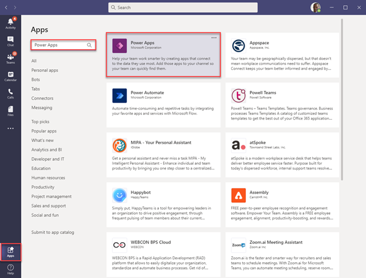
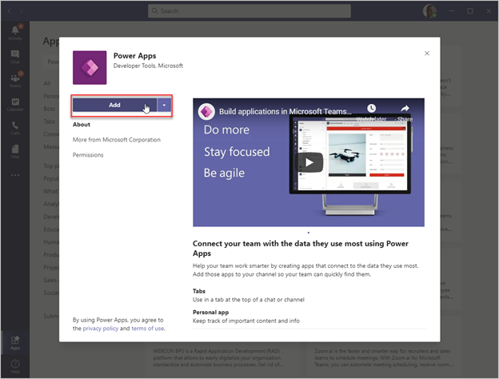
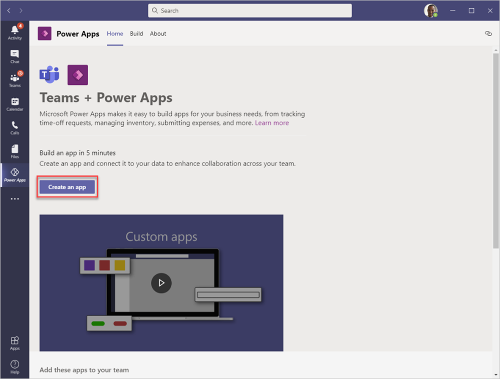
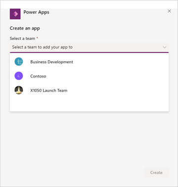
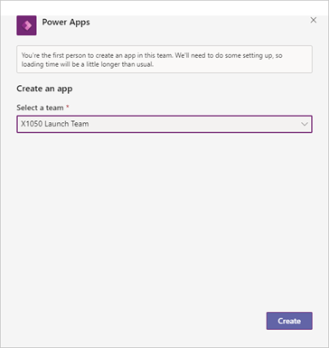
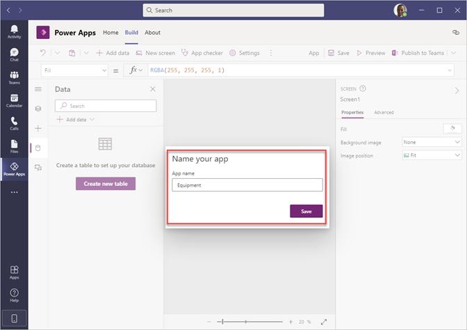

The Dataverse for Teams environment is where all business data, apps, and flows are stored. Each environment is associated with a Microsoft Office 365 group for the team. For this reason, each team can only have one Dataverse for Teams environment. When an app or chatbot is created or installed for the first time into a team, the Dataverse for Teams environment is provisioned automatically. After the environment has been created, you can create tables and flows in Dataverse.

## Install Power Apps inside Teams

The Power Apps application for Teams lets you create, edit, and delete apps and tables in Dataverse for Teams. To provision the Dataverse for Teams environment, you first need to install an app into Teams. 

1. To get started, open Teams and look for the **Apps** button in the lower-left corner of the window. 

1. On the **App Marketplace** screen, use the search box to find Power Apps. Select **Power Apps**.

	> [!div class="mx-imgBorder"]
	> 

1. Select the **Add** button to add the Power Apps application to your Teams client.

	> [!div class="mx-imgBorder"]
	> 

When Teams has successfully added Power Apps, you will be brought to the main **Power Apps** screen. This screen provides access to existing apps along with templates and **Learn** module links.

## Provision Dataverse for Teams to create a table

Now that you have the Power Apps application installed, you can create the first app, which will automatically provision the environment. Decide on which team to create the environment and to store your table. The Summary unit of this module provides links if you need to create a new team.

1. Select the **Start now** button.

	> [!div class="mx-imgBorder"]
	> 

1. Select the team for your app.

	> [!div class="mx-imgBorder"]
	> 

	A message will appear, stating that you are the first person to create an app in this team. 

1. Select **Create** to have the Dataverse for Teams environment built. While waiting for the process to complete, you can close the window and do other work. Teams will send both a message card and an email when the work is complete.

	> [!div class="mx-imgBorder"]
	> 

	When your environment is provisioned, a pop-up window will display in the lower-right corner of your screen, letting you know that the process has finished.

	> [!div class="mx-imgBorder"]
	> 

	At this stage, the Power Apps editor will appear. 

1. Enter the name for your app and then select **Save**.

	> [!div class="mx-imgBorder"]
	> 

With the creation of the first app, you now have a Dataverse for Teams environment to help you start building tables. The Power Apps editor enables you to quickly create tables with the **Create new table** button, which the next section will explain.
