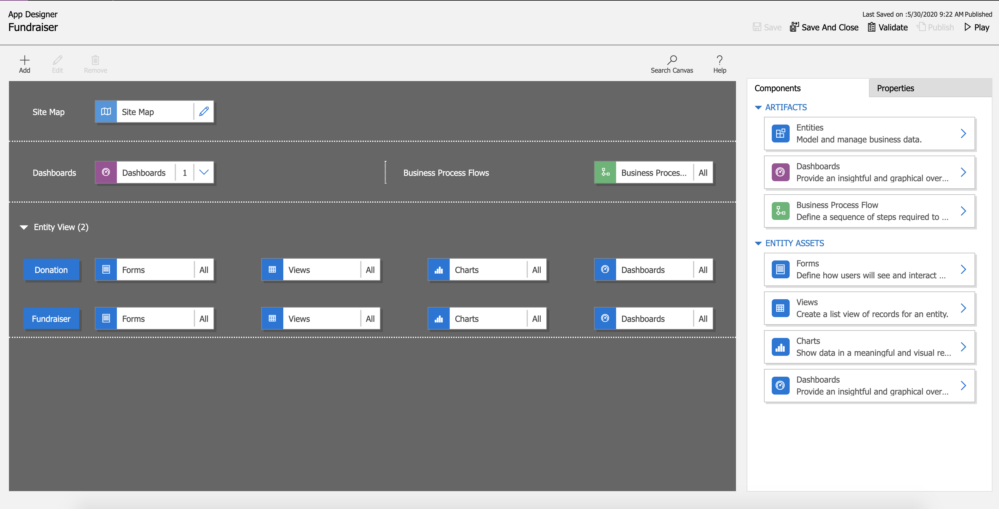
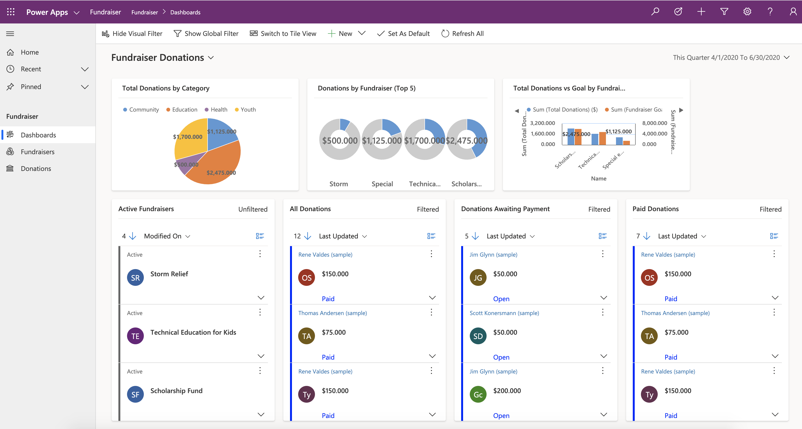
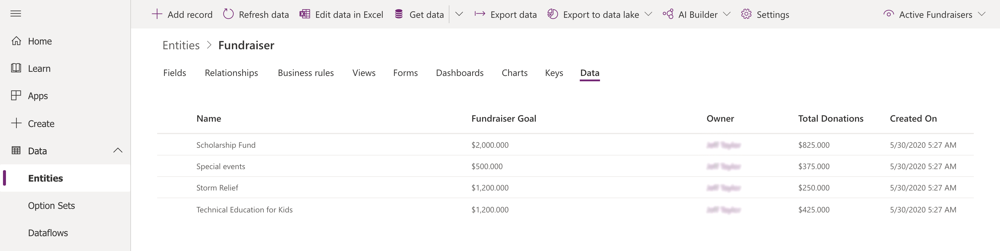
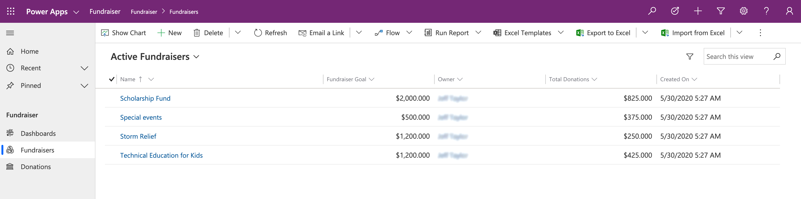
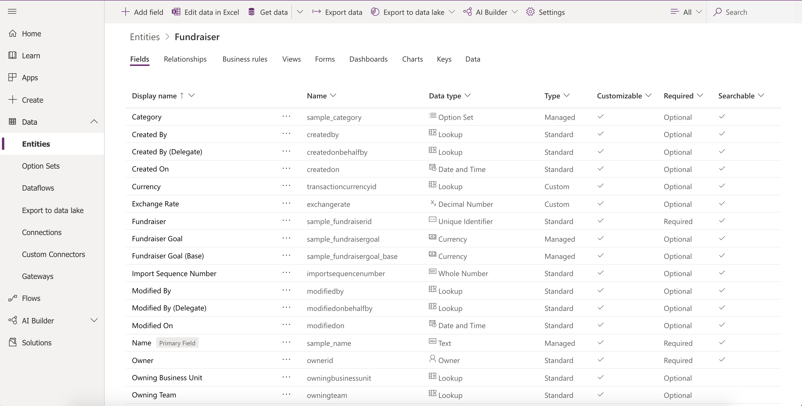
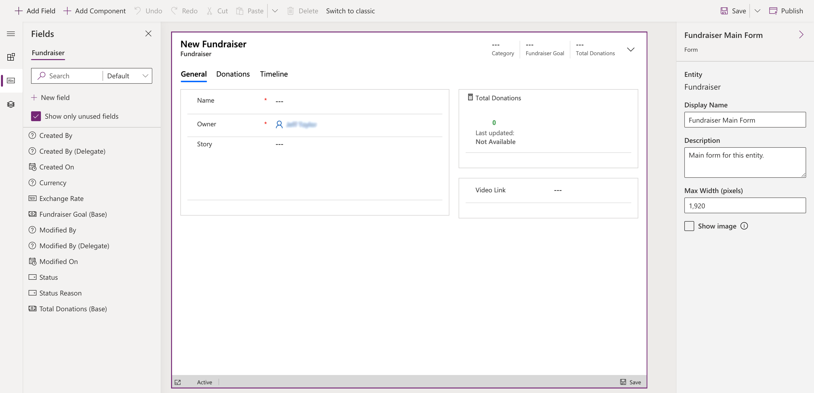

As an App Maker, before you begin building your Power Apps solution, it’s recommended to go through a design process. 
When designing your Power Apps solution, there are several different factors to consider:
-	Business requirements
-	Data Model
-	Business Logic
-	Output
By going through a simple design process, you can flush out any minor issues before they become a larger problem once the app is in production. 

Here is a quick look at the App Designer for an example Model-driven app called “Fundraiser.”

When the app is put into Play Mode, it looks completely different.

## Understand the needs of the user

With Model-driven apps, the name says it all. Your primary design goal is to get your Common Data Service data model in order. With that in place, you can connect Power Apps, and a Model-driven app will be created for you from that model. 

Model-driven apps are created using the App Designer.  You will choose the entities, dashboards, Business Process flows, forms, and other components that you want to make available in your app, and then the app will be created for you. This means you will need to spend more time understanding what your user needs than how it is going to look.

### Business Requirements

The first step in the process is to understand your business requirements. Work with the app stakeholders to consider your security, accessibility, data, and design needs. 

For security, the Common Data Service has a robust security model. You will want to consider how securing your app’s data affects your app and what security model best supports your business needs. There are lots of options available, including hierarchy security, row-level security, to name a few. You will need to confirm your data is secured to meet your needs, and then your app will honor that security. For more information, see [Security in Common Data Service](https://docs.microsoft.com/power-platform/admin/wp-security/?azureportal=true).

During this process, you will also want to identify any government regulations or authentication/authorization requirements (if applicable). You may want to implement multi-factor authentication but will need to think about how this will affect users connecting to your application. You don’t necessarily have to have all the answers to your questions here; you just want to flush out all of the requirements. 

Finally, does your app need to be available when the user is disconnected from the internet? This is called Offline Mode and is supported by the Common Data Service and Model-driven apps when using iOS or Android clients. It does require additional design considerations. For more information, see [Set up mobile offline synchronization](https://docs.microsoft.com/dynamics365/mobile-app/setup-mobile-offline-for-admin).
	
### Data Model

As you begin the data modeling process, there are a couple of important questions to ask yourself:

- What type of data will your solution be storing and or collecting?
- How will this data relate or coincide with the other data you are working with?

These questions are important when designing a model-driven application because of how model-driven applications function.  Remember, model-driven applications use a metadata-driven architecture. This means a large portion of the model-driven app is based on how your data is modeled, and there is no need to write custom code to alter the app design. To expand on this a little further, when thinking about Metadata this simply means “data about data” and this data defines the structure stored in the system. 

You can view the app metadata by reviewing the Entity in the Common Data Service.

You can also view the app metadata by putting the app in Play mode.

In the example above, for the Fundraiser Entity, there are several pieces of metadata being collected, such as:

- Name
- Fundraiser Goal
- Owner
- Total Donations
- Created On

Each solution you develop and deploy will have its own set of metadata to collect. This basic understanding of metadata is important as you continue the design process and modeling your app data. 

As you think about your data model also think about field types. When adding fields to your entity in the Common Data Service, the field type you choose will determine how users enter and view that in your Model-driven app. Option sets show as dropdowns, currency shows with currency symbols, while decimal numbers don’t. These little changes in the entity can have a profound effect on how your user experiences your app.

> [!NOTE]
> If a field type needs to be changed to a different field type, (i.e. text field to an option set), then you will need to delete that field and recreate with the correct field type. This will cause you to lose any data associated with that field.

### User Interface (UI) and User Experience (UX)

When building a Model-driven app, most of the UI and UX are predetermined for you. You define the data model to build from, and then Power Apps determines the controls used in the app. You can influence these controls by determining what entity assets you include. You define in the App Designer What Forms, Views, Charts, and Dashboards are used in the app. You also control the navigation options via the Site Map. As you are planning your app, determine which components are needed in the app design, and create them before building your app. 

To continue building off of the example we’ve been using throughout this module, below is a simple Model-driven Form, which captures various pieces of information for creating a New Fundraiser. 

 
Here is an example of what the New Fundraiser form looks like when editing from the App Designer.

### Business Logic

When incorporating business logic in your app, there are two primary options available. You can set **Business Rules** on your Common Data Service entities or you can build **Business Process Flows**.

With Business Rules,** you will define behaviors at the data layer. This is great for changing when a field is required, setting a default value, or even showing or hiding a field based on a criteria. An example could be an entity for tracking expenses. You could have a field for type of travel and then build a business rule that says if they choose automobile then the mileage field is required, else it is optional. This gives you great power to make sure you maintain data consistency in all scenarios. 

**Business Process Flows** are used to guide users through using your app. These workflows can provide visuals on next steps based on the status of the data and facilitate other actions that you want to occur as the user uses the app. Business Process Flows let you bring automation to your app and make it more of a guided experience than just a place to enter data.

### Output

A common output need for apps is to visualize the data.  For this requirement, you can implement Dashboards with custom filters and visual graphics to tie all of this data together right in your app. When creating your Dashboards, make sure it’s simple for your users to consume without overwhelming them with all the data. Provide high-level snapshots of your data and allow them to use filters to dive deeper into the data if needed. 

### Additional third-party solutions and app accelerators

It is also important to know about the different App accelerators and third-party solutions available to you. Depending on the industry you are in, Health, Financial, Banking, Education, Non- Profit, Automotive, or Media, Microsoft has released a number of accelerators or foundational components to assist you with quickly standing up your solution. For more information, see [Industry accelerators overview](https://docs.microsoft.com/common-data-model/industry-accelerators/?azureportal=true).

