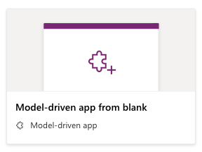
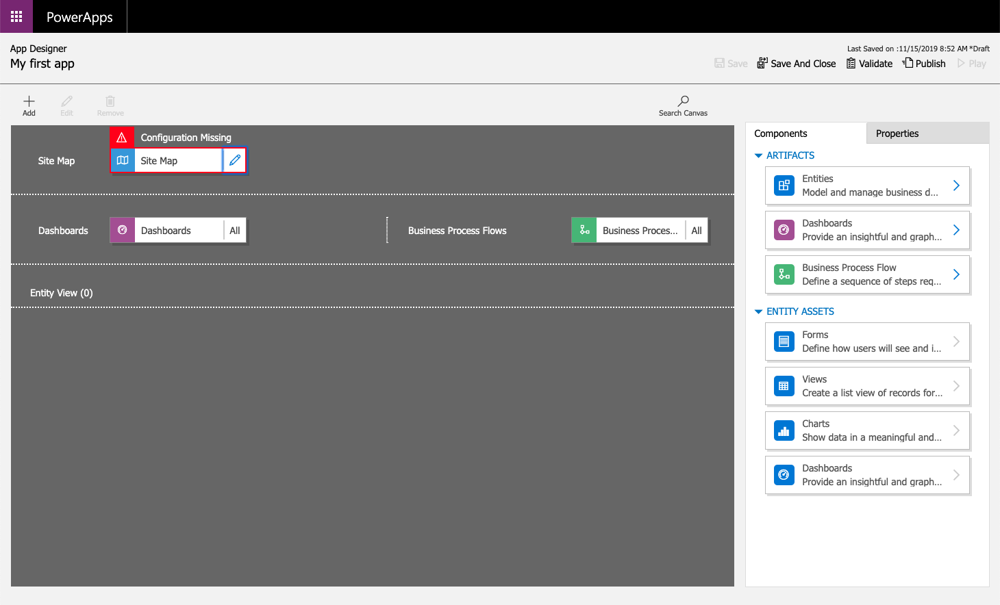
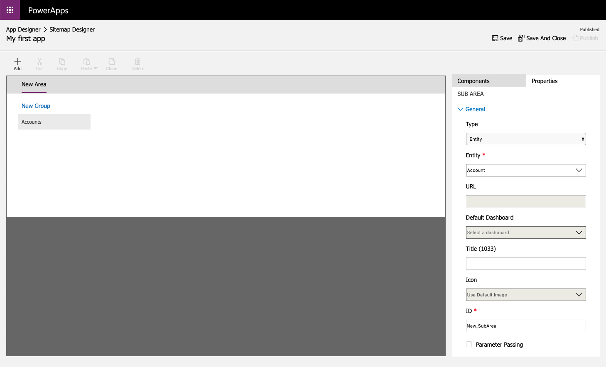
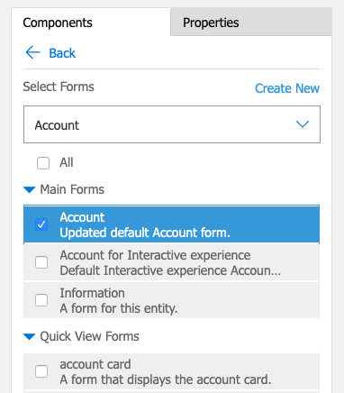
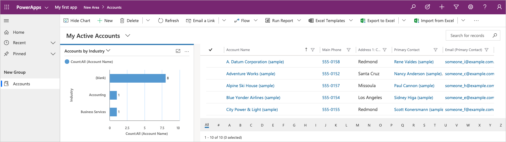

In this unit, you'll create a model-driven app by using one of the standard entities that's available in your Microsoft PowerApps environment.

## Create a model-driven app

1. Sign in to [PowerApps](https://web.powerapps.com/) by using your organizational account.
2. Select the environment you want, or go to the [PowerApps admin center](https://admin.powerapps.com/) to create a new one.
3. On the **Home** page, select the **Model-driven app from blank**.  
4. Click **Create**.

    

5. On the **Create a New App** page, enter a name and description for the app.
6. Select **Done**. Your new app appears in the App Designer, and you can now add components to it.

## Add components to your app
You add components to your app by using the App Designer.

1. Select the **Open the Site Map Designer** pencil icon to open the site map designer.

    

2. In the site map designer, select **New Subarea**, and then, in the right pane on the **Properties** tab, select the following properties:

    - **Type**: *Entity*
    - **Entity**: *Account*

    

3. Select **Save And Close**.
4. In the App Designer, select **Forms**, and then, in the right pane under **Main Forms**, select the **Account** form.

    

5. In the App Designer, select **Views**, then select the following properties:

    - Active Accounts
    - All Accounts
    - My Active Accounts

6. In the App Designer, select **Charts**, then select the **Accounts by Industry** chart.
7. On the App Designer toolbar, select **Save**.

## Publish your app
On the App Designer toolbar, select **Publish**. After you publish the app, it's ready 
for you to run or share with others.

Above My Active Accounts, select **Show Chart**.

If the sample data for your accounts does not have an Industry populated, go into a few accounts and add an Industry. Once you have updated a few accounts with an industry the chart will update as well.  

