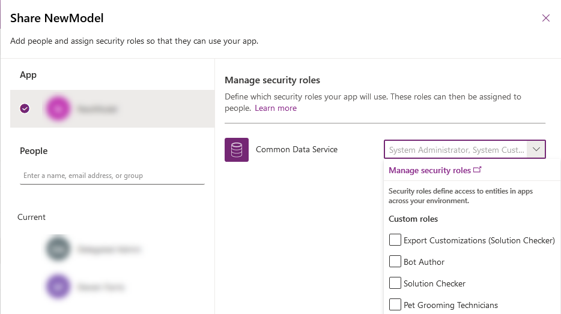
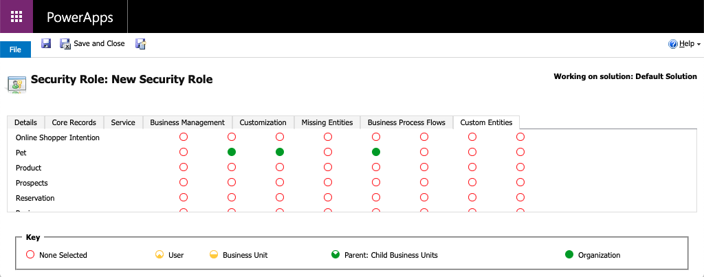
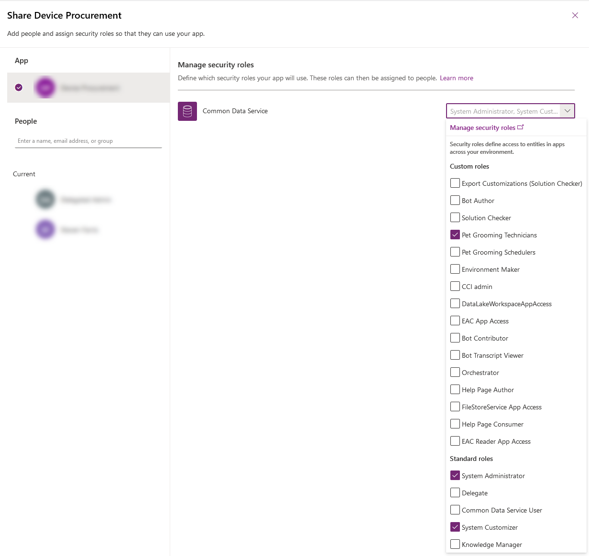

Microsoft Power Apps uses role-based security for sharing. A security role includes privileges that define a set of actions that can be performed in the app. All app users must be assigned to one or more predefined or custom security roles.

Roles can be assigned to individual users or to teams. When a user or a team is assigned to a role, that user or all members of that team are granted the set of privileges associated with the role.

In this unit, you'll learn how to share a model-driven app so that others can use it.

Specifically, you'll learn how to:

- Create a custom security role.
- Assign users to the custom security role.
- Assign the security role to an app.

To share an app, you must have the Environment Admin or System Admin role.

## Scenario

> [!NOTE]
> This scenario builds on ideas and concepts from the previous units. To complete this exercise, you will first need to create an app as described in the previous unit of this module and create the Pet
> table as described in unit [Create a Microsoft Dataverse table](/learn/modules/get-started-with-powerapps-common-data-service/3-create-a-cds-entity/?azure-portal=true) of [Get started with Dataverse Service module](/learn/modules/get-started-with-powerapps-common-data-service/?azure-portal=true).

This unit uses the example of a company named Contoso, which has a pet grooming business that services dogs and cats. An app that has a custom table for tracking the pet grooming business has already been created and published.

The app must be shared so that the pet grooming staff can use it. To share the app, an admin or app maker assigns one or more security roles to users and to the app.

## Create or set up a security role

The Power Apps environment includes predefined security roles. These roles reflect common user tasks, and the access levels that are defined follow the security best practice of providing access to the minimum amount of business data that's required to use the app.

Remember that the Contoso pet grooming app is based on a custom table. Because the table is custom, privileges must be explicitly specified before users can work in it. To do this, you can use either of the following approaches:

- Expand an existing predefined security role so that it includes privileges on rows that are based on the custom table.
- Create a custom security role to manage privileges for users of the app.

Because the environment that will maintain the pet grooming rows is also used for other apps that the Contoso company runs, a custom security role that's specific to the pet grooming app will be created. Additionally, two different sets of access privileges are required:

- Pet grooming technicians just need to read, update, and attach other rows. Therefore, their security role will have read, write, and append privileges.
- Pet grooming schedulers need all the privileges that pet grooming technicians have. In addition, they must be able to create, append to, delete, and share rows. Therefore, their security role will have create, read, write, append, delete, assign, append to, and share privileges.

To learn more about access and the scope of the different privileges, see [Security roles](/dynamics365/customer-engagement/admin/security-roles-privileges?azure-portal=true#security-roles).

## Create a custom security role

1. Sign in to [Power Apps](https://powerapps.microsoft.com/?azure-portal=true) by using your organizational account. If you don't already have an account, select **Get started free**.

1. For your new app, select the **...** to the right of the name, and then click **Share**.
1. In the **Share** dialog box, select your app at the top left and then select the drop-down next to the environment on the right. Select **Manage security role**.

   

1. On the **All Roles** page, click **New**.
1. In the **Role Name** box, enter *Pet Grooming Technicians*.
1. In the Security Role designer, on the **Custom Tables** tab, find the **Pet** table.
1. On the **Pet** row, click **Read**, **Write**, and **Append** four times, to set the scope for each to *organization*  is selected:

    

1. The pet grooming app also has a relationship with the account table. On the **Core Rows** tab, on the **Account** row select the **Read** privilege four times until it is set to *organization* scope .
1. Click **Save and Close**.
1. In the Security Role designer, select **New** and then in the **Role Name** box, enter *Pet Grooming Schedulers*.
1. On the **Custom Tables** tab, find the **Pet** table.
1. On the **Pet** row, click each of the following privileges four times, until the *organization* scope  is selected: **Create**, **Read**, **Write**, **Delete**, **Append**, **Append To**, **Assign**, and **Share**.
1. The pet grooming app also has a relationship with the account table, and schedulers must be able to create and change account rows. Therefore, on the **Core rows** tab, on the **Account** row, select each of the following privileges four times, until the *organization* scope  is selected: **Create**, **Read**, **Write**, **Delete**, **Append**, **Append To**, **Assign**, and **Share**.
1. Select **Save and Close**.

## Assign security roles to users

Security roles control a user's access to data through a set of access levels and permissions. The combination of access levels and permissions that's included in a specific security role sets limits on the user's view of data and interactions with that data.

### Assign a security role to the pet grooming technicians

1. Select the model-driven app you created in the previous unit and click **Share**.
2. In the **Share** dialog box, select your app on the left and then select the drop-down next to the environment name on the right and then choose the **Pet Grooming Technicians** role.

    

3. In the list below the app, select a few of your users to be pet groomers.
4. Select the drop-down next to the environment name and choose **Pet Grooming Technicians** security role to assign it to that user.
5. Select **Share** at the bottom when finished.

### Assign a security role to the pet grooming schedulers

1. In the **Share** dialog box, select your app on the left and then select the drop-down next to the environment name on the right and then choose the **Pet Grooming Schedulers** role.
2. In the list below the app, select a few of your users to be pet grooming schedulers.
3. Select the drop-down next to the environment name and choose **Pet Grooming Schedulers** security role to assign it to that user.
4. Select **Share** at the bottom when finished.

## About predefined security roles

The following predefined roles are available with a PowerApps environment. Unless otherwise noted, all the privileges have global scope.

| Security role            | Privileges | Description |
|--------------------------|------------|-------------|
| Environment Maker        | None | Users who have this role can create new resources that are associated with an environment, including apps, connections, custom application programming interfaces (APIs), gateways, and flows that use Microsoft Flow. But these users can't access the data in an environment. To learn more about environments, see [Announcing Power Apps environments](https://powerapps.microsoft.com/blog/powerapps-environments/?azure-portal=true). |
| System Administrator     | Create, Read, Write, Delete, Customize | This role has full permission to customize or administer the environment, including creating, changing, and assigning security roles. User who have this role can view all data in the environment. To learn more, see [Privileges required for customization](/powerapps/maker/model-driven-apps/privileges-required-customization?azure-portal=true). |
| System Customizer        | Create (self), Read (self), Write (self), Delete (self), Customizations | This role has full permission to customize the environment. But users who have this role can view rows only for environment tables that they create. To learn more, see [Privileges required for customization](/powerapps/maker/model-driven-apps/privileges-required-customization?azure-portal=true). |
| Basic User | Read, Create (self), write (self), delete (self) | Users who have this role can run an app in the environment and perform common tasks for the rows they own. |
| Delegate                 | Act on behalf of another user | This role lets code run as or impersonate another user. This role is typically used with another security role to provide access to rows. To learn more, see [Impersonate another user](/dynamics365/customerengagement/on-premises/developer/org-service/impersonate-another-user/?azure-portal=true). |
