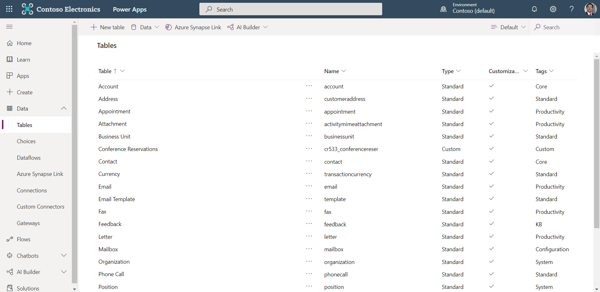

Microsoft Dataverse lets you securely store and manage data used by business applications. 

## Tables
Data within Dataverse is stored within a set of records called tables. A **table** is a set of records used to store data, similar to how a table stores data within a database.

Dataverse includes a base set of standard tables that support common business scenarios that connect to Dynamics 365 application data. You can also create custom entities specific to your organization and populate them with data that you import from lists in SharePoint, from Excel, or from PowerQuery. App makers can then use Power Apps to build rich applications using this data.

Dynamics 365 applications, such as Dynamics 365 Sales, Service, and Marketing, use Dataverse to store and secure data used by the applications. This means you can build apps using Power Apps and Dataverse directly against your core business data already used within Dynamics 365 without the need for manual integration.

 > [!NOTE]
 > Dynamics 365 Finance, Dynamic 365 Supply Chain Management, and Dynamics 365 Retail  currently require the configuration of the Data Integrator to make your business data available within Dataverse.

For most organizations, it's a good idea to use the standard entities and attributes as they were intended. But to meet your business needs, you can extend the functionality of standard entities by creating one or more custom entities to store information that's unique to your organization. 

## Logic and validation
Entities within Dataverse can leverage rich server-side logic and validation to ensure data quality. You can also reduce repetitive code in each app that creates and uses data within a table.

* **Business rules**: Business rules validate data across multiple columns in a table, and provide warning and error messages, regardless of the app that's used to create the data. 
* **Business process flows**: Business process flows guide users to ensure they enter data consistently and follow the same steps every time. Business process flows are currently supported only for model-driven apps.
* **Workflows**: Workflows automate business processes without requiring user interaction. 
* **Business logic with code**: Business logic supports advanced developer scenarios that extend the application directly through code. 

## Security
Data in Dataverse is securely stored so that users can see it only if you grant them access. Role-based security, based on the Dynamics 365 system allows you to control access to entities for different users within your organization.
