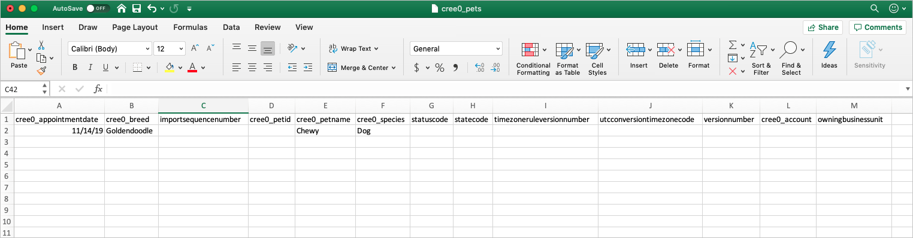
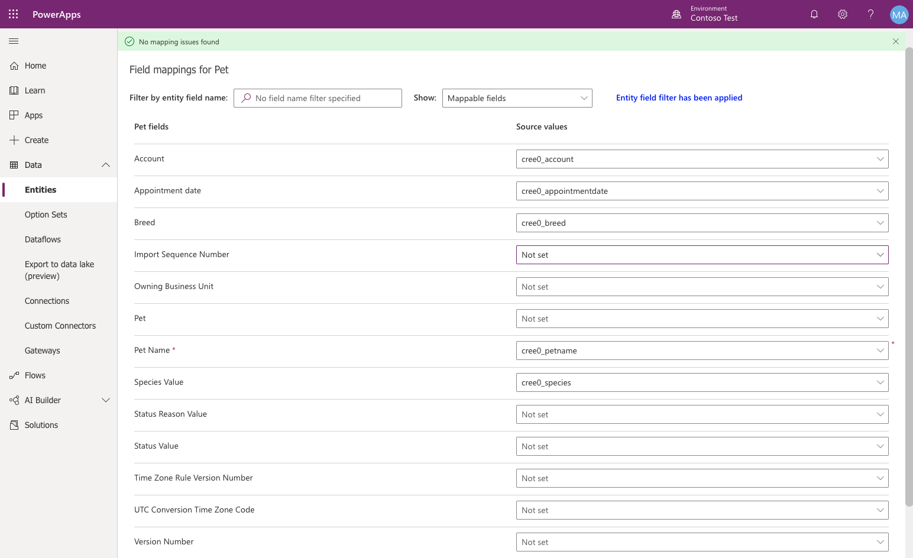
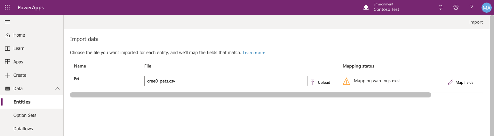

You can import data into your Microsoft Dataverse database in bulk from Microsoft Excel or CSV files. 

Every table has required columns that must exist in your input file. We recommend that you create a template. A template will save you time and effort. First, export data from the table. You'll use the same file (updated with your data) to import data into the table.

## Create a file template
You can do a one-time data export from a standard table or a custom table, and you can export data from more than one table at a time. If you export data from more than one table, each table is exported into its own Microsoft CSV file. In this example, you'll see how to export the **Pet** table. But remember you could select several tables to export if you would like.

> [!NOTE]
> The Pet table was created in the previous exercise.

1. On [powerapps.com](https://make.powerapps.com/), in the left navigation pane, expand **Data** and select **tables**.
1. Select **Data** at the top, and then select **Export data**.
1. Select the **Pet** table, and then select **Export data**.
1. After the export is finished, select **Download exported data** and save the file.

## Copy data into your template
When you add data to a template file, you must make sure the data is unique. You can use either *primary keys* or *alternate keys*.

1. Open the CSV file that you created in the previous section.
1. Add at least one new row of data. You only need to add information to the columns below.

    - **Appointment date**
    - **Breed**
    - **Pet name**
    - **Species**

    

1. Save the file. 

## Import the file
1. In the left navigation pane, expand **Data**, and then select **tables**.
1. Select the **Pet** table, select the drop-down arrow next to Get Data, and then select **Get data from Excel**.
1. Select **Upload** and select the file that you updated and saved from the previous section.
1. After the file is uploaded, select **Map columns**.
1. Set the following Pet columns Source values to **None**.

    - **Import Sequence Number**
    - **Owning Business Unit**
    - **Pet**
    - **Status Reason Value**
    - **Status Value**
    - **Time Zone Rule Version Number**
    - **UTC Conversion Time Zone Code**
    - **Version Number**
 
    

1. In the upper right, select **Save changes**.

    

    You'll notice under Mapping status, it states "Mapping warnings exist." The reason for this mapping status is that we set some of the columns to **None** or **Not**. This is fine because we didn't want to include those columns. This warning can be ignored. 

1. In the upper right, click **Import**.

    After the data has been successfully imported, you'll see the total number of inserts and updates. Now let's go take a quick look at the imported data.

1. On the left, select **tables**.
1. Select the **Pet** table.
1. On the table designer toolbar, select **Data**.

Notice that the Account column is empty. This is because when you updated the Excel export file and update columns, you weren't instructed to update this column. The reason you weren't instructed to update the Account column is because you cannot set a lookup value when importing data from Excel. This must be done from Power Apps.
