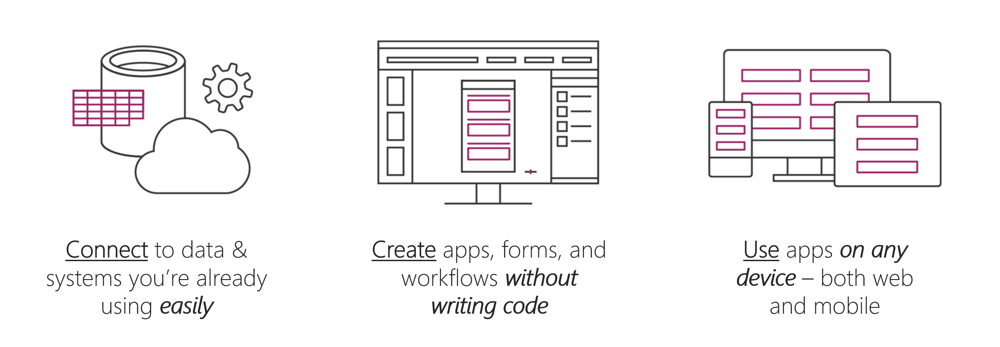

Welcome to Microsoft Power Apps. This self-paced, online module helps you build apps from the ground up.

 In this module, you will:
  - Explore how Power Apps can make your business more efficient.
  - Learn which technologies to use to perform tasks in Power Apps.
  - Learn about the different ways to build an app in Power Apps.
  - Create your first app from data in a Microsoft Excel workbook.

Power Apps is a suite of apps, services, connectors, and a data platform that provides you with an opportunity to build custom apps for your business needs. By using Power Apps, you can quickly build custom business apps that connect to your business data that is stored either in the underlying data platform (Microsoft Dataverse) or in various online and on-premises data sources (SharePoint, Excel, Office 365, Dynamics 365, SQL Server, and so on).

Apps that are built by using Power Apps provide rich business logic and workflow capabilities to transform your manual business processes to digital, automated processes. Power Apps simplifies the custom business app building experience by enabling users to build feature-rich apps without writing code.

Power Apps also provides an extensible platform that lets pro developers programmatically interact with data and metadata, apply business logic, create custom connectors, and integrate with external data.

With Power Apps, you can:

- Build an app quickly by using the skills that you already have.
- Connect to the cloud services and data sources that you're already using.
- Share your apps instantly so that coworkers can use them on their phones and tablets.

When it comes to using Power Apps to get things done and keep people informed, your options are nearly limitless. The following examples can help you think about how to use an app, instead of traditional paper notes, to run your business:

- **Equipment in the field** - Often, company representatives who visit customers in the field carry clipboards to help guarantee a paper trail of parts with scheduled replacement dates. By running an app on a tablet, reps can look up the customer's equipment, see a picture of a part, test and analyze the part, and then order new parts. Reps can perform these tasks on-site instead of leaving the customer's warehouse.
- **Restaurant employee management** - Employees of a large restaurant might fill out work schedules and vacation requests on a piece of paper that's affixed to a wall. With Power Apps running on everyone's smartphone, employees can open the app to record the same information, anywhere, anytime. The app can even send reminders for the start of the next day's shift.

If you're a beginner with Power Apps, this module gets you going quickly; if you're familiar with Power Apps, it ties concepts together and fills in the gaps.
