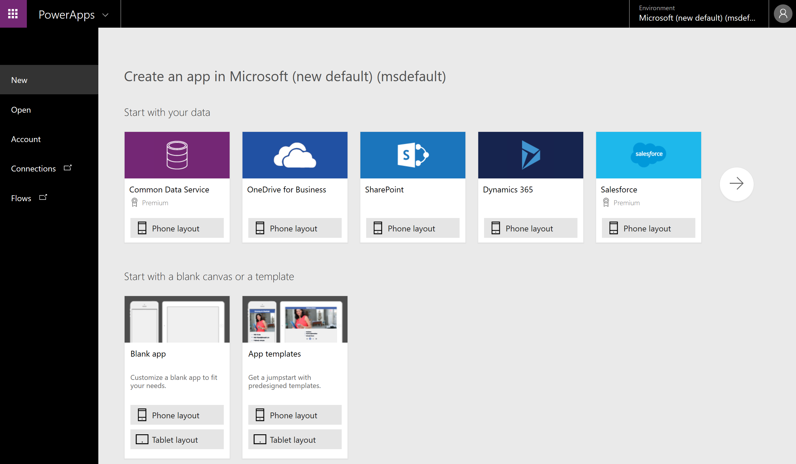
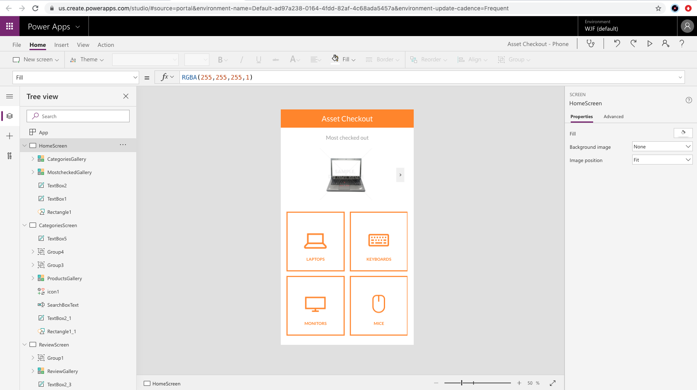

This unit explores each part of the following Power Apps components:

* **Power Apps Home Page** - Apps start here, whether you build them from data, a sample app, or a blank screen.
* **Power Apps Studio** - Develop your apps further by connecting to data, adding and arranging user interface (UI) elements (known as controls), and building formulas.
* **Power Apps Mobile** - Run your apps on Microsoft Windows, Apple iOS, and Google Android devices.
* **Power Apps Admin Center** - Manage Power Apps environments and other components.

## Power Apps Home Page
If you are building an app, you'll start with the [Power Apps Home Page](https://make.powerapps.com). You can build apps from sample apps, templates, or a blank screen. All the apps that you've built appear here, along with any apps that others have created and shared with you.

## Power Apps Studio
Power Apps Studio is where you can fully develop your apps to make them more effective as a business tool and to make them more attractive. Power Apps Studio has three panes that make creating apps seem more like building a slide deck in Microsoft PowerPoint:

- **Left pane** - Shows a hierarchical view of all the controls on each screen or a thumbnail for each screen in your app.
- **Middle pane** - Shows the canvas app that you're working on.
- **Right pane** - Where you set options such as the layout, properties, and data sources for certain controls.

## Power Apps Mobile
Power Apps Mobile for Windows, iOS, and Android devices allows you to use all the apps that you've created, and those others have shared with you, on your mobile device. You or your users can download the Microsoft Power Apps app from the appropriate app store. When users log in with their credentials, they will see all apps that have been shared with them. The Power Apps Mobile app only needs to be downloaded once. 

When you use apps in Power Apps Mobile, you get the most out of your device's capabilities: camera controls, GPS location, and more.

## Power Apps Admin center
The Power Apps admin center is the centralized place for managing Power Apps for an organization. On this site, you can define and manage different environments to house the apps. For example, you might have separate environments for development and production apps. Additionally, you can define data connections and manage environment roles and data policies. 

## Licensing 

Most users get their initial start with Power Apps by utilizing one of the licenses that comes with their Microsoft 365 Plan or Microsoft Dynamics 365 Plan. These licenses allow you to extend the functionality of the app that is licensed. This means if you purchased a Microsoft 365 plan that included a Power Apps license then you can build apps that extend and use SharePoint as a data source. But Power Apps doesn’t have to stop at just extending that platform. 

Power Apps has over 300 available data source connectors available including Common Data Service. To incorporate Common Data Service or any of those additional connectors all users of the app will need a premium license. There are two different ways to acquire a Premium license: 
- Per App model 
- Per User model. 

The Per App license allows users to access premium connectors for a specific business solution. The Per User license allows users to run unlimited premium licensed apps. This gives you the ability to grow with Power Apps and control cost by purchasing the license that best matches your business goals. 

In addition, Power Apps also has the capability to use Power Apps portals to build externally or internally facing websites using Common Data Service and Power Apps controls. Power Apps portals have their own licensing model and are not included in any of the licenses discussed previously above. With Power Portals you will purchase a capacity based license to meet your business needs.  

Review the following links about licensing.

[Microsoft Power Apps Pricing](https://powerapps.microsoft.com/pricing/?azureportal=true)

[Microsoft Power Automate Pricing](https://us.flow.microsoft.com/pricing/?azureportal=true)

[Microsoft Power portals Pricing](https://powerapps.microsoft.com/portals/?azureportal=true).

