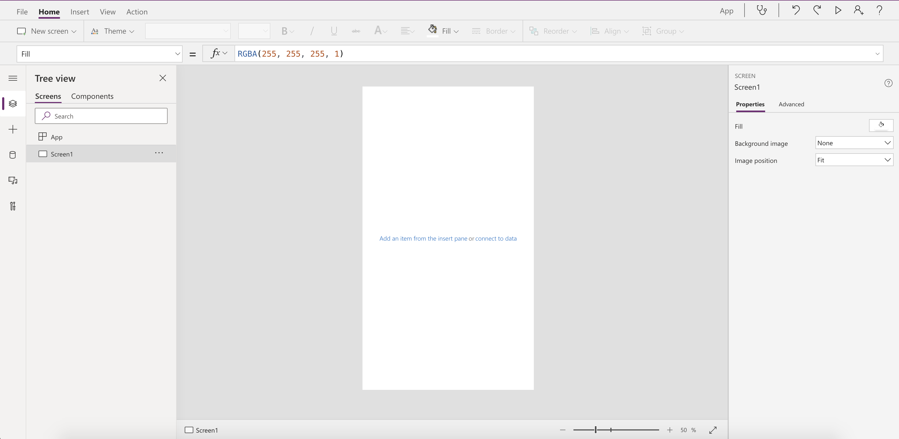
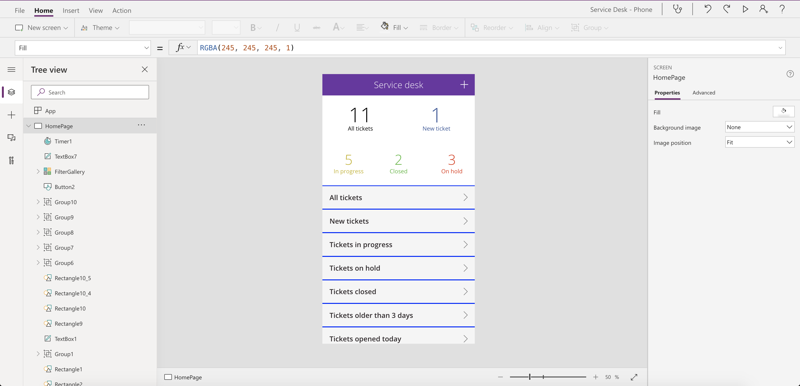
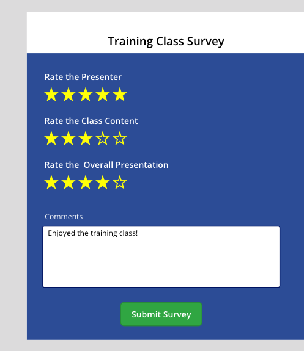
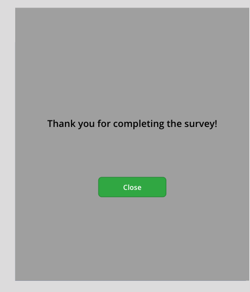
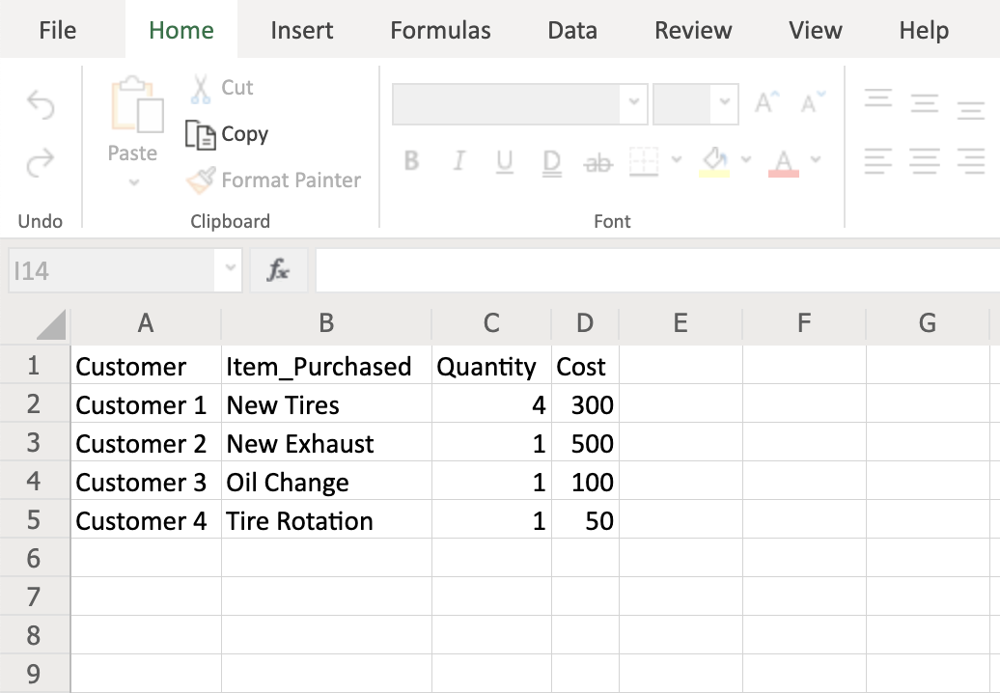

As an App Maker, before you begin building your Power Apps solution, it's recommended to go through a design process. 
When designing your Power Apps solution, there are several different factors to consider, such as:
-	Business requirements
-	Data Model
-	UX
-	UI
-	Business Logic
-	Output

By going through a simple design process, you can flush out any minor issues before they become a larger problem once the app has been put into production. It is also important to understand that this design process is for Canvas apps. 

So how do you go from a simple blank Canvas app, as seen below?

To a fully customized Canvas app solution?

## Understand the needs of the user

One of the most powerful and, at the same time, challenging parts of building a canvas app is that you start with a blank screen. This gives you the ability to build what you want, but to do that you have to know what you want. 

In many cases, when purchasing software to solve and or streamline business solutions, there are many business processes that don't quite fall within the software's supported guidelines. When you run into this issue, typically, there are several internal discussions and meetings held to determine how those unsupported processes can be updated/altered to meet the software requirements. For most organizations, this isn't ideal because of the cost or time takes to update those business processes. The great news is, by using Power Apps to build your solution, you won't have to worry about unsupported business solutions. Why? With Power Apps, you can build a custom solution tailored to the exact needs of your business requirements. 

Often when building an app, you are tempted to recreate the piece of paper or legacy software-driven process exactly. This is possible but might not be the ideal solution. By challenging the existing process and asking what it is the business needs to do, not what does the piece of paper or old software allows you to do, it opens the possibility of better, more efficient processes. For example, maybe on the paper process, the user had to type notes about what they see.  Would it be better instead to just take a picture? This type of thinking will lead to better apps and better outcomes. 

### Business Requirements

Every app you develop will have a different set of business requirements based on the solution. Taking the time to think about all the requirements is key to rolling out a successful production app. 

Depending on the solution or company policies, you may have certain security, privacy, or compliance requirements you must follow. For example, let's say you are collecting secure personal information in the app.  You will want to ensure this information is securely stored and not visible to everyone. 

During this process, you will also want to identify any government regulations or authentication/authorization requirements (if applicable). You don't necessarily have to have all the answers to your questions here; you just want to know all the requirements.

### Offline Mode

One of the first questions to consider when developing your application is, will the app need to function offline? If so, will the entire app or only part of the app needs to function offline? When will the data be synchronized to my data source? Are there any limitations? 

This is important to consider during the planning phase because if you were to build your app without this functionality, then decide to add it later, it will be more difficult than just doing it in the first place. Why is this?  You will need to make sure you are using collections and additional functions like SaveData and LoadData as you go along to allow your app to function offline. Also, if you are using Forms and trying to implement Offline mode, you will run into issues. 

There is a thorough discussion that needs to take place around Offline mode, and it's best to have this early in the design process as it will affect the rest of the process.

### Data Model

In the "Power Apps related technologies" module, you learned about some of the common data sources for building apps, but with all these choices how do you actually decide which data source to use for your solution? Maybe you already have a data source implemented that users work with on a day to day basis, like SharePoint. Could you just use this as your data source to build your app? Do I need to connect to multiple data sources? These are all common questions you should ask yourself and there are number of additional factors to consider, such as:

- **Business Requirements** – Every data source and it's supported functionality is slightly different. So, depending on your app requirements you need to select the data source that supports your needs or modify your business requirements to comply with the supported functionality for the selected data source.
- **Licensing/Cost** – Certain data sources like the Common Data Service or SQL are considered a "premium data source". A premium data source will require each user who uses the app to have a Power Apps Per App Plan or a Power Apps Per User Plan. For more information about licensing, see [Power Apps pricing](https://powerapps.microsoft.com/pricing/?azureportal=true)

### User Experience (UX)

By designing your Power Apps solution in a Canvas app, you have complete control of the end-user experience. This allows you to fully customize nearly every aspect of your app. However, just because you can doesn't necessarily mean you should. When designing your Power Apps solution your goal should be to keep it simple. When your end users open the application and begin using it, they should have no confusion about what to click on or where to go. If your app requires an extensive training program for users to understand how to use it, you may want to rethink your app.

Some of the basic designs elements you will want to consider are things like: 

- Custom Branding (your logo and colors)
- Pop-ups
- Hide/show buttons based on users' access/permissions

One of the most common User Experience enhancements you can implement in your applications are Pop-ups. By implementing pop-ups, you can provide the users with a simple, but useful visual to confirm what the user clicked on went through or maybe your pop-up acts as a loading screen as the logic on the backend is processed. For example, in the screenshot below when a user clicks on "Submit", we might have a simple pop-up display to let them know their submission was successful. 

In this example app, the user completes a Survey for the training class they just attended.

Once all of the information has been written to the data source successfully, a pop-up is generated to confirm the submission was successful.

Without confirmation, a user may not be sure if their submission was accepted. They may try to click the button again, causing incorrect or inconsistent data being written to the data source.

Remember, these are not the only customizations you can make to the app, these are just some of the common ones. Another thing to keep in mind as you add different design features is the more logic you add for the customization of the app the more code your application will need to process. So, for example, if you add several different functions for hiding buttons, or showing popups on a given screen, this could cause your application performance to slow as each piece of code runs.

Finally, challenge yourself to do better with your user experience. Maybe today, the user records room temperatures by clicking in a box, changing the device keyboard from letters to numbers, and then typing in “70”. A better option may be to replace with a slider control that defaults to 70 and ranges from 65 to 75. Then, with a swipe of their finger, they can record the temperature. Small changes like this make for happier, more productive app users.

### User Interface (UI)

To fully visualize the User Interface or UI, you may want to consider creating a mockup of your application. Two common ways to create a mockup of your application are below:
- Use Visio to create a wireframe diagram. A wireframe is a visual representation of an application's user interface. To begin, there are various website and mobile wireframe templates available, or you could start from blank template. The diagrams are a quick way to show app functionality and gain team consensus on the design.

The example below shows a simple Visio wireframe of a Purchase Items screen in an inventory app.

- Use Power Apps to create a mockup of your application. You can add most of the controls, graphics, forms, and other items to your app screens and play with the layout and size for each element as if you were building the app for real. When designing the UI you don't need to add the logic behind the various elements you placed on the screen.  The goal here is to focus on what the app could look like and how it could function. This similar to what you can do with a Visio wireframe but one of the biggest pros of going this route is that you will gain more experience working with Power Apps and also learn more about the various UI elements available in the process. All of the experience and knowledge you will gain by creating your app mockup in Power Apps will only payoff later when it's time to start on the production app. Another big upside to using Power Apps for your mockup is that if you show this to your team and they like what you did, you can continue building off this app or create a new app and copy the elements you would like to keep to your other application. By not having to redo the UI or only having to redo parts of it, you could potentially save yourself hours of work. 

The example below shows a simple mockup of a New Purchase Order Screen.

It really comes down to your preference and comfort with the software you are using to create the mockup. You should also consider licensing and costs when making this decision. Visio requires additional licensing to get the full functionality required for creating a wireframe diagram. Whereas with Power Apps, it doesn't matter which license you have.  As long as you have Power Apps (and sufficient permissions in your environment), you can create apps and mockup apps.

As you design the User Interface, a few additional things to think about are Accessibility and Localization. It's important to ensure the app interface follows accessibility guidelines so all your users can interact with your application without any issues. To review these guidelines and additional accessibility properties, see [Create accessible canvas apps in Power Apps](https://docs.microsoft.com/powerapps/maker/canvas-apps/accessible-apps?azureportal=true).

Localization can be something you must consider when developing your application as well. Depending on where your app will be used, you may need to use different punctuation. For example, some regions of the world use a . (dot or period) as the decimal separator while others use a , (comma). For more information on building a globally supported application, see [Build global support into canvas apps](https://docs.microsoft.com/powerapps/maker/canvas-apps/global-apps?azure-portal=true).

### Business Logic

When using the common data service, you can create business rules and recommendations to apply logic and validations without writing code or creating plug-ins. The great thing about the common data service and business rules is that they are applied at the data level. This means that you can apply rules that are enforced regardless of how the data is accessed. 
 
Often when building apps all of the business logic is built into the app. This works great if the data is only accessed via the app. The challenge is often business data is used in many ways and from different tools. This is where Business Rules shine. You can apply logic on the data in the Common Data Service, allowing your rules to be enforced no matter which tool interacts with the data. 

For example, you have built a capital project expense tracking application using Common Data Service as the data source. In your business process. the duration field is an optional field if your request is less than $10,000, but duration field is required if it is more than $10,000. After you set up your entity in Common Data Service, you would then apply a business rule that says if Project Amount is greater than $10,000 then make project duration a required field. Now regardless of how the user interacts with the data the Business Rule will be enforced, keeping your data integrity.

### Output

Finally, you will want to discuss your app's data output. This simply means what type of data will your app generate, and once the data is generated what will be done with it? A few questions to ask your app stakeholders:
- How does the data need to be visualized?
- What actions will be taken on the data once it is collected?
- Are there specific format or file types the data are needed?

The answers to these questions will help determine if additional functionality needs to be added to the app such as a Power BI report, email output, PDF, or CSV.   

Let’s look at an example.  Perhaps your organization has a legacy ERP solution and the orders submitted in your Power App need to be reflected in the ERP application. While one option might be to build a custom connector to that solution, another option may be to export the data to a CSV file using Power Automate and Power Apps together, see screenshot below:

The great thing about generating this CSV file export is that it's not linked to your data, so the changes you make to the file will not alter the app data.
