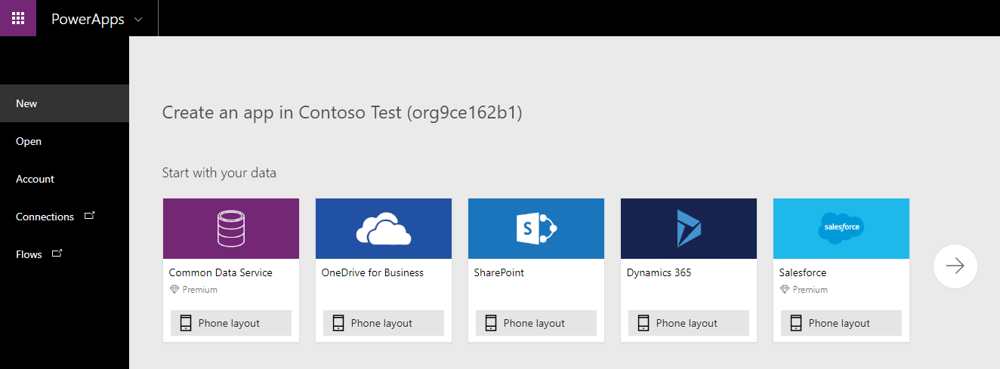

This unit describes how to create an app from a template, a blank canvas, and a data source. This learning path is focused on canvas apps, which give you the flexibility to arrange the user experience and interface the way that you want it. You can get started in many different ways; however, for all of the options, you will use the Power Apps Studio features and functionality to build your app.

## Create an app from a template
A good way to create an app is to start from a template. Templates use sample data to help you determine what's possible. By opening templates in Power Apps Studio, you can learn, hands-on, how an app is built.

For example, you can use the Budget Tracker template to create an app that helps you track the budget for projects and events with custom categories, simple data entry, and visuals that highlight expenditures for an effortless inspection.

## Create an app from a data source
Another great way to get started is to generate an app from your own data. Simply point Power Apps at the data source of your choice (for example, a list in Microsoft SharePoint or Microsoft Dataverse), and watch as Power Apps automatically builds a three-screen app. This three-screen app lets you display, edit, delete, and create records.

A special data source is SharePoint. Modern lists in SharePoint and Power Apps have a tight integration. You can either build an app from within a SharePoint site or you can use Power Apps to customize your modern list forms.

The following app was created from a list in Microsoft Lists and lets you browse items in the list, view item details, and create and edit items. After Power Apps generates an app, you can customize it to make it look and behave exactly the way you want.

## Build from a blank canvas
You can also build an app from the ground up and add all the pieces as you go. You can then branch out and use your imagination.