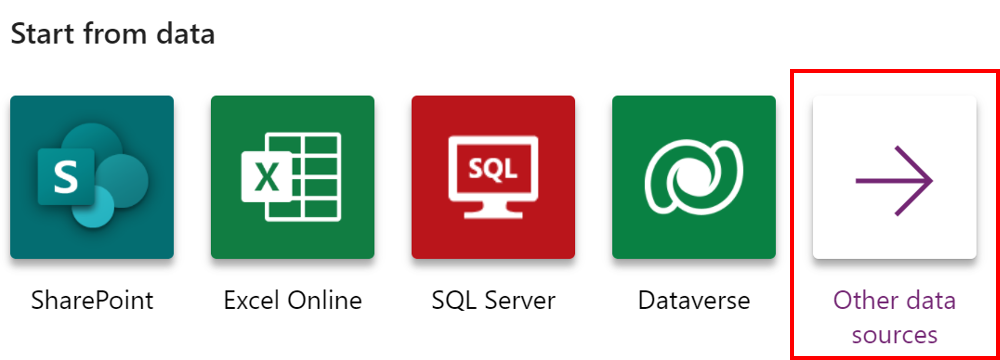

In this unit, you'll generate a mobile app where the data source is a Microsoft Excel workbook that's stored in Microsoft OneDrive for Business. This Excel workbook lists a company's inventory of flooring samples with pictures and prices.

Keep in mind that you can use data from many other sources, including Microsoft SharePoint, cloud services like Salesforce, and on-premises sources like Microsoft SQL Server.

> [!NOTE]
> Power Apps requires either an Office 365 license or a free trial. Learn more about your licensing options. [Microsoft products include Microsoft Power Apps and Power Automate.](/powerapps/administrator/pricing-billing-skus/?azure-portal=true)

Before you begin, watch this video for a brief overview of what to expect when creating your first Power App.

> [!VIDEO https://www.microsoft.com/videoplayer/embed/RE4vls4]

## Connect to a data source

To connect to a data source, use the following procedure:

1. Download the [Flooring Estimates workbook](https://az787822.vo.msecnd.net/documentation/get-started-from-data/FlooringEstimates.xlsx) and save it to OneDrive for Business.

1. Go to [https://make.powerapps.com](https://make.powerapps.com/?azure-portal=true) and sign in with your organizational account.

1. On the **Home** screen, under the **Start from data** section, select **Other data sources**.

    

    Generated apps are always based on a single list or table, but you can add more data to the app later. The next four steps explain how to connect to the Excel workbook.

1. In the **New** tab section, under **Connections**, select **OneDrive for Business** and browse to the file location.
    You might need to select **New Connection** to see the **OneDrive for Business** connection.
1. Under **Choose an Excel file**, select the **FlooringEstimates.xlsx** file.
1. Under **Choose a table**, select the **FlooringEstimates** table.
1. Select **Connect** on the bottom right.

Power Apps generates the app by inspecting your data and matching it with Power Apps capabilities so that you get a working app as a starting point.

## Explore the generated app

Your new three-screen app now opens in Power Apps Studio.

The following figure shows the main development window for Power Apps Studio, which you'll learn more about in later units.

Select **Play** :::image type="icon" source="../media/powerapps-arrow.png"::: in the upper-right corner to practice using the app. Notice that it includes all the data from the table and provides a good default experience.

All apps that are generated from data have the same set of screens that you can view from the Screens pane:

* **Browse screen** - This screen appears by default. In it, you can browse, sort, filter, and refresh the data from the data source. In the browse screen, you can add items to the data source by selecting the plus sign (**+**).
* **Details screen** - The details screen shows all information about a single item. In this screen, you can open an item to edit or delete it.
* **Edit/create screen** - In this screen, you can edit an existing item or create a new one.

To make your app visible on the phone, it needs to be saved. Select **File**, **Save as**. Replace the current title "App" with **flooring-estimates app**, and then select **Save**. You will see a green check mark when all changes are successfully saved. You can now open the app on your phone.

## Install the app on your device

To see how the app runs on mobile, install the Power Apps Mobile app on your phone. When building an app, you should test it in the same form factor as your users.

1. Download Power Apps Mobile from the app store for the platform that you want to use.

2. Sign in by using your username and password.

3. On your phone or tablet, run the flooring-estimates app in Power Apps Mobile. If you do not want to install the app, you can run it in a browser.

4. If you do not see the flooring-estimates app, then in your Power Apps Mobile app, select the user account menu and toggle on **Show non-production apps**. You may need to swipe to the left or tap your profile icon to get this option.
