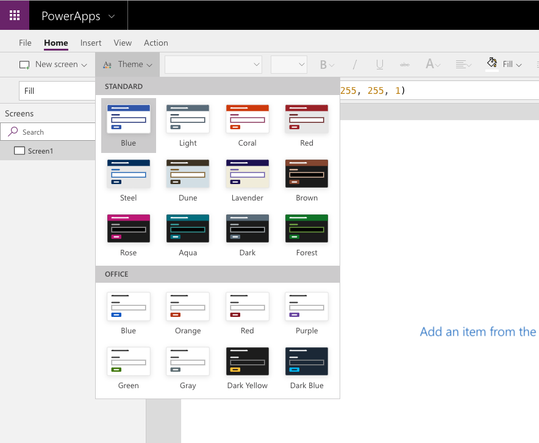

A quick and easy way to change the colors in your app is to apply a theme. In Power Apps, there are several out-of-the-box themes to choose from. The following screenshot illustrates all the themes that are available in your app.

These themes have a specific set of default colors and visual elements which will alter the look and feel of your entire app. To use any of these themes in your Canvas app, select a theme from the ribbon. The changes to your app will take effect immediately.

If none of the included themes work for your app, you can create a custom theme. For example, if you decide to select the Steel theme but want the screen background to be a lighter color, this can be easily done. To change the background of your screen, change the **Fill** property to **RGBA(250, 250, 250, 1).** The
screen will be a slighter lighter shade of gray. Keep in mind, this only
changed the fill of that specific screen, if you want to add a new blank
screen it would still have the **Fill** property of **RGBA(232, 232, 232,
1)**. This is by design when working with a canvas app. Also, there is
no option to create a Custom theme for a canvas app and store it to be
used for other apps.

Typically, many organizations will select the theme that best suits their needs, and then alter the various control properties to align with their corporate branding.
