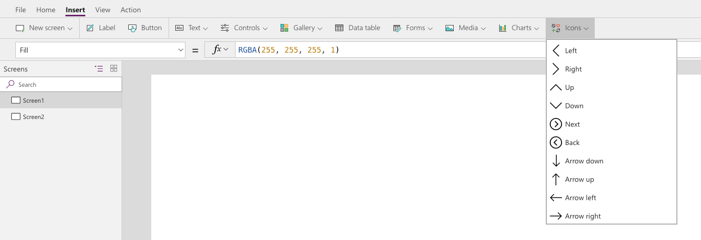

When designing your app, utilize Shapes and Icon controls when possible
to enhance the user experience of your app. There are certain shapes and
icons that are universally recognized that you will find in many of the apps that you use daily. 
For example, instead of adding a Button
control to your app and setting the **OnSelect** property to Back(), you
could just as easily use the **Back** icon control and set it's
**OnSelect** property to Back().

Remember, icons are controls, and each control has a specific set of
properties that can be modified to change how the control looks and
functions. To view all of available icon controls, select **Insert**
and then select the **Icons** drop-down menu.

These controls include arrows, geometric shapes, actions, and symbols. By incorporating shapes and icons, you can save some space and reduce clutter in your app, especially when working with a Phone form factor app. The Phone form factor app has a much smaller area for designing and adding controls so replacing some of the buttons with shapes and icons could really benefit the overall spacing of your app.
