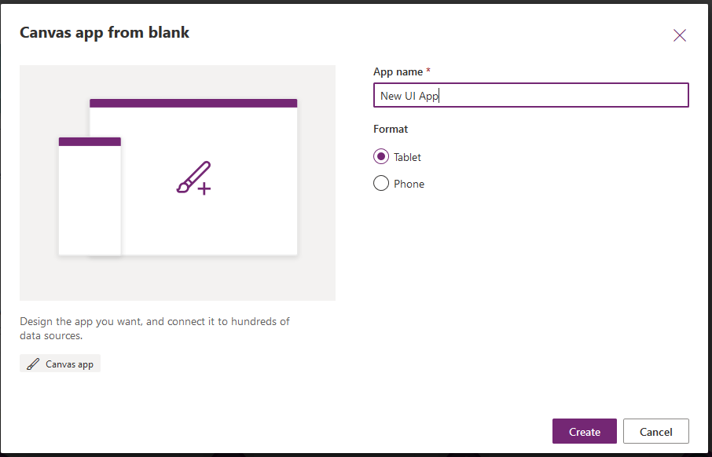
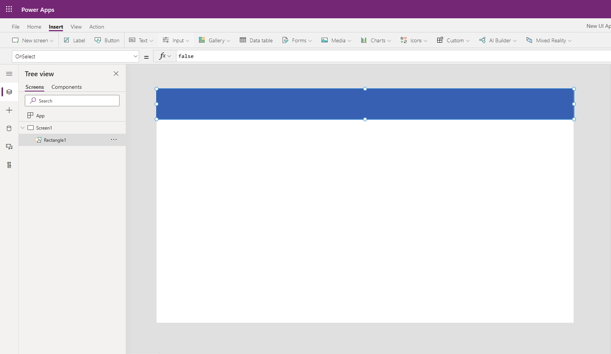
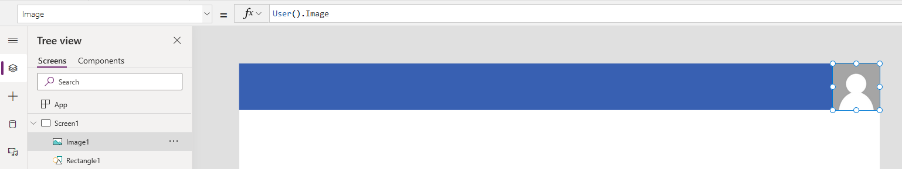
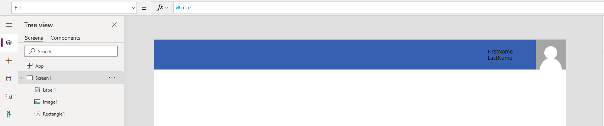
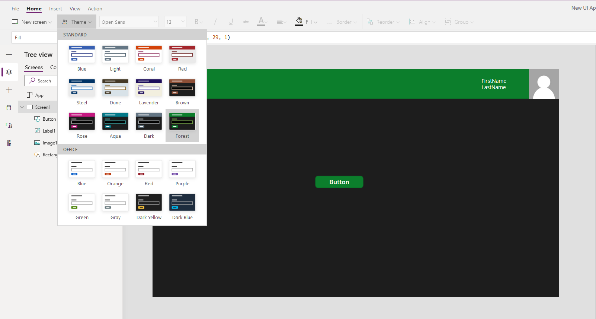

In this unit, you'll generate a new canvas app that you will customize with various pieces of the UI covered in the previous units. This should give you a good idea of the capabilities of UI design in Power Apps.

> [!NOTE]
> Power Apps requires either an Office 365 license or a free trial. Learn more about your licensing options. [Microsoft products include Microsoft Power Apps and Power Automate.](/powerapps/administrator/pricing-billing-skus/?azure-portal=true
)


### Creating a new blank app header

1. Log into [Power Apps](https://make.powerapps.com/?azure-portal=true
).

1. On the Home screen select **Canvas app from blank**.

	

1. Name your app **New UI App** and click **Create**.

	

1. In the new app, select the **Insert** tab and the **Icons** dropdown. Scroll close to the bottom of the dropdown options and choose **Rectangle**.

1. Move and resize the rectangle to cover the top of your app screen.

	

1. Next, select the **Media** dropdown at the top and choose **Image**.

1. Move the image to the top right corner of your app screen.

1. Change the Image property to:

   ```powerappsfl
   User().Image
   ```

	

1. Insert a **Label** and change the Text property to:

   ```powerappsfl
   User().FullName
   ```

1. Move the label next to the image and resize as needed.

	

1. Insert a **Button** and move it to the middle of the screen.

1. Select the **Home** tab in the top left, and click the **Theme** dropdown. Choose **Forest**.

	

Notice how the entire app's color scheme changes according to the new theme; including the button, label, and font colors. This is how easily you can make your Power Apps look and feel unique and fun, but also enhance the usability and appearance.