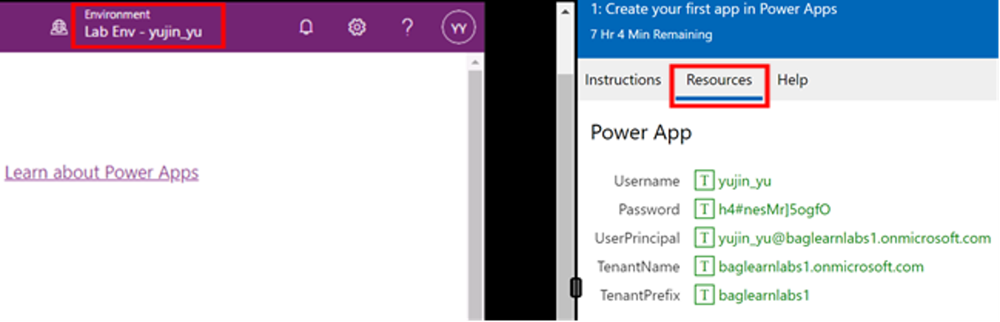

## Read this first - before you start the lab!

> [!IMPORTANT]
> For this lab,  do not sign in with your credentials. Use the following steps to sign in to your lab environment with the correct credentials.

1. Select **Launch VM mode** in this unit.
1. You'll see a PowerShell window and a Windows Command window appear. After about two to three minutes, they'll close, and Power Apps will open automatically. Wait for the **Power Apps** home screen.
    
3. In the Environment section on the top banner, change your environment to the one listed  in the **Resources** tab of the lab side bar.
4. Don't stay signed in or store the password on the virtual machine.
5. To see the lab instructions, select the Instructions tab on the lab side bar.

You can now begin your work on this lab.
