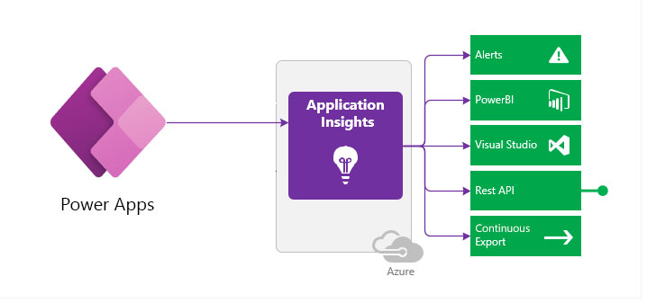
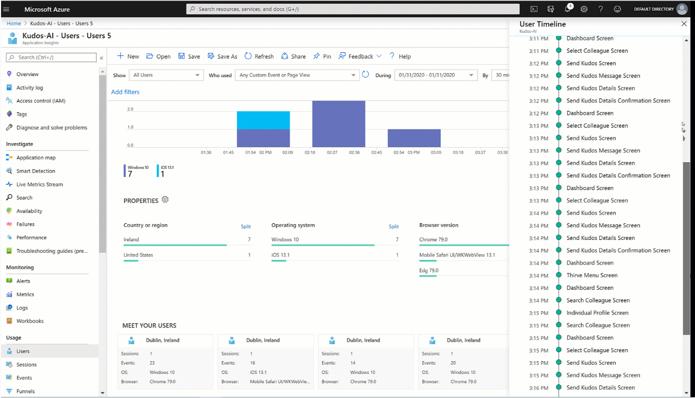
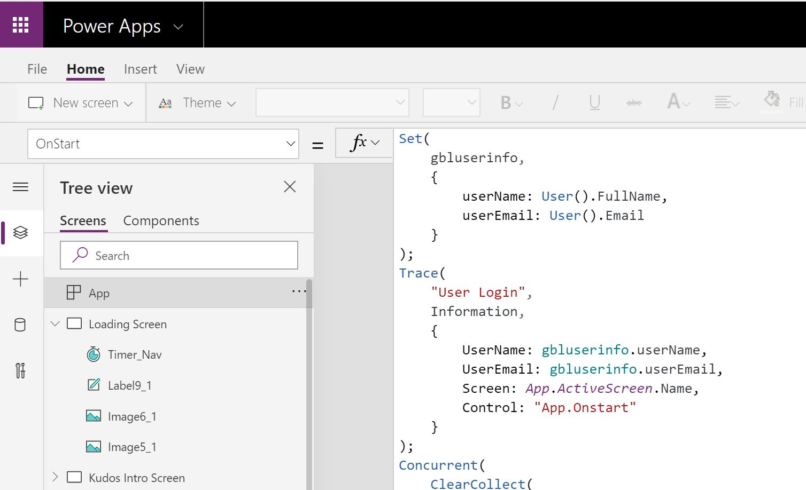

You have built an app, and you have published and shared it with people in your organization. Now, you need to know how people are using it and if it's performing well. If you configured your app to send telemetry to Application Insights, you could check how it's doing in the Microsoft Azure portal. For example, you could answer the following questions:

-   How many people are using the app?

-   What screens do people use most often?

-   How long are users on a screen?

-   Which screens are slow?

Application Insights is a feature of Microsoft Azure Monitor that you can use to monitor application performance. You can configure custom apps, including canvas apps from Microsoft Power Apps, to send telemetry to Application Insights. After the telemetry is in Application Insights, you can view or access the data by using multiple options.

> [!div class="mx-imgBorder"]
> 

From the Azure portal, you can access prebuilt visualizations of the telemetry that was captured from users who were running your app.

> [!div class="mx-imgBorder"]
> 

For more custom analysis of the data, you can compose custom queries of the data or use Microsoft Power BI to create custom visualizations of your data.

Canvas apps from Power Apps will automatically send basic screen telemetry to Application Insights if you set up the **Instrumentation Key** on the app object. The telemetry is only captured when your published app is run; therefore, usage from within Microsoft Power Apps Studio when you build the app won't impact your usage telemetry.

In addition to the basic telemetry that the Power Apps runtime sends, you can also log custom events by using the Trace() function from Microsoft Power Fx. By strategically instrumenting your app with Trace() function calls, you can include app context information that you can use to analyze app-specific challenges. The following example shows the use of Trace() to record the user and active screen information when the **OnStart** property runs.

> [!div class="mx-imgBorder"]
> 

Setting up your canvas app to send telemetry to send data is a simple process that the next topic will cover. Sending of telemetry adds minimal overhead to an app and should be considered for any app with multiple users. Without actual telemetry, you are left with user perception of how your app is doing. While user perception is an important part of how you should improve your application, actual telemetry removes user emotion and focuses on empirical data. The rest of this module will explain how to set up and use the telemetry that you capture in Application Insights to improve your application.
