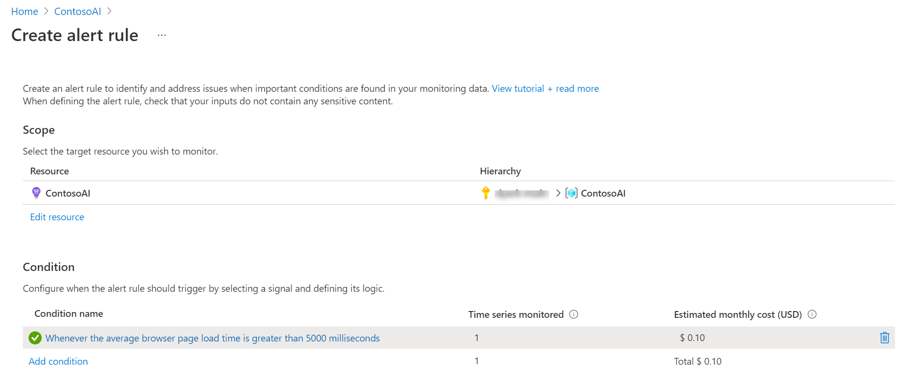

After you have configured your application to send telemetry to Application Insights, you can view collected data from the Azure portal. From your Application Insights resource in the portal, you have the following ways to access the data:

-   **Individual visualizations:** For example, users report, allow you to visualize summary data for a time period and allows drilling down into more detail.

-   **Workbooks:** Provide insights into the availability, performance, usage, and overall health of the underlying components. There are several pre-built and you can build your own include data from multiple Azure data sources.

-   **Logs:** Allow you to query the raw event data and look for patterns or answer questions either directly in Application Insights on Azure portal or an external app like Power BI.

It is important to understand that Application Insights can be used to collect application performance data for many different types of applications including Power Apps. This is why the portal offers many different visualizations and workbook templates for the different types of applications. Not all of these are applicable for Power Apps, and as you explore the different assets you may find that many don't contain data or provide a limited experience. The following are some of the ones you will find useful for Power Apps:

-   Investigate > Transaction Search

-   Monitoring > Metrics

-   Monitoring > Logs

-   Monitoring > Workbooks > App Performance Index

-   Monitoring > Workbooks > Active Users

-   Monitoring > Workbooks > Analysis of page views

-   Monitoring > Workbooks > Engaged Users

-   Monitoring > Workbooks > New, returning, and churn

-   Monitoring > Workbooks > Usage calendar

-   Monitoring > Workbooks > Usage through the day

-   Monitoring > Workbooks > User Timeliness

-   Monitoring > Workbooks > User Retention

-   Usage > Users

-   Usage > Sessions

-   Usage > Events

-   Usage > User Flows

A good place to start is Usage > Users and see who/how many are using your app. To find your Application Insights resource in the Azure portal select All Resources and search on the name, you provided.

## Cohorts

Cohorts allows you to define sets of users, events, or operations that have something in common. For example, you could define a cohort for all users of a specific screen in your app. Another example would be all users from a country/region. You could then use the cohort to filter your Application Insights visualizations.

## Custom visualizations

From most of the built-in visualizations like Users and Metrics you can add or modify the filters and other criteria and then save your custom visualization. This can be useful if you find yourself frequently filtering on the same thing each time you visit the data. For example, [you can create a new chart](/azure/azure-monitor/essentials/tutorial-metrics-explorer/?azure-portal=true) on metrics and customize the time range and granularity.

## Alerts

You can use the alerts feature to keep aware of the metrics and proactively send notifications when your apps do not behave as planned. For example, you could configure an alert if average page load time was high.

> [!div class="mx-imgBorder"]
> 

## Power BI

If you would like to use Power BI to create some custom visualizations, you can [import the log data into a Power BI dataset](/azure/azure-monitor/visualize/powerbi/?azure-portal=true).

## Automate reporting using Power Automate

[Using the Azure Monitor connector](/azure/azure-monitor/logs/logicapp-flow-connector/?azure-portal=true) you can build automated workflows that use data from your Application Insights workspace. For example, you could have a daily e-mail that includes a list of errors logged by users of your app.