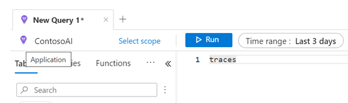
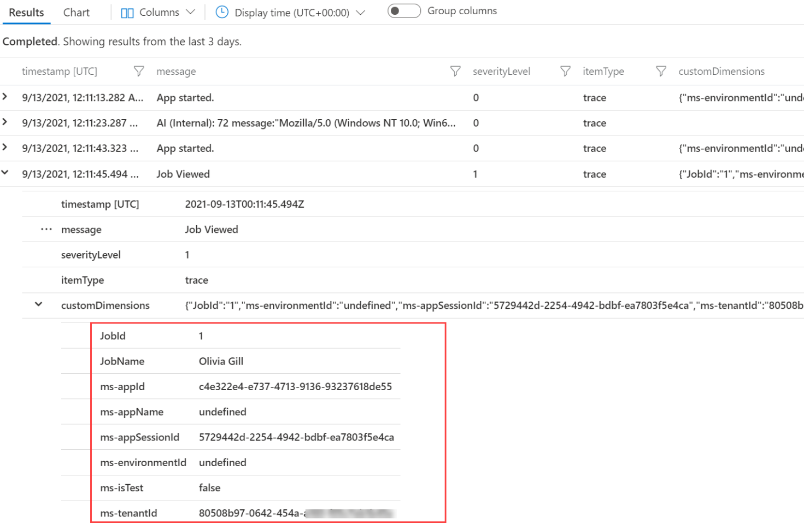
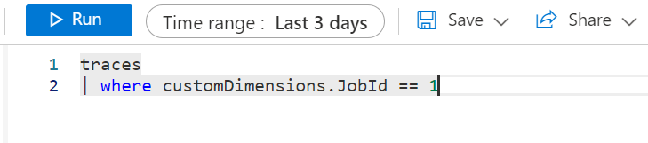

In addition to the telemetry that is sent automatically by Power Apps runtime to Application Insights, you can use the Power Fx Trace() function to send custom events. By instrumenting your app with trace calls, you can capture important events and associated data. 

Examples of when you might add Trace() function calls include:

-   Using **OnStart** to log the parameters that are passed to your app when it was started

-   When users enable or disable options in your application

-   When a button is selected to perform an action

-   When the user cancels an action

-   When an error occurs, such as someone submitting a form or data source errors

-   Logging validation errors

-   Logging search criteria so that you can determine the popular searches

-   Logging feedback based on a user's likes or dislikes in an app

-   Anything that you want to query later

In addition to logging the data for Application Insights, trace data is also visible in the Monitor tool and Power Apps Test Studio results.

The syntax for the function is as follows:

`Trace(message, trace_severity, custom_record )`

The message parameter is required, and you should use it to identify why you called trace, such as entering **Trace("Timesheet Validation Failed")**.

Optionally, you can pass a severity level of information, warning, error, or critical. When used to consistently categorize your traces, severity can be helpful in querying the data. For example, you could get a daily email with a list of all errors that were captured.

The Trace() function also allows you to pass a data record with context information. This record can have one or more data fields that would be helpful in analyzing the trace event data later. Additionally, you can use this data in the log queries to reduce the set of trace records that you review. You can compose the inline record by using braces (**{}**) that contain named field values. For example, you could enhance your previous validation by passing more context information:

`Trace(“Timesheet Validation Failed”,Warning, { hoursWorked:ThisItem.HoursWorked”)`

When composing Trace() function calls, make sure that you keep the following parameters in mind:

-   Avoid sensitive data being recorded in Application Insights that might cause compliance problems, such as a customer's name and email address.

-   Be alert for bad data or a formula that might cause unexpected results.

-   Avoid sending too much data; send only what you need to analyze or query the data.

-   Use consistent field names to help make querying easier across related trace calls.

## Query the traces

You can query and view the data that is captured by each Trace() function call by querying the log and using **traces** as the table name.

> [!div class="mx-imgBorder"]
> 

In the results, each line will have an **itemType** of **trace**. In each row, the **message** and **severityLevel** will display. If you expand the row, a **customDimensions** property will display that you can further expand to show the fields that you logged as context data when you invoked the Trace() function.

> [!div class="mx-imgBorder"]
> 

In the preceding image, **JobId** and **JobName** were context data. All **ms-** fields are automatically added to every trace. You can use this data to build a query similar to the following example that queries for all trace records from a specific **JobId**.

> [!div class="mx-imgBorder"]
> 

You can use **ms-appId** to find all traces for a specific app and **ms-appSessionId** to find all traces for a user for that session of running the app. Each app that logs data will have a unique **ms-appId**.

Adding traces to your app can provide you with a valuable resource to track problems. Traces are especially valuable because you can use them to capture data for an app that is running in production and doesn't require you to run the app in Power Apps Studio. By proactively adding Trace() function calls to your application, you will be ready when users report a challenging problem in production.
