In this exercise scenario, you have been asked to collect telemetry data from the Cost Estimator application. You have decided to use Application Insights to collect and analyze the telemetry data.

## Tasks

The tasks that you will complete in this exercise are:

- Add trace that will track viewed jobs.

- Add trace that will track jobs from validation errors.

## Objectives

The objectives of this exercise are to show you how to:

- Create an Application Insights app in Azure.

- Connect a canvas app to Application Insights.

- Add traces to your application.

- Query trace logs.

## Prerequisites

Make sure that you meet the following prerequisites before beginning the exercise:

- An environment with Microsoft Dataverse installed

- A Microsoft Azure subscription: [Azure - Sign up](https://signup.azure.com/signup?offer=ms-azr-0044p&appId=102&ref=portal&redirectURL=https:%2F%2Fazure.microsoft.com%2Fen-us%2Fget-started%2Fwelcome-to-azure%2F&l=en-us&correlationId=a18965c7a16f4722a855a8e7953047f3)

## Exercise 1: Import a solution 

In this exercise, you will import a solution into your environment. This solution contains a working canvas application. You will modify it later to add tracing to certain user actions and then analyze the results.

### Task: Import a solution

In this task, you will import a solution into your environment.

1.  Go to [Power Apps maker portal](https://make.powerapps.com/?azure-portal=true) and select the environment that you want to use for this lab.

1.  Select **Solutions > Import**.

	> [!div class="mx-imgBorder"]
	> [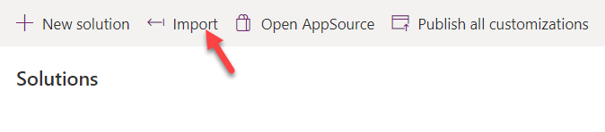](../media/import-button.png#lightbox)

1.  Select **Browse**.

1.  Browse to the lab resources folder, select the **ContosoCostEstimator_1_0_0_1.zip** solution, and then select **Open**.

1.  Select **Next**.

1.  Select **Import** and then wait for the solution importing to complete.

## Exercise 2: Set up the app

In this exercise, you will set up the app for Application Insights. If you have an active Azure subscription that is associated with your lab user, follow the steps in this section. If you don't have an active Azure subscription, you will be prompted to add it while following these steps. The free Azure subscription that is offered will be enough for you to complete this lab.

### Task: Create an Application Insights app

In this task, you will create an Application Insights app in Microsoft Azure, which requires an active Azure subscription. If you don't have an Azure subscription, you can [sign up](https://signup.azure.com/signup?offer=ms-azr-0044p&appId=102&ref=portal&redirectURL=https:%2F%2Fazure.microsoft.com%2Fen-us%2Fget-started%2Fwelcome-to-azure%2F&l=en-us&correlationId=a18965c7a16f4722a855a8e7953047f3).

1.  Go to the [Microsoft Azure portal](https://portal.azure.com/?azure-portal=true) and select **Create a resource**.

	> [!div class="mx-imgBorder"]
	> [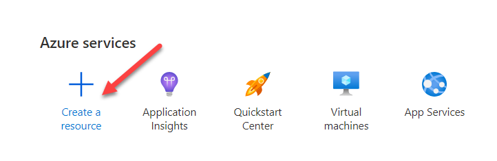](../media/create-resource.png#lightbox)

1.  Search for and select **Application Insights**.

1.  Select **Create**.

1.  Select your subscription and then select **Create new** under the **Resource Group** dropdown list.

1.  Enter **fl_insights** for **Name** and then select **OK**. Replace **fl** with your initials.

	> [!div class="mx-imgBorder"]
	> [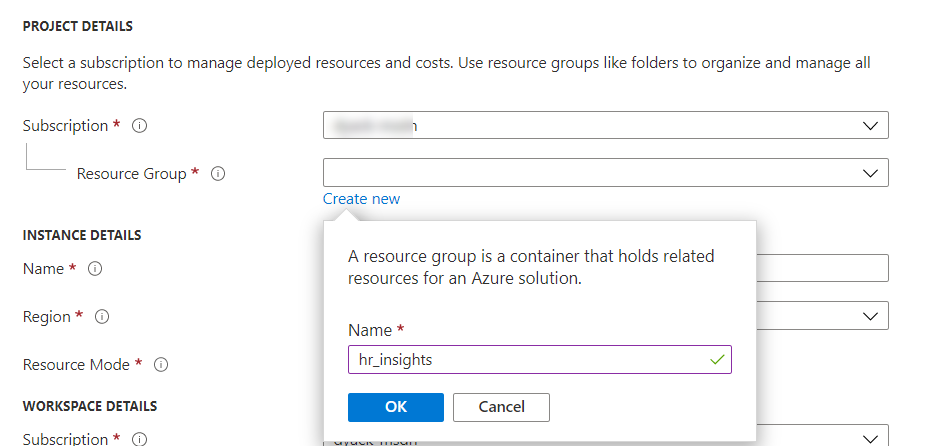](../media/resource-group.png#lightbox)

1.  Enter **Insights_Lab** for **Name**, select your **Region**, and then select **Review + create**.

1.  Select **Create** and then wait for the resource to be created.

1.  Select **Go to resource**.

1.  Copy the **Instrumentation Key**.

	> [!div class="mx-imgBorder"]
	> [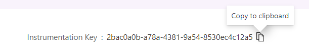](../media/instrumentation-key.png#lightbox)

1. Go to the [Power Apps maker portal](https://make.powerapps.com/?azure-portal=true) and select the environment that you are using for this lab.

1. Select **Solutions** and then select to open the **Contoso Cost estimator** solution that you imported.

1. Select to open the **Cost Estimator** application. The application should open in app studio.

1. Select **App**, go to the **Properties** pane, and then paste the instrumentation key that you copied from the **Instrumentation Key** field.

	> [!div class="mx-imgBorder"]
	> [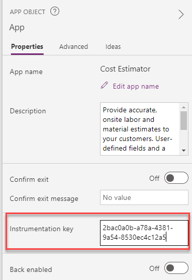](../media/properties-instrumentation-key.png#lightbox)

1. Select **File > Save**.

1. Select **Publish**.

1. Select **Publish this version** and then wait for the publishing to complete.

1. Select the **back** button.

1. Select **Play**.

1. Make sure that the app loads the data.

	> [!div class="mx-imgBorder"]
	> [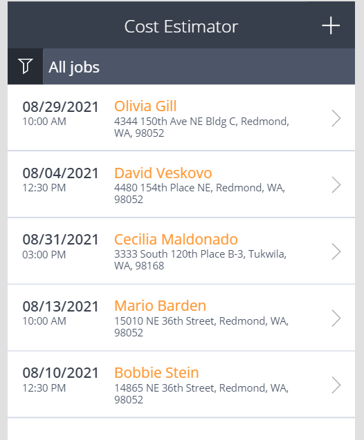](../media/cost-estimator.png#lightbox)

1. Close the preview.

1. Do not navigate away from this page.

## Exercise 3: Edit and add trace

In this exercise, you will add trace to the application by modifying formulas that are already part of the working app from Power Apps.

### Task: Add trace

In this task, you will add trace to the application.

1.  Expand **OpenJobsPage**.

1.  Expand **JobsListGallery** and then select **icon2**.

	> [!div class="mx-imgBorder"]
	> [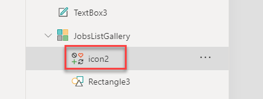](../media/icon-control.png#lightbox)

1.  Append the **OnSelect** value of **icon2** with the following formula. This trace will track which jobs are being viewed.

	`;Trace("Job Viewed",TraceSeverity.Information,{JobId:ThisItem.JobId, JobName:ThisItem.JobName})`

	> [!div class="mx-imgBorder"]
	> [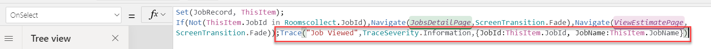](../media/edit-formula.png#lightbox)

1.  Select **NewJobPage** from the **Tree view**.

1.  Select the **Save job** button.

	> [!div class="mx-imgBorder"]
	> [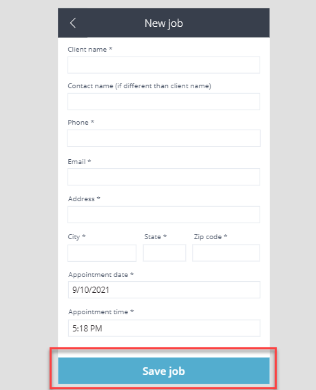](../media/save-job.png#lightbox)

1.  Go to the formula bar, select **OnSelect**, and then expand the formula bar.

	> [!div class="mx-imgBorder"]
	> [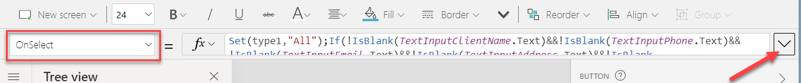](../media/expand-formula.png#lightbox)

1.  Select **Format text**.

	> [!div class="mx-imgBorder"]
	> [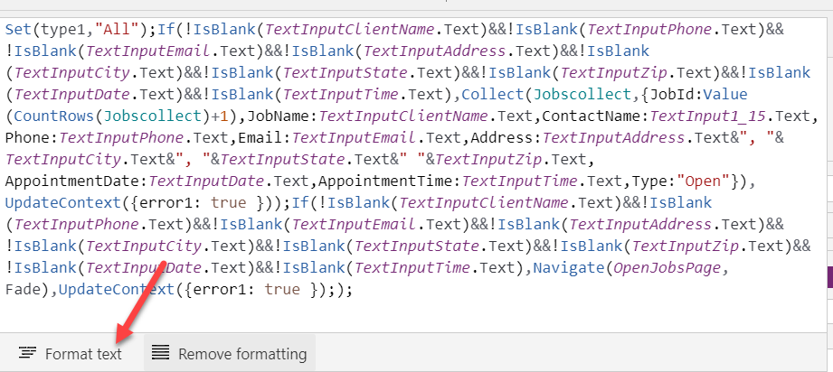](../media/format-text.png#lightbox)

1.  Scroll down and locate **UpdateContext**. Two occurrences should be shown.

	> [!div class="mx-imgBorder"]
	> [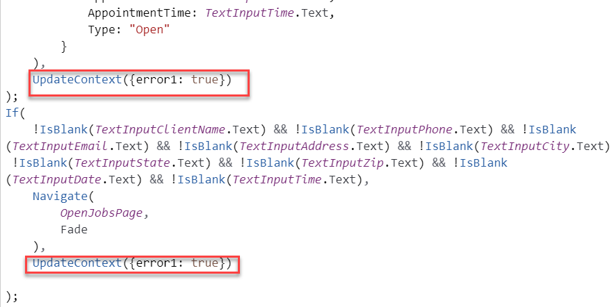](../media/update-context.png#lightbox)

1.  Add the following formula after the first **UpdateContext** occurrence.

	```powerappsfl
	;
	Trace(
	        "Validation Failed",
	        TraceSeverity.Warning,
	        {
	            JobName: IsBlank(TextInputClientName.Text),
	            ContactName: IsBlank(TextInput1_15.Text),
	            Phone: IsBlank(TextInputPhone.Text),
	            Email: IsBlank(TextInputEmail.Text),
	            AppointmentDate: IsBlank(TextInputDate.Text),
	            AppointmentTime: IsBlank(TextInputTime.Text)
	        }
	    )
	```

	> [!div class="mx-imgBorder"]
	> [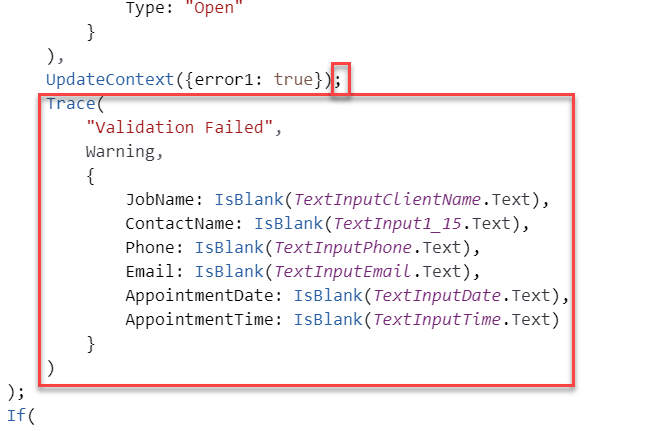](../media/formula-edit.png#lightbox)

1. Go to the second **UpdateContext** occurrence and add the same formula.

	> [!div class="mx-imgBorder"]
	> [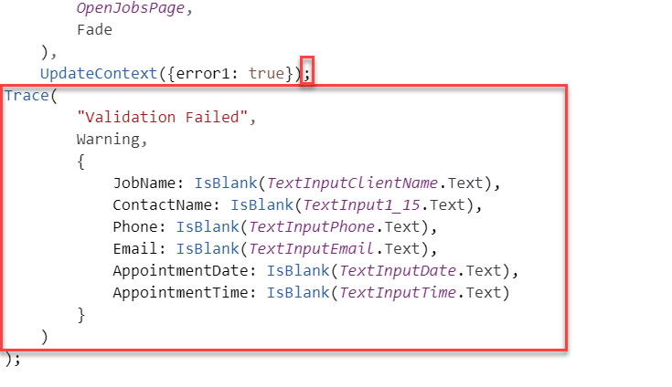](../media/formula-edit-2.png#lightbox)

1. Select **File > Save**.

1. Select **Publish**.

1. Select **Publish this version** and then wait for the publishing to complete.

1. Close the app studio browser window or tab.

## Exercise 4: Run the published app 

In this exercise, you will run the published application, which will trigger the tracing that you added. Additionally, it will give you data to analyze in the steps that follow.

### Task: Run the application

In this task, you will run the application that you published.

1.  Go to the [Power Apps maker portal](https://make.powerapps.com/?azure-portal=true) and make sure that you are in the correct environment.

1.  Select **Apps** and then select to launch the **Cost Estimator** application.

1.  Select to open a job.

	> [!div class="mx-imgBorder"]
	> [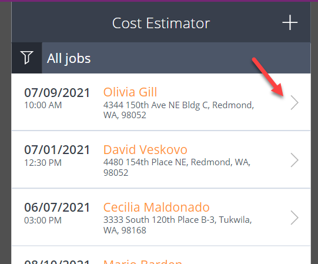](../media/row.png#lightbox)

1.  Select the **back** button.

1.  Open another job and then select the **back** button again.

1.  Open a few more jobs.

1.  Select the plus (**+**) icon to add a job.

1.  Select **Save job** without providing data, which will give you data to analyze where the user didn't follow the expected data entry path.

	> [!div class="mx-imgBorder"]
	> [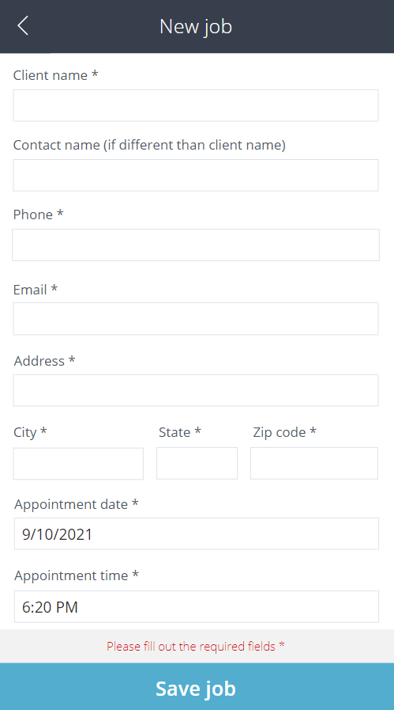](../media/cost-estimator-form.png#lightbox)

1. Provide a **Client name** and then select **Save job**.

1. Provide an **Email** and then select **Save job**.

1. Provide an **Address** and then select **Save job**.

1. Provide **City** and **State** information and then select **Save job**.

1. Provide **Zip code** and **Phone** information and then select **Save job**.

	> [!div class="mx-imgBorder"]
	> [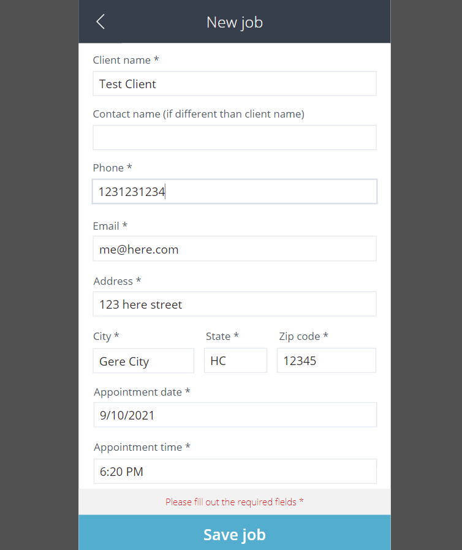](../media/cost-estimator-form-2.png#lightbox)

   The job should be saved.

1. Create another job, but this time, provide a contact name and then leave some of the required fields empty.

## Exercise 5: View Application Insights 

In this exercise, you will view Application Insights.

### Task: View Application Insights

In this task, you view Application Insights.

1.  Go to the [Microsoft Azure portal](https://portal.azure.com/?azure-portal=true) and make sure that you are in the correct environment.

1.  Select to open the **Insights_Lab** resource that you created.

	> [!div class="mx-imgBorder"]
	> [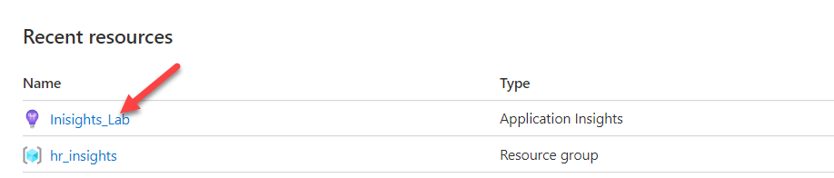](../media/insights-lab.png#lightbox)

1.  Scroll down to the **Usage** section and select **Users**.

	> [!div class="mx-imgBorder"]
	> [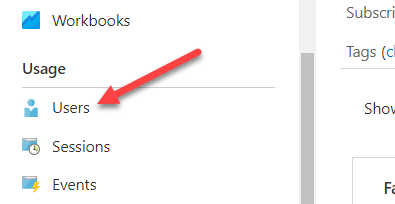](../media/users.png#lightbox)

1.  At least one user should display. If at least one user doesn't show, edit the app again, make sure that you provided the correct Instrumentation key, and then publish it again.

	> [!div class="mx-imgBorder"]
	> [](../media/user-count.png#lightbox)

1.  From the chart, scroll down and select **View more insights** in the lower left of the chart.

	> [!div class="mx-imgBorder"]
	> [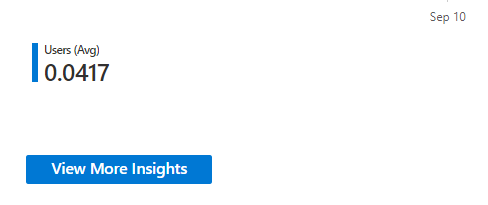](../media/view-more-insights.png#lightbox)

1. At least five events should show. If at least five events don't show, then return to Exercise 4 and complete it again. Wait for five minutes before continuing.

1.  Scroll down and select **View user timeline**.

	> [!div class="mx-imgBorder"]
	> [](../media/user-timeline.png#lightbox)

1.  Information about the use location and events should display. Select to expand the session.

	> [!div class="mx-imgBorder"]
	> [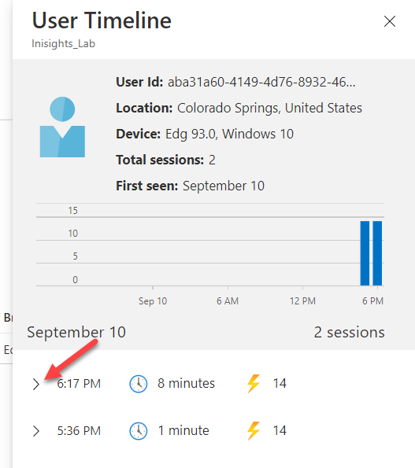](../media/expand-session.png#lightbox)

1.  View the listed events.

	> [!div class="mx-imgBorder"]
	> [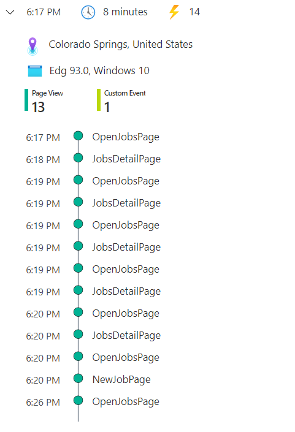](../media/session-events.png#lightbox)

1. Go to the **Monitoring** section and select **Logs**.

	> [!div class="mx-imgBorder"]
	> [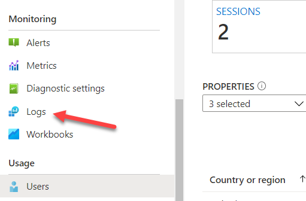](../media/logs.png#lightbox)

1. Close the **Queries** pop-up window.

1. Do not navigate away from this page.

## Exercise 6: Query the logs

In this exercise, you will query the logs.

### Task: Query the logs

In this task, you will query the logs.

1.  Type **pageViews** and then select **Run**.

	> [!div class="mx-imgBorder"]
	> [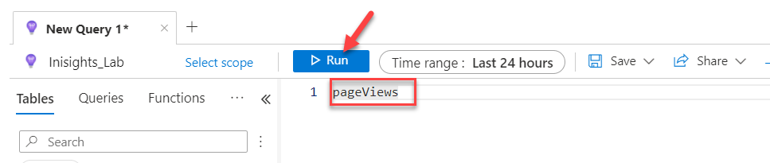](../media/run-query.png#lightbox)

1.  Go to the **Results** tab.

1.  Traces should display. Scroll up/down and left/right to view what was traced.

1.  Expand one of the results and then select to expand **customDimensions**.

	> [!div class="mx-imgBorder"]
	> [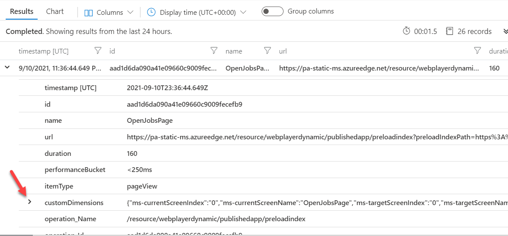](../media/expand-custom-dimensions.png#lightbox)

1.  Change the query to **traces** and then select **Run** again.

	> [!div class="mx-imgBorder"]
	> [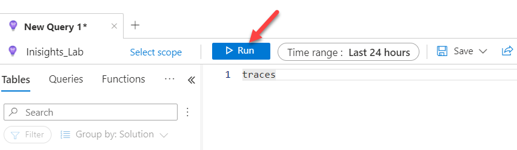](../media/run-query-2.png#lightbox)

1.  Expand one of the results and then select to expand **customDimensions**.

1.  Filter for validation logs. Replace the query with the following query logic and then select **Run**.

	```powerappsfl
	traces
	| where message =="Validation Failed"
	```

	> [!div class="mx-imgBorder"]
	> [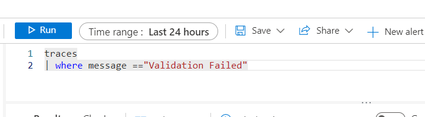](../media/query-traces.png#lightbox)

1.  Expand one of the results and then select to expand **customDimensions**.

	> [!div class="mx-imgBorder"]
	> [](../media/query-results.png#lightbox)

1.  Query for jobs without a contact name. Paste the following query and then select **Run**.

	> [!div class="mx-imgBorder"]
	> [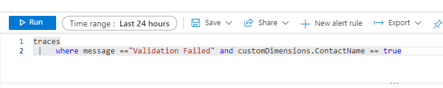](../media/query-traces-run.png#lightbox)

    You should get traces with no contact name.
