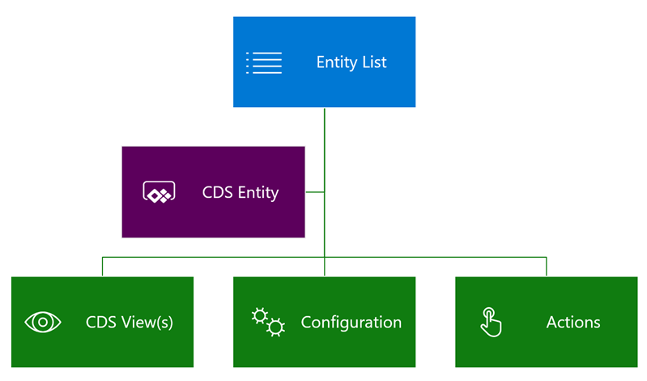
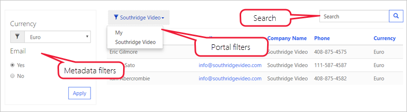

Add entity lists to web pages using Portal Studio where you can configure some of the main properties. Additional configuration options are available using the Portal Management app.

## Configure entity list

Portal Studio provides basic interface for creating and configuring entity lists. But not everything can be configured in Portal Studio. Makers can customize all entity list features and properties using the Portal Management app. To access entity lists in the Portal Management app:

1. Navigate to the [Power Apps maker portal](https://make.powerapps.com/?azure-portal=true).
1. In the top right-hand corner, use the environment selector to select the target environment.
1. From the list of Apps, locate and open the Portal Management app. (The app Type is **Model-driven**).
1. In the left navigation, select Entity Lists.
1. Open the list created earlier in Portal Studio.

> [!div class="mx-imgBorder"]
> 

An entity list can be as simple or as complicated as your business requirements specify. To begin with, the only required properties for the entity list, besides the name and the website, are the target **Entity Name** and one or more **Views**.

**Entity Lists** are highly configurable and have a lot of settings defining the list behavior. Lists can also include actions for the user to interact with the items on the list.

> [!div class="mx-imgBorder"]
> 

Let's take a quick look at some of the most common features and settings.

> [!NOTE]
> Most of the options that add interactive elements such as buttons, support customization of the elements in multiple languages. For example, if multiple views are enabled, name for each of the views in the view selector can be customized for each of the enabled portal languages.

### Views

Selected views define the Common Data Service entity fields, list layout, and the default sort order.

**Multiple views**. If more than one view is specified, a drop-down list renders to allow the user to switch between the views.

**Sorting and pagination**. Sorting is enabled on any of the displayed columns and the page size is configurable.

> [!div class="mx-imgBorder"]
> 

> [!NOTE]
> Entity lists include general properties **Web Page for Details View** and **Web Page for Create**. These properties are for backward compatibility only. The functionality is included as part of the View Actions and Item Actions grid configuration.

### Configuration

#### Filtering and searching

**Search**. When Quick Search is enabled, the portal renders a text search box. It is similar to the quick search feature in model-driven apps. Quick search runs across the view columns and lets users locate information within larger lists by using plain text input. Portal users can use the asterisk (*) wildcard character to search on partial text.

**Portal filters**. List data can be filtered by the current portal user, the current portal user's parent account, and the current portal website. This feature enables some common scenarios using configuration only, without the need for any additional development:

* List of product reviews left by the current user.
* List of the buildings on the campus for the department (account) of the current user.
* List of all draft pages for the current website only when multiple portals are provisioned.

If both the current portal user and current portal user's parent account filters are enabled, the portal renders a dropdown to allow the user to view their own data (My) or their parent account's data (account name is displayed).

**Metadata filters**. Another configuration-only feature. Records in the list can be filtered on any of the list columns, including ranges, lookups, optionsets, and even custom FetchXml expressions. Portal users have access to the interactive filtering panel when the entity list is rendered.

> [!div class="mx-imgBorder"]
> 

#### Display options

Views can render as traditional grid lists, calendars, or maps. Delivering list content as an OData feed is also supported.

> [!div class="mx-imgBorder"]
> 

Alternative views may require some additional configuration such as start and end date fields for a calendar, or latitude and longitude fields for a map.

> [!IMPORTANT]
> Maps and calendars require page templates that can render the view. When a starter portal is provisioned, **Rewrite** page templates like **Page** or **Full Page** support this functionality.  Pages using **web templates** render the default entity list view.

### Actions

Entity lists can have actions associated with them to enable per-list commands like **Create** and **Download** (as an Excel spreadsheet), or per-record commands like **View** or **Edit**, and to trigger workflows.

> [!div class="mx-imgBorder"]
> 

For more detailed information about entity list attributes and relationships, and how to use them to configure list behavior, see [About entity lists](https://docs.microsoft.com/powerapps/maker/portals/configure/entity-lists/?azure-portal=true).

Now that we've seen how to build and render entity lists, let's take a look at how portals can display and interact with individual records.
