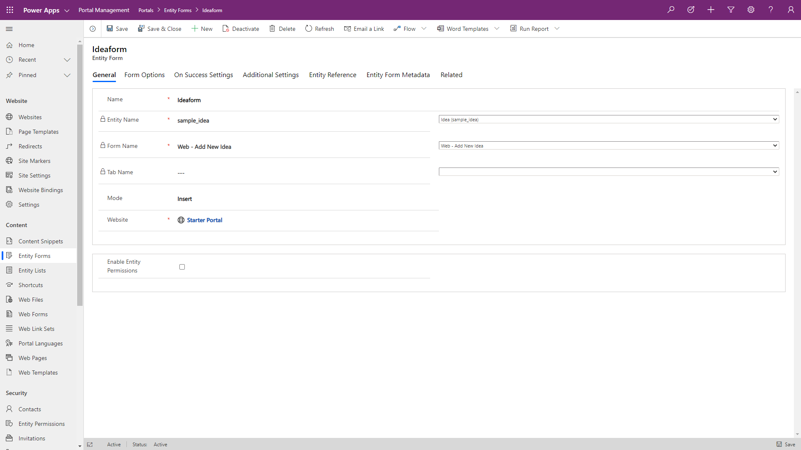

You can add an entity form to a webpage by using Power Apps portals Studio from the components menu. However, not all available settings can be configured in portals Studio. A number of additional configuration options are available for entity forms in the Portal Management app. To access an entity form in the Portal Management app:

1. Go to [Power Apps maker portal](https://make.powerapps.com/?azure-portal=true).
1. In the upper-right corner, use the environment selector to select the target environment.
1. From the **Apps** list, locate and open the Portal Management app. (The app type is Model-driven).
1. In the left navigation, select **Entity Forms**.
1. Open the form that was created previously in portals Studio.

> [!div class="mx-imgBorder"]
> [](../media/entity-form-meta-data.png#lightbox)

Forms can include actions for the user to interact with the record. Detailed configurations for each form element are available by using additional **Entity Form Metadata** records.

> [!div class="mx-imgBorder"]
> [](../media/entity-form-overview.png#lightbox)

## Configuration

The following sections describe different ways that you can configure entity forms.

### Form options

Most of the form options support customization of the Cascading Style Sheets (CSS) elements to change visual appearance. You can specify text elements such as labels, messages, and tooltips in multiple languages. For example, the default message after the form submission is "Saved," but you can customize the message for each of the enabled portal languages.

Other form options include:

- Enable CAPTCHA to prevent spamming on forms that are open to anonymous users.
- Control validation behavior, for example, whether to mark all fields as required regardless of the form setting.

See the [Form options](https://docs.microsoft.com/powerapps/maker/portals/configure/entity-forms#form-options/?azure-portal=true) documentation for a complete list of available options.

### On success settings

Behaviors on successful form submission options are to display a message or redirect to another page or URL. Displaying a message is common for "contact us" and similar forms where submissions are anonymous and repeatable. Redirect is used in scenarios where a portal user, typically authenticated, has been dealing with a list of records and views or has been editing some of them.

Configure the success message on the **Additional Settings** tab.

### Additional settings

Additional settings define more aspects of form behavior, including styling, translation of UI elements, and so on.

#### Actions

Because each entity form deals with an individual entity record, several actions are available for you to use to run against this record, for example **Update**, **Delete**, **Deactivate**, and so on. Configure these actions that are displayed at runtime as command buttons by selecting **Additional Settings > Action Button Configuration**. All commands include options to rename the buttons and change their placement on the form.

> [!TIP]
> Some of the settings and configuration options are hidden. Use the **Advanced settings** check box to display all available options for the form and individual actions. For example, to change the default success message, add the **Submit** action and select **Advanced settings**.

Other actions that you can configure include:

- **Associate Current Portal User on Insert** - Use these options to keep track of which portal contact created or updated the record. This feature creates a portal equivalent of `Created By` and `Modified By` fields in Common Data Service. You can also set parental relationships where applicable. For example, if a new account record is created, you might want to automatically set the current contact as a primary contact.

- **Add Attach File** - Several options are available for you to add a file upload control to your form. Configuration is flexible and supports multiple files, storage options, MIME type, and size restrictions (for example, you can restrict uploads to images up to 2MB in size).

- **Geolocation** - You can configure an entity form to display a map control that either displays an existing location as a pin on a map or that allows the user to specify a location. For more information, see [Add Geolocation](https://docs.microsoft.com/powerapps/maker/portals/configure/add-geolocation/?azure-portal=true).

The form's map control requires additional configuration to tell it what the various location fields are, to assign values to them, or to retrieve values from them. For more information, see [Geolocation configuration for entity forms](https://docs.microsoft.com/powerapps/maker/portals/configure/entity-forms#geolocation-configuration-for-entity-forms/?azure-portal=true).

> [!div class="mx-imgBorder"]
> [](../media/entity-form-geolocation.png#lightbox)

### Entity reference

Entity reference provides a way to associate the current record that is being created or updated with another target record. This feature is useful if you have multiple steps with multiple entity types and want to relate the resulting records or if the page is passed through a query string of a record ID that you want to associate.

For example, you might have an event page that displays information about an upcoming webinar. You want to include a registration button that redirects visitors to the registration page where the registration form is displayed. You can pass the event identifier in a query string and, when the registration form is submitted, you'll be able to automatically link the registration information to the event.

## Entity form metadata

**Entity form metadata** records allow you to control the appearance and behavior of individual form elements, including:

- The appearance of fields, sections, and tabs. For individual fields, define default values, validation behavior, and other aspects.
- Subgrids configuration allows you to define actions for related records, similar to entity list actions.
- Behavior of notes and timeline sections, and whether new records can be added. This feature is commonly used to allow portal users to enter comments about the record, for example, a case in progress.

> [!TIP]
> You can find some of the entity form documentation in the **Web Forms** section. For example, entity form metadata can be located under [Configure web form metadata for portals](https://docs.microsoft.com/powerapps/maker/portals/configure/configure-web-form-metadata/?azure-portal=true) and [Configure Web form subgrids for portals](https://docs.microsoft.com/powerapps/maker/portals/configure/configure-web-form-subgrid/?azure-portal=true) documentation pages in the **Web Forms** section.

## Add an entity form to your portal

An entity form defines the required behavior but does not contain information about how and where on the site the form should render. The two ways to render an entity form in a portal are:

- Explicitly specify the entity form as a target for an entity list action like **Create**, **Update**, or **Edit**. In this case, the form renders in a modal pop-up window. Certain limitations apply when the form is rendered in a pop-up window, for example, creating related records from subgrids is not available.
- Similar to an entity list, you can add an entity form component to a webpage from the portals studio. This action places a Liquid tag on the webpage copy to render the entity form.

```twig

```

> [!div class="mx-imgBorder"]
> [](../media/entity-form-liquid-tag.png#lightbox)

Because forms submit information back to the server for processing, you will have much less control over entity forms rendering as compared to entity lists.
