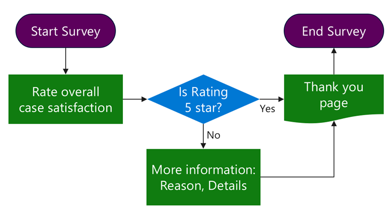

With the **Entity Forms** feature, users can access individual records within the portal. Often, Common Data Service records are too complex to present on a single page or data requirements exist that include multiple Common Data Service entities. The following sections consider scenarios where it is not effective or even possible to implement data capture on a portal by using entity forms.

## Surveys

Consider a scenario where you want to capture feedback from customers after a case is closed. To increase survey completion rates, the business decides to require no additional captured information if the customer gives the case handling a rating of 5 out of 5.

> [!div class="mx-imgBorder"]
> 

In this scenario, a web form allows you to implement two pages for information capture and to add branching logic.

When you are designing surveys, consider whether you can extend and use a built-in **Feedback** entity to capture entries, or whether creating a separate entity is more appropriate. In general, a **Feedback** entity is suitable for shorter, more targeted surveys like product or case feedback. For more information, see [Configure an entity for feedback/ratings](https://docs.microsoft.com/powerapps/maker/common-data-service/configure-entity-feedback).

## Complex data capture

In an implementation that involves complex data capture, the business accepts applications for online training. The process is selective, and the training is highly specialized and targets a specific audience. Applicants need to satisfy some prerequisites such as educational and employment requirements.

> [!div class="mx-imgBorder"]
> 

Applicants might not be fully aware of the requirements and might not have all required evidence up front. The application process needs to implement the ability to suspend and resume the application and to handle multiple file uploads. Multiple entities could also be involved. Basic information and identity validation steps update the contact record while the rest of the data is captured in a separate entity for the application process.

In this scenario, a web form is effective in implementing the wizard-style application process with a progress indicator and forward and back navigation.

When you are planning multi-step data capture, consider the following questions:

- Is the process streamlined or does conditional branching exist?
- What entities are involved in the process, and how are they related to each other?
- Does the portal user need to be authenticated prior to the process start?
- Are users allowed to suspend and resume the process?
- Is a user restricted to a single process, or are multiple processes allowed for each user?
- Do you need to handle notes or file uploads?
- Do you need to include multiple related records that display by using subgrids?

To implement these and similar processes, web forms extend the entity form concept to allow multi-step and multi-form interactions. Web forms allow you to build complex, multi-step forms including:

- Single or multi-step navigation
- Conditional branching
- Entry across a number of entities
- Custom requests that are chained together in a single flow

> [!NOTE]
> The **Web Forms** feature is configured in the Portal Management app and not through portals Studio.

## Common practices

Use web forms sparingly. Though more powerful, they are also more complex to create and maintain than entity forms. As you evaluate the complex business processes, analyze your data capture requirements. If you're dealing with a data entry process for a single entity that has numerous fields to capture, consider creating an entity form with multiple tabs and using the **Auto Generate Steps From Tabs** form option to automatically generate multi-screen data entry with **Next** and **Previous** buttons added as required.

Web forms work well when the processes involve branching, span multiple entities, or require suspend and resume functionality. In these scenarios, dividing the process into smaller steps makes it easier to implement and maintain.

Create a flowchart or a diagram for your process and enumerate the steps. Use a naming convention for the steps so that they can be easily identified, for example: 

1. Rating capture
2. Check the rating (condition)
3. Additional details

Because the steps usually need to point to the next step in the sequence, another good practice is to build the steps from last to first so that you can populate the lookups as you create the steps without the need to go back and revise.

No restrictions are on the next step in the sequence. Steps can point to one of the previous steps, including self-creating a loop. This technique is useful for a repeatable data entry, for example, **"Add another item?"** Make sure that you have a clean conditional exit from the loop.
