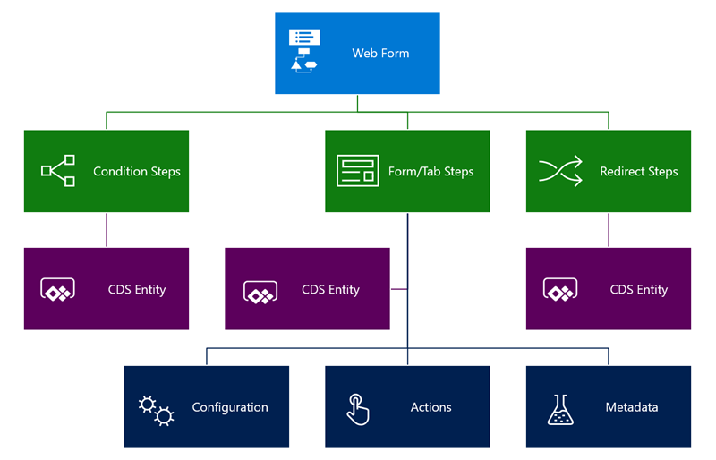
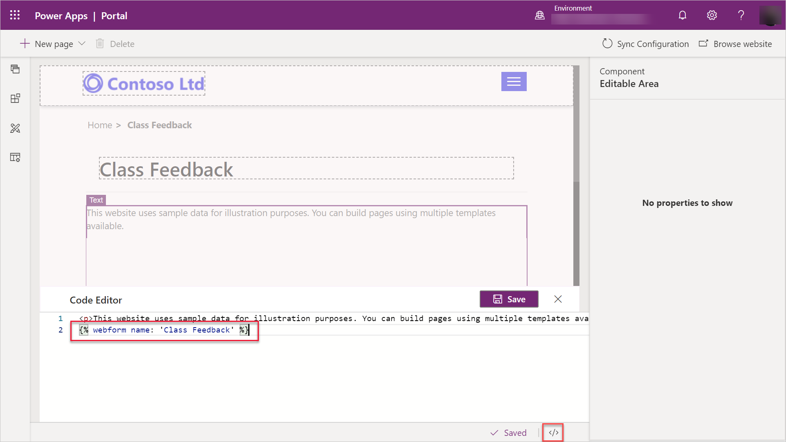

Web forms are configured in the Portal Management app, not through Portal Studio.

> [!div class="mx-imgBorder"]
> [](../media/web-form-overview.png#lightbox)

### Web form properties

Unlike an entity list or entity form, a web form is not linked to any particular CDS entity. Instead, a web form organizes web form steps and persists a history of a user's steps as web form session records. Options on the web form control top-level preferences for the multi-step process:

* **Start step** controls the initialization of the form within the portal.
* **Authentication** associates a form session with a portal user. Authenticated web forms capture portal user information and provide save and resume capabilities using sessions.
* **Expiration** defines how to handle stale saved sessions and expire them.
* **Progress indicator** is supported where the web form includes multiple steps.

### Web form steps

**Web form steps** provide the flow logic of the form’s user experience, such as steps and conditional branching. They also provide details regarding the rendering of a form and additional behavior.

> [!IMPORTANT]
> If **web form steps** are modified, previously created history data could now be stale. Any time steps are changed, we recommend that you delete all **web form session** records to eliminate a mismatch between the sequence of steps logged in the history and the current sequence.

Each **web form** presented on the portal has one or more steps. These steps share some common properties.

* **Target Entity**. The CDS entity selected for the step defines available fields and how step data is related to the previous and next steps in the sequence.
* **Next Step**. Each Step contains a pointer (a lookup) to the next step, with the exception of terminal steps. Terminal steps do not have a next step, and are the last step of the web form. With conditional branching, you can have multiple terminal steps.

* **Move Previous Permitted**. This property defines whether the step allows users to return to the previous step. Depending on the logic and the data captured, some steps are irreversible, while others, typically during the information capture sequence, allow navigation back and forth through the steps.

The following step types are available: **Load Form/Load Tab** step, **Redirect** step, and **Condition** step.

> [!NOTE]
> The condition step cannot be selected as the start step for a web form.

#### Load form and load tab step

The **Load Form** and **Load Tab** step types allow the step to act as an entity form within the overall web form process. They load a model-driven form with a similar set of options available as an **Entity Form**. For more details about configuring individual Load Form and Load Tab steps, see [Define a load form and load tab step type](https://docs.microsoft.com/powerapps/maker/portals/configure/load-form-step/?azure-portal=true).

Similar to the **entity form** configuration, the related **web form metadata** records contain additional behavior modification logic to change or override the functionality of form fields when rendered on the portal. You can use the **web form metadata** to redefine the behavior of individual fields, sections, tabs, subgrids, notes, and timelines.

#### Redirect step

The **Redirect** step type allows for a redirect of the user's browser session to another page in the portal or to an external URL. This is useful for seamlessly directing the process flow. Configuration is similar to Entity Form **On Success** settings. For more information, see [Add a redirect step type](https://docs.microsoft.com/powerapps/maker/portals/configure/add-redirect-step/?azure-portal=true).

#### Condition step

The **Condition** step type evaluates an expression. If the expression evaluates to true, then the next step is displayed. If the expression evaluates to false and if the **Next Step If Condition Fails** is specified, that step is displayed. Combining Condition and Redirect steps allows the creation of data-driven process flows.

> [!IMPORTANT]
> There is no design-time validation of expressions. If a specified logical expression is invalid, for example if it refers to a non-existent entity field, the step fails to execute and a generic portal error message is displayed to the user. Keep expressions simple and make sure that the syntax and field references are correct.

For more information about configuring Condition steps and expression syntax, see [Add a conditional step type](https://docs.microsoft.com/powerapps/maker/portals/configure/add-conditional-step/?azure-portal=true).

## Add a web form to your portal

A web form defines required behavior but does not contain any information regarding how and where on the website to render the form. The web form contains relationships to web pages and a start step in order to control the initialization of the form within the portal.

> [!NOTE]
> A web form cannot be selected as an action target, it can only be displayed on a web page.

The web form is not listed as a component in Portal Studio, but a maker can add the following Liquid tag to the page source code to display a pre-configured form in the Portal Management app.

```twig

```

> [!div class="mx-imgBorder"]
> [](../media/web-form-portal-studio.png#lightbox)

You can also select a web form as the value for a Web Form lookup on a web page. The page template associated with the web page uses that form definition to render the form.

> [!VIDEO https://www.microsoft.com/videoplayer/embed/RE4AoG8]

Now that we have covered the fundamental concepts of interacting with CDS data, let's see how we can use them together and start building robust and functional web apps instead of isolated web pages.
