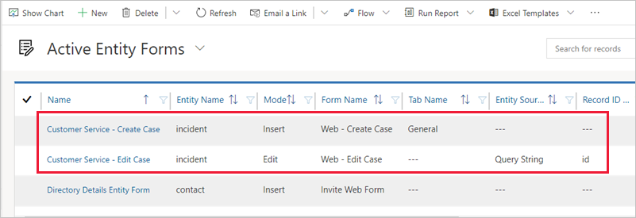
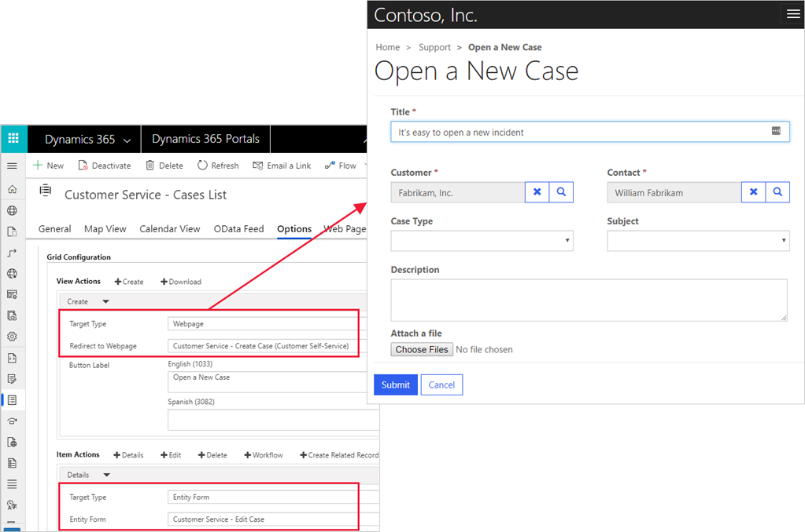
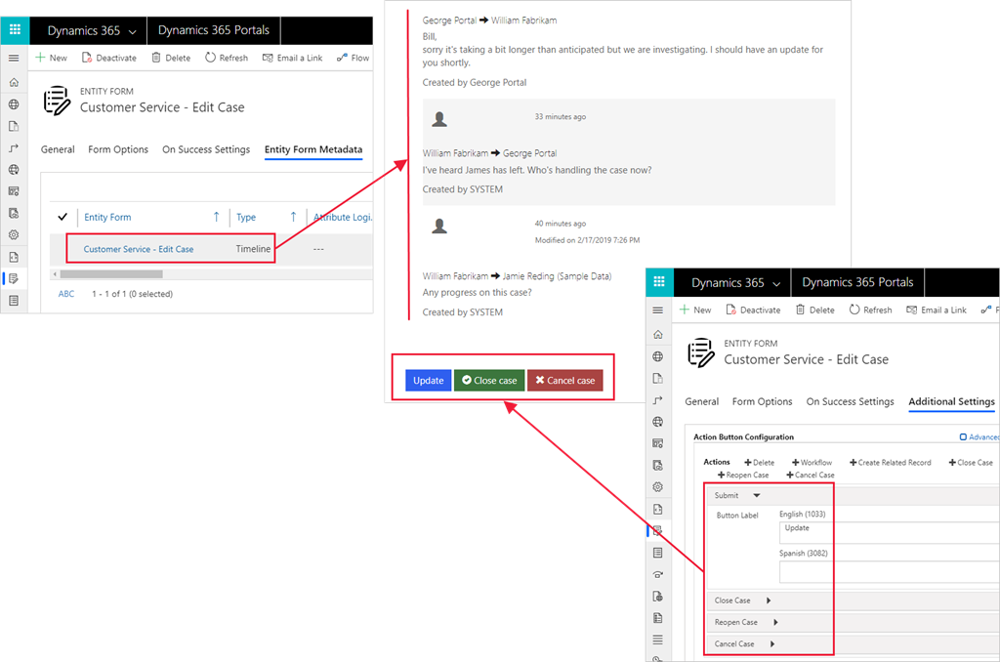

Entity lists, entity forms, and web forms are the fundamental building blocks that enable Common Data Service data interactions for portal users. Each of them can be used in isolation. An entity list can display a company directory and allow users to download it as an Excel spreadsheet. An entity form can capture leads on a "contact us" page. A web form can collect anonymous product feedback from site visitors.

However, the real power of the Power Apps portals platform is in how these components can be brought together by using data-driven configuration. The following sections explain how you can use the lists and forms together and start building robust and functional web apps instead of isolated web pages.

## Linking lists and forms

The **Help desk** application that is included in the portal templates contains the following features:

- **Entity forms** - Enable users to create a new case or edit an existing case. These forms use model-driven forms that are defined in a Common Data Service instance with the Dynamics 365 Service app.

   > [!div class="mx-imgBorder"]
   > 

- **Entity list** - Contains actions that are linked to entity forms.

   > [!div class="mx-imgBorder"]
   > 

- **Entity form** - Used for editing a case and also contains metadata to help refine the display of some fields and enable the **Timeline** subgrid for comments. The entity list includes case-specific actions such as **Close case**.

   > [!div class="mx-imgBorder"]
   > 

This entity list is related to the **Customer Service – Home** webpage and portal, where users are presented with a complete application in a user-friendly format.

You can use this pattern across any entity in Common Data Service and any new entity that might be required to meet a customer’s needs. The basic configuration includes:

- Entity lists that are built on one or more views.

- Entity forms to create and view individual records. If the record creation process is complicated, use a web form instead.

- Action button configuration on the entity list to use entity forms for create, update, and view operations.

- An **On Success** setting for the entity forms to redirect users back to the list, where applicable.

Basic configuration is usually sufficient to get started. You can enhance this configuration with additional settings.

## Advanced settings

Power Apps portals extend Common Data Service functionality to web audiences, but they are not a direct replacement for model-driven Power Apps. Power Apps portals use model-driven views and forms to define the layout and behavior of lists and forms on the website, but not all features of model-driven apps are available in portals.

No direct equivalents exist for client-side business rules or custom JavaScript. Only HTML and image web resources are supported, and HTML can't rely on scripts that communicate with the parent model-driven form. Another limitation is that connections, PCF controls, file datatype, and multi-select option sets are not supported.

You can use advanced settings to implement some of the features that do not map across from model-driven apps to portals.

### Commands

Entity lists, entity forms, and web forms include action button configuration that adds per-record actions. See [Entity form action configuration](https://docs.microsoft.com/powerapps/maker/portals/configure/entity-forms#entity-form-action-configuration/?azure-portal=true) and [Entity list configuration](https://docs.microsoft.com/powerapps/maker/portals/configure/entity-lists#entity-list-configuration/?azure-portal=true) for information about available actions.

Some commands include the **Filter Criteria** setting. You can use it to enter FetchXML that evaluates and hides the command if the selected record is not returned by the specified FetchXML query.

### Form metadata

Metadata settings for entity forms and web forms control the appearance and behavior of individual form elements, including fields, sections, tabs, subgrids, and notes.

For example, one of the most common techniques is to specify default values for individual fields. Often, this technique is used in combination with hidden fields, for example hiding a case origin and setting it to **Web**. That approach ensures that all cases that are created through the portal have the appropriate case origin set without the need for server-side reinforcement of the rule.

For more details about metadata configuration for forms, see [Configure web form metadata for portals](https://docs.microsoft.com/powerapps/maker/portals/configure/configure-web-form-metadata/?azure-portal=true).

### Form subgrids

If a model-driven form includes a subgrid of related records, the entity form and web forms display a read-only list of records by using the default view. To enable actions for the grid such as **Create**, **Update**, and **Delete**, you must configure those actions by using metadata configuration. Metadata configuration allows you to implement the portal equivalent of standard grid commands that are available in model-driven apps. For more information and step-by-step instructions, see [Configure Web form subgrids for portals](https://docs.microsoft.com/powerapps/maker/portals/configure/configure-web-form-subgrid/?azure-portal=true).

### Notes

Notes are supported by Power Apps portals out of the box. You can add notes to your forms on the portal by adding the **Notes** control to the model-driven form. You can configure the behavior of the **Notes** control by using metadata. For more information, see [Configure notes for entity forms and web forms on portals](https://docs.microsoft.com/powerapps/maker/portals/configure-notes/?azure-portal=true).

However, the **Notes** entity is not customizable in Common Data Service. As a result, certain restrictions are applied to supported functionality. For example, editing is only allowed by the note's author, no support is offered for an approval process, and visibility of notes is defined by the content by using a predefined naming convention. All these limitations restrict the use of notes in most scenarios.

Power Apps portals include alternative implementations for notes and attachments by using a portal comments custom activity.

> [!TIP]
> Consider replacing notes with portal comments if your implementation allows.

Portal comments can be shown on a form by using the **Timeline** control. No functional difference exists in the portal implementation of the **Notes** and **Timeline** controls, and the same metadata configuration is available. Using portal comments has the following benefits:

- Comment approval by using the **Send** command. Only sent or received comments are visible on the portal.

- Record of portal users who created and received the comment.

- Further customization of the portal comment entity is possible to implement additional business requirements.

For a reference to an implementation that uses portal comments, see how case comments are implemented on any of the portal templates.

## Extend with workflow

Forms and lists support extensibility by using classic Common Data Service workflows. This mechanism is flexible and powerful in exposing additional business functionality. You can define a classic Common Data Service workflow for the target entity and add a workflow action button.

Real-time and background workflows are supported, and you can configure the action button to refresh the page or redirect to the destination of your choice after the workflow is called.

For example, you could add a custom **Email Update** button to the case form that invokes a classic workflow to send case details and notes history to the current portal user by email.
