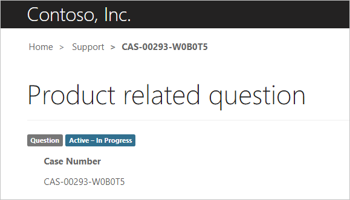
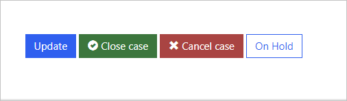
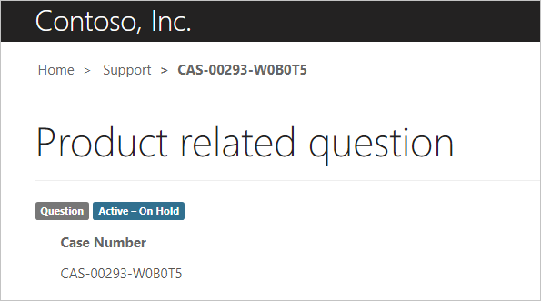
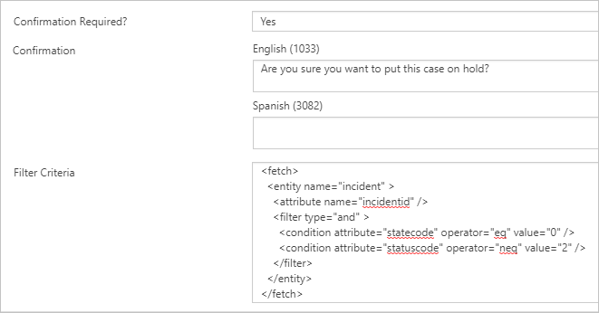

The purpose of this hands-on lab is to introduce the process of extending entity forms with additional actions.

Exercises work best when you have sample data to work with. Depending on the environment that you are working with, you might want to install sample data to assist with exercises. Power Platform does provide the ability to add sample data as needed. If the environment that you are working in does not have sample data installed, follow the steps in the [Add or remove sample data](https://docs.microsoft.com/power-platform/admin/add-remove-sample-data/?azure-portal=true) documentation to install sample data into your environment.

## Learning objectives

At the end of these exercises, you will be able to:

- Create a new workflow for a case entity.
- Configure a new workflow action for entity forms.
- Add a user prompt for a workflow action.
- Apply a conditional filter to an action button.

**Estimated time to complete this exercise:** 15 to 20 minutes

### Prerequisites

The prerequisites for performing tasks in this exercise are:

- System Administrator access to a Common Data Service instance with the Dynamics 365 Customer Service app installed.

- A provisioned Customer self-service, Community, or Partner portal template. If you do not have a Power Apps portal available, follow the [Create Portal](https://docs.microsoft.com/powerapps/maker/portals/create-portal/?azure-portal=true) instructions to create one.

## Scenario

Your organization has provisioned a Power Apps portal template to extend the case management capabilities of the Dynamics 365 Customer Service app.

The business wants to enable customers to place an active case on hold, with the following parameters:

- When a portal user presses the button, they should receive a confirmation message.
- Only active cases that are not already on hold should display the interface to portal users.

To finish the exercise, complete the following tasks:

1. Create a real-time workflow for the case entity that sets the case status to **On Hold**.
1. Add a workflow action button to the existing case edit form.
1. Add a confirmation message.
1. Add filter criteria to show the button only for active cases that are not on hold.


### Create a workflow process

Before you enable additional actions for the entity form, you need to create a workflow that is called by the form. Choose to create a real-time workflow for immediate visual feedback on the entity form.

1. Open the [Power Apps maker portal](https://make.powerapps.com/?azure-portal=true) and sign in.
1. Make sure that the selected environment is the one with the portal solution installed.
1. Select **Solutions**.
1. Select **Common Data Service Default Solution**.
1. Select the ellipsis (**...**) button and then select **Switch to classic**.
1. In the new window that opens, select **Processes**.
1. Select **New**.
1. Enter the following values:
   - **Process name** - Case On Hold
   - **Category** - Workflow
   - **Run this workflow in the background** - Clear this option
   - **Entity** - Case
1. Select **OK**.
1. Select **As an on-demand process**.
1. Clear **Record is created**.
1. Select **Add Step > Change Status**.
1. Change the record status to **On Hold**.
1. Select **Activate**.
1. Select **Close**.

### Create an action button

After the workflow has been created, you can add a workflow action button to the case entity form and configure this button to call the workflow.

1. Go to the [Power Apps maker portal](https://make.powerapps.com/?azure-portal=true).
1. Make sure that the correct environment is selected in the environment selector in the upper-right corner.
1. From the **Apps** list, locate and open the Portal Management app (Type = Model-driven).
1. Select **Entity Forms**.
1. Select **Customer Service - Edit Case**.
1. Select the **Additional Settings** tab.
1. Press **+ Workflow**.
1. Enter the following values:
   - **Workflow**: Select Case on hold
   - **Button Label**: On Hold
1. Select **Save**.
1. Do not close the window.

#### Test

To test that your new workflow action button works, follow these steps:

1. Open your portal in a new browser window: `https://yourportal.powerappsportals.com`.
1. Sign in as an existing customer.
1. If you do not have a customer account, follow these steps in the Portal Management app:
   1. Select **Contacts**.
   1. Select **New**.
   1. Switch to the **Portal Contact** form.
   1. Enter your name of choice.
   1. Select **Web Authentication**.
   1. Enter the username of your choice.
   1. Select **Login Enabled**.
   1. Select **Save**.
   1. Select **Change Password** and enter the new password of your choice.
   1. Add the **Authenticated Users** web role to the contact record.
   1. Sign out as a system administrator.
   1. Sign in as the new user.
1. Select **Support** on the top menu bar.
1. Select an existing case. If no existing cases exist, create and save a new case record.
  
   The case should be **Active - In Progress**.

   > [!div class="mx-imgBorder"]
   > [](../media/case-active.png#lightbox)

   At the bottom of the case window is a new **On Hold** button.

   > [!div class="mx-imgBorder"]
   > [](../media/hold-button.png#lightbox)

1. Select the **On Hold** button. A message stating, "The workflow has been initiated" will display.
1. The window will refresh and the case status will change to **Active - On Hold**.

   > [!div class="mx-imgBorder"]
   > [](../media/case-hold.png#lightbox)

1. Scroll down and verify that the **On Hold** button is still present.

### Enhance the action button

Having the workflow button visible at all times does not make sense in certain scenarios, such as for disabled cases. You can enter additional information to enhance the user experience.

1. Switch to the Portal Management app.
1. Select **Entity Forms**.
1. Select **Customer Service - Edit Case**.
1. Select the **Additional Settings** tab.
1. Select **Advanced Settings** and locate the **Workflow** action.
1. Enter the following values:
   - **Confirmation required** - Yes
   - **Confirmation** - Are you sure you want to put this case on hold?
1. In the **Filter Criteria** box, copy and paste the following XML:

   ```xml
   <fetch>
   <entity name="incident" >
      <attribute name="incidentid" />
      <filter type="and" >
         <condition attribute="statecode" operator="eq" value="0" />
         <condition attribute="statuscode" operator="neq" value="2" />
      </filter>
   </entity>
   </fetch>
   ```

   This FetchXML ensures that the button is only visible when the case is active (`statecode eq 0 (Active)`) and the status reason field is not **On Hold** (`statuscode neq 2 (On Hold)`).

   > [!div class="mx-imgBorder"]
   > [](../media/button-enhancement.png#lightbox)

1. Select **Save**.

#### Test the action button

1. Open the portal and sign in as a user.
1. Select **Support**.
1. Create a new case and enter data of your choice.
1. Select **Save**.
1. Confirm that the status is **Active - In Progress** and that the **On Hold** button is visible.
1. Select **On Hold**. The confirmation will display.

   > [!div class="mx-imgBorder"]
   > [](../media/confirmation.png#lightbox)

1. Select **Cancel**.
1. Select **Close case** and then select **Yes** when prompted.

The case status should state **Resolved - Problem Solved**. Only the **Reopen Case** button should be visible.

## Additional exercise

You might want to add a **Resume** workflow and an action button to the form. The action button should only be visible when the case is on hold.

This exercise shows how Power Apps portals helps you extend entity forms, effectively converting simple data entry forms into a part of a web app.
