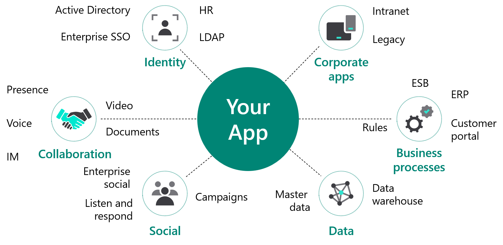
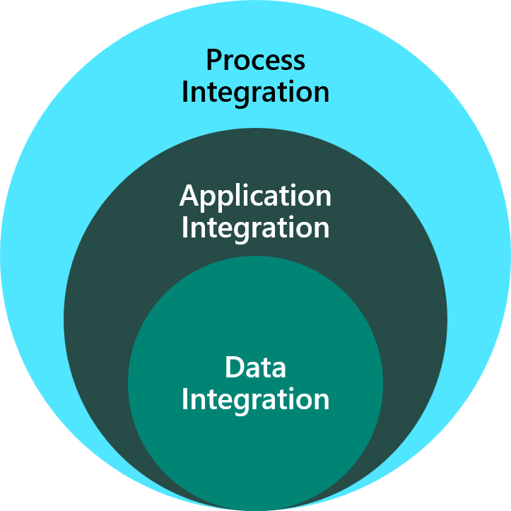

Solution architects lead the identification of integrations in and out of Microsoft Power Platform. The solution architect will guide how implementations are designed as part of the overall architecture.

In this module, you will learn the different ways to integrate with Microsoft Power Platform and the solution architect's role in integration. Additionally, you will:

- Learn about integration and why it's needed.
- Discover Microsoft Power Platform features that enable integration.
- Use the capabilities of Microsoft Azure.

The business app that you are building is often part of a broader scope. While in the user's perspective, the app connects to various other enterprise systems, so the app could be a participant in a larger enterprise process flow that spans multiple enterprise systems.

## Integration overview

Integration is the connecting of one or more parts or components of systems to create a more unified experience or to ensure a more consistent outcome of a process. Integration results in a system that acts as one, not as individual parts that run on their own agenda.

Consider integration as the stitching together of pieces to create a greater whole. Integration allows data integrity, better user adoption, higher ROI, and so on.

Different components can be connected or disconnected, and integration is the process of determining how best to get them to work together in a coordinated way.

## Why integration is necessary

Six common variables are involved in determining the necessity of integration. Each variable defines an inherent problem, which allows for rectification through integration.

- **Usability** - From the user's perspective, a common problem in enterprises is the variety of different systems that they need to interact with to perform a job. Through integration, the tasks that a particular user needs to perform can be provided in a single, seamless, user interface. Training costs and time to perform a task can be decreased, which can also lead to greater consistency and customer satisfaction.

- **Volume** - Where data volumes are large, or are changing regularly, it can be problematic to duplicate. Through integration, rather than by copying or migration, the data can be accessed from a common place.

- **Real-time** - It is important to have access to up-to-date information about customers. Because customer data can be managed by different teams or as part of a regulated process, it might not be possible to use the same system to support both business needs. Integration can make it possible to access up-to-date data in real-time, ensuring accuracy every time.

- **Cost** - Some functionality is cheaper to access externally rather than reproduce. One example is address lookup. Integration to an external provider can be cheaper than replicating the capability from the raw postal service source data within the system.

- **Duplication** - Consistency of data is critical. One example is the allocation of service resources to tasks. Duplication might result in double-booking, which will result in an inability to deliver the required service. Though this capability might be required across multiple business areas, it is not uncommon for a single system to manage the allocation and offer that consistent service to other systems, an ability that integration can provide.

- **Reuse** - Reimplementing common functionality is expensive, particularly when ongoing maintenance and regression testing of enhancements are considered. An approach where common functionality is reused, rather than being reimplemented, can often be cheaper and can lead to greater consistency. Integration can provide this vital undertaking.

## Types of integration

Three types of integration are:

- **Data** - Combining data from different sources and presenting the user with a unified view.
- **Application** - A higher-level integration that connects at the application layer.
- **Process** - Combining multiple disparate systems, and each of those systems is part of an overall business function.

## How solution architects can help

The solution architect can help with integration in the following ways:

- Identify where integration is required.
- Lead the design effort on how integrations are implemented and then ensure that integrations fit within the overall architecture.
- Lead the evaluation efforts of integration tools from other sources.
- Ensure that the integration doesn’t make the solution too fragile.
- Consider integrations as part of the overall disaster recovery plan.

When evaluating integrations, the solution architect should always consider *the cost of doing nothing*. To figure out whether it is worth integrating data, applications, or processes, the solution architect must first understand the cost of not solving the problem. As a part of defining the business value that you hope to achieve from integrating with your Microsoft Power Platform solution, you should get a better understanding of what it is costing the organization to solve the problem in the current manner or what it would cost to perform manually. In other words, measure the cost of doing nothing. A key question to ask is how often this situation happens. You might have experienced situations where an integration has taken six months to develop, only for it to synchronize a small number of customer details a day.
