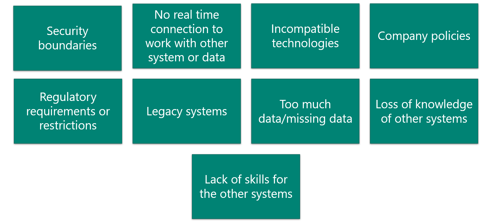
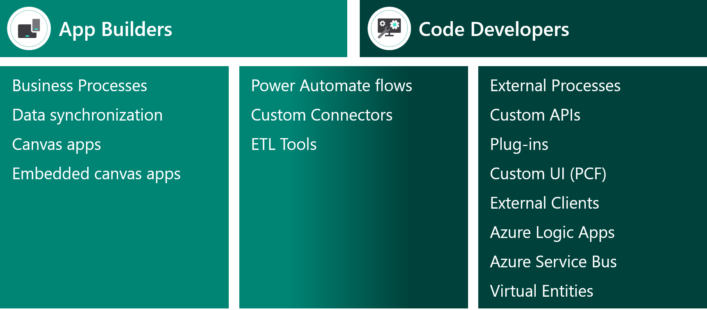

Integrations can be expensive, complex, and occasionally challenging.

## Common challenges

The following diagram shows common integration challenges that a solution architect might encounter.

The solution architect must ensure that integrations are not brittle; tightly-coupled systems are hard to change.

## Influencers

Factors that will influence how you design integrations include:

- Volume of data that is being moved or accessed
- Quality of data
- Latency to access or work with other systems
- Security requirements
- Reliability requirements
- Impact of duplication of data or functionality
- Fit with existing Microsoft Power Platform capability
- Cost, time, and resources
- Internal politics

## Causes of failure

Consider the projects that you have worked on that experienced issues with integrations and what might have caused the integrations to fail.

The following factors will cause integrations to fail:

- Underestimating the complexity of integrating
- Poor user experience with the integrated solution
- Increasing cohesion of components, which creates a fragile system
- Not knowing what Microsoft Power Platform does or doesn't do well
- Not knowing what the other system does or doesn't do well
- Source data is of poor quality or is full of duplicates and dirty data
- Not being clear regarding what the system of record is
- Having multiple parties involved and not coordinating the building of the integrations
- Other parties who are building integrations are unfamiliar with Microsoft Power Platform

## Design for resilience

The solution architect needs to ensure that integrations are designed to be resilient:

- Expect transient errors with your integrations.
- Include escalating retry logic with the circuit breaker pattern to eventually fail.
- Use queuing or other loosely coupled techniques to increase resiliency.
- Include in your designs how to handle common expected failures.

## Integration design process

Every situation is unique, and you will encounter a variety of integration scenarios on projects. While it is useful to be introduced to and learn how to integrate a technology, it is more important that you develop skills to evaluate real project needs. By using the principals, ideas, and concepts, you can navigate through complex integration challenges. The following diagram shows the steps that you should follow in the integration process.

The design process is a balance, and you won't have a right or wrong answer for a solution. When considering the options for integration, the solution architect needs to assess the skills that are available in the team and the breadth of Microsoft Power Platform capabilities.

In some cases, it is cheaper to hire staff than to build the integration. Technologists often overlook non-technical solutions that are still viable. You should also consider whether the integration is necessary and if it needs to be real-time.

> [!IMPORTANT]
> The solution architect should also consider using Power Automate Desktop flows to perform integrations at the user interface level.

## Data integration

When evaluating integrations, solution architects should categorize each piece of data because it will guide them toward the appropriate integration solution. 

Ways that you can categorize data include:

- **Volatility** - Determine if the data is highly volatile, that is, if it is rapidly changing.
- **Volume** - Assess how large the volume of data is.
- **Time sensitive** - Decide if the data needs to be real-time.
- **Batch** - Evaluate whether the data must be processed in batch or if it must be processed on a transaction-by-transaction basis.
- **Regulated** - Asses if the data contains personal information or if restrictions are in place on where the data can be stored.
- **Licensed** - Determine if the data is licensed and if limitations are on data use.
