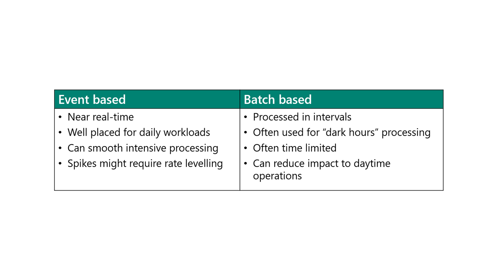
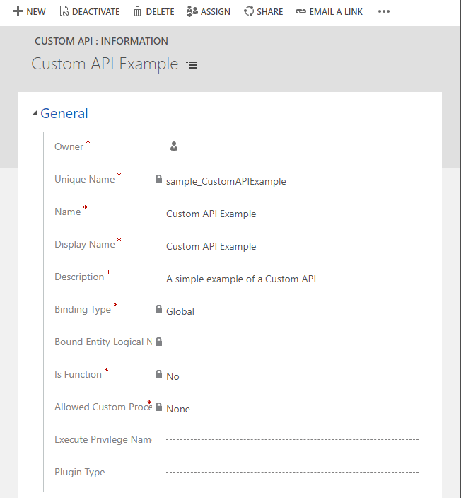

Inbound data integration focuses on getting data into Microsoft Dataverse so that it is available to apps and flows.

## API

The web API is one of two web services that you can use to work with data and metadata in Dataverse. The other is the Organization Service.

Dataverse Web API provides a development experience that can be used across a variety of programming languages, platforms, and devices. Dataverse Web API implements the OData (Open Data Protocol), version 4.0, an OASIS standard for building and consuming RESTful APIs.

All data operations that use the Dataverse APIs, whether using the Web API or the Organization Service, are converted into messages that follow the platform's event framework. This framework allows processes, such as classic workflow and Power Automate cloud flows, to be initiated and allows developers to add custom plug-in steps that can be run to perform validation and further processing.

## Event vs. batch

Solution architects should categorize the data that is required in Dataverse. A key category is event or batch based. The following diagram compares these two approaches.

## Push pattern

When considering getting data into Dataverse, you will need to determine if data will be pushed into Dataverse by another system or if it will be pulled into Dataverse.

The general push pattern for inbound integration into Dataverse is to use the web API with the other system making the web API calls. However, allowing other systems to write directly into Dataverse requires the other systems to understand the data model in Dataverse and how the processes in Microsoft Power Platform solution operate. It's a good idea to create a layer for external systems to access the following entities:

- **Event-based processing** - Power Automate and Microsoft Azure Logic Apps are good approaches for individual transactions that are triggered by changes in the source system.
- **Batch processing** - Batch is often abstracted by tooling from other sources such as KingswaySoft or by using Microsoft Azure Data Factory.
- **Microsoft Azure Functions** - Azure Functions can abstract the need to implement business logic within your enterprise integration layer.
- **Custom API** - Create your own API for other systems to call.

> [!NOTE]
> Power Automate is often used to synchronize data between Dataverse environments.

When designing integration solutions, you need to consider using multiple threads to overcome latency effects and service limits.

## Pull pattern

The pull pattern can be effective for data augmentation. You can use the pull pattern to get the data from an external system on demand when rows are retrieved in Dataverse. Virtual entities can be a good fit for this pattern.

## Alternate keys

In Dataverse tables, rows are uniquely identified by using a GUID. Other systems that need to integrate with Dataverse will need to record the GUID in the database or will have to query Dataverse to find the row that needs to be updated. This approach is inefficient. Dataverse provides the capability to create alternate keys on tables.

An alternate key allows external systems that need to read and write rows to efficiently access the rows without having to first run a query to find the GUID. For example, accounting systems often have an alphanumeric account number that uniquely identifies the account. You can define the account number column in the Dataverse table to be an alternate key so that the accounting system can read and write the account by using the data that it holds in its own system.

## Upsert

You can reduce the complexity that is involved with data integration scenarios by using the Upsert message. When pushing data into Microsoft Dataverse from an external system, you might not know if a record already exists in Dataverse. In such cases, you will not know if you should use an **Update** or a **Create** operation. You first need to perform a query to determine if it exists before performing the appropriate operation. You can now reduce this complexity and load data into Dataverse more efficiently by using the Upsert message.

Upsert is used with Alternate keys. You need to provide enough information in the upsert call, and Dataverse will look up the row and either create or update the row, as shown in the following diagram.

> 

## Custom APIs

Custom APIs are newly released functionalities that allow you to abstract and consolidate a group of operations into an API that the other systems can call.

You can define custom APIs by creating a custom API record, as shown in the following screenshot.

A custom API can be a function or an action. You should use a function, which is a GET request, to get information, and an action when you want to modify data.

You can use a plug-in to perform the actual data operation for the custom API.

> [!NOTE]
> For more information, see [Create and use Custom APIs](https://docs.microsoft.com/powerapps/developer/data-platform/custom-api).

## Azure Functions

Microsoft Azure Functions enables developers to create complex, reusable custom logic and integrate with the other systems. Azure Functions can be consumed with webhooks or wrapped inside a custom connector. By using Azure Functions, developers can create reusable components for functional consultants and app makers to use in their apps and flows. Additionally, other applications can access Azure Functions to push and pull data into Dataverse. Azure Functions can connect to Dataverse and access the data.

You can create an API for your solution by using Azure Functions to create custom server-side logic and expose the API through Microsoft Azure API Management.
