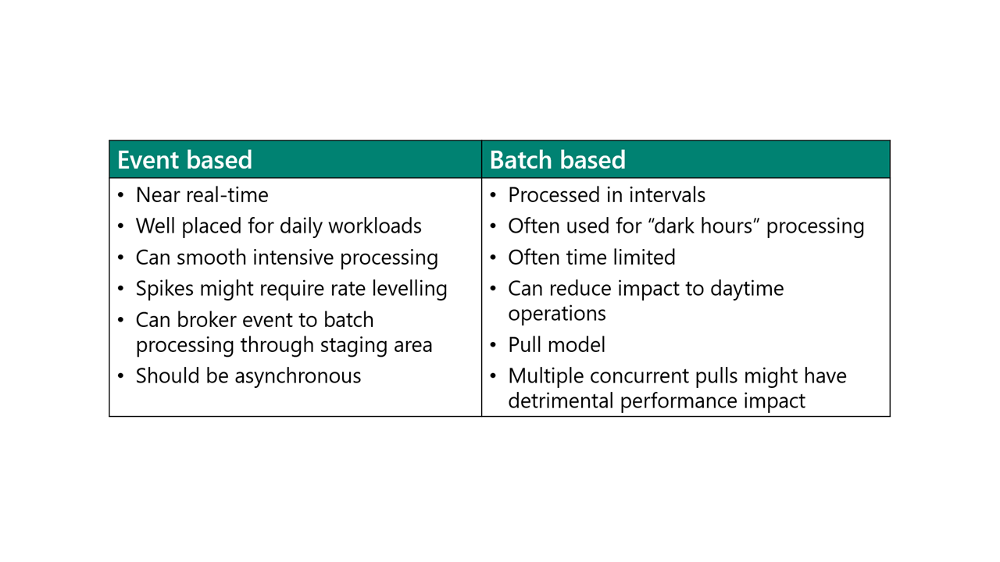
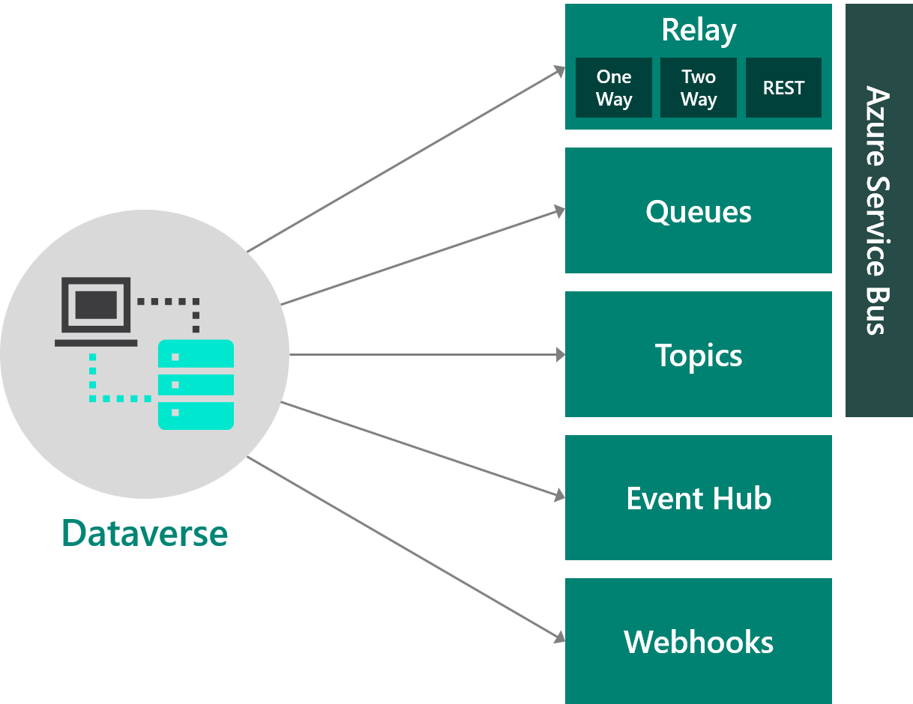
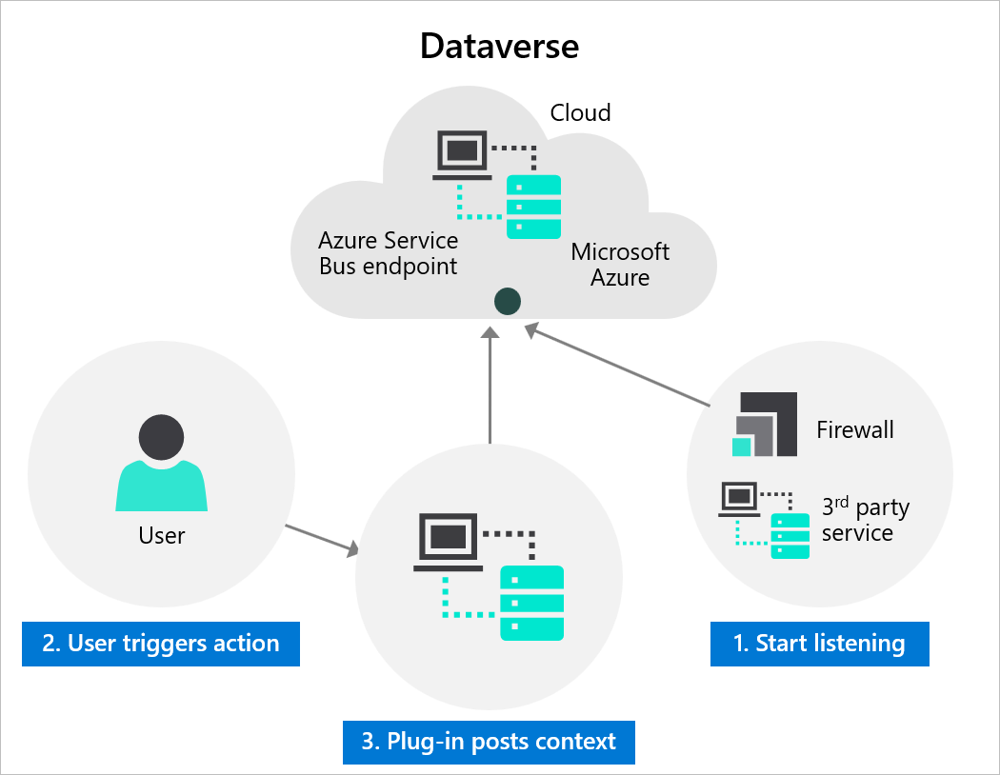
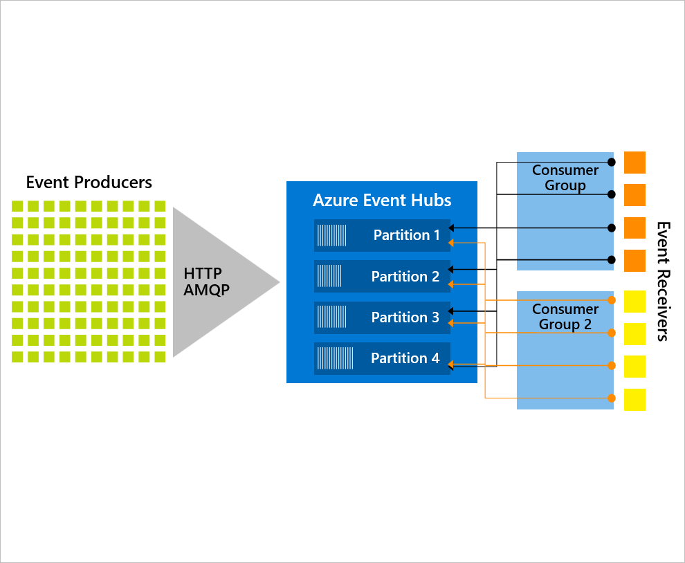

Outbound data integration takes data from Microsoft Dataverse and makes it available to other systems.

## Dataverse event publishing

Dataverse provides an event model for integrating with other systems. Dataverse supports triggering of custom code and external actions when events are detected in the platform. This event model is known as the Event Framework. The Event Framework provides you with the capability to register custom code to be run in response to specific events. Typically, you would use the Event Framework to trigger custom plug-in code, but you can also use it for integrations with other systems.

To use the Event Framework for your solution, make sure that you're familiar with the following concepts:

- The events that are available
- How the event is processed
- What kind of data is available when the event occurs
- What time and resource constraints apply
- How to monitor performance

Additionally, you can specify the different stages:

- **Pre-Validation** - For the initial operation, this stage will occur before the main system operation. This stage provides an opportunity for you to include logic to cancel the operation before the database transaction. This stage occurs before any security checks are performed to verify that the calling or signed-in user has the correct permission to perform the intended operation.
- **Pre-Operation** - Occurs before the main system operation and within the database transaction. If you want to change values for table that is included in the message, you should do it in this stage.
- **Main-Operation** - For internal use only except for custom API and custom virtual table data providers.
- **Post-Operation** - Occurs after the main system operation and within the database transaction. Use this stage to modify properties of the message before it is returned to the caller.

> [!NOTE]
> Integration typically uses the Post-Operation stage and the asynchronous running mode.

The Event Framework can trigger:

- Plug-ins
- Classic workflows
- Power Automate cloud flows
- Messages to Azure Service Bus and Azure Event Hub
- Webhooks

## Event vs. Batch

Solution architects should categorize the data that is required in Dataverse. A key category is event or batch-based. The following diagram compares these two approaches.

## Push pattern

Event-based processing is associated with the push pattern. An event in Dataverse runs a process that connects to the external system and updates the data in that system. When linking directly to another system, solution architects need to ensure that they are not creating performance issues for both systems and are not creating a tightly coupled system.

> [!IMPORTANT]
> If using plug-ins, the solution architect needs to be aware of the two-minute time limit for plug-in processing.

## Pull pattern

The pull pattern uses external events from the other system or a scheduled trigger to retrieve a set of data from Dataverse and process the set of data that is returned.

> [!NOTE]
> The Recurrence trigger in Power Automate is often used in the pull pattern.

## Change tracking

The change tracking feature in Dataverse provides a way for you to keep the data synchronized in an efficient manner by detecting what data has changed since the data last synchronized. Without change tracking, it is difficult to build a reliable and efficient mechanism to determine what rows have changed in Dataverse.

When you are retrieving data with change tracking, a set of delta changes is returned by Dataverse.

> [!NOTE]
> Change tracking must be enabled on the table.

## Azure integration

The Dataverse platform supports outbound integration with Azure. Dataverse can send messages to Azure services by using the Event Framework, as shown in the following diagram.

## Service Bus

One service that Dataverse can integrate with is Microsoft Azure Service Bus.

You can use Azure Service Bus to decouple applications and services from each other, which provides the following benefits:

- Load-balancing work across competing workers
- Routing and transferring of data are more secure and control across service and application boundaries
- Coordination of transactional work that requires a high degree of reliability.

Azure Service Bus can provide a more secure and reliable communication channel between Dataverse runtime data and external cloud-based or on-premises line-of-business (LOB) applications, as shown in the following diagram.

As shown in the previous image, an Azure Service Bus resource has been created in Azure. A listener process has been developed that waits for messages to be posted onto an Azure Service Bus. In Dataverse, the Azure Service Bus endpoint has been registered by using the Plug-in Registration tool, and a step has been defined that posts the plug-in context to the Service Bus as a message when an event occurs, such as a row being created in Dataverse.

The listener process will automatically be able to read the message and extract the details of the event from the context (which table, ID of the row, user who triggered the event, the list of data changes, and so on) and perform the appropriate processing on this data.

The listener process can be:

- A C# program that runs on an on-premises system that polls the Service Bus for new messages.
- An app in Microsoft Azure Logic Apps that is triggered automatically when a new message is posted.
- A function in Microsoft Azure Functions that is triggered automatically when a new message is posted.

The integration with Azure Service Bus is useful when the likelihood exists that the other system is not available or is limited in its ability to process high volumes of messages because the messages can be queued, allowing the receiving system to process the messages as fast as they can.

You can post a message to the Service Bus in one of two ways:

- **No code** - Create a step for the event in Dataverse against the Azure Service Bus endpoint. The plug-in implementation context is posted to the Service Bus.
- **Code** - Create and register a plug-in in Dataverse that calls the Azure Service Bus endpoint. The message that is posted to the Service Bus can be customized.

Azure Service Bus can be used to:

- Build reliable and elastic cloud apps with messaging.
- Protect your application from temporary peaks.
- Distribute messages to multiple independent operating systems.
- Decouple your applications from each other.
- Create ordered messaging that is scaled to multiple readers.

## Relay

Microsoft Azure Relay is a service that was previously part of Azure Service Bus but has been separated into its own service.

Azure Relay service facilitates tight integration between systems by helping you more securely expose services that reside within a corporate enterprise network to the public cloud. You can expose the services without opening a firewall connection and without requiring intrusive changes to a corporate network infrastructure.

Azure Relay supports the following scenarios between on-premises services and applications that are running in the cloud or in another on-premises environment:

- Traditional one-way, request/response, and peer-to-peer communication
- Event distribution at internet-scope to enable publish/subscribe scenarios
- Bi-directional and unbuffered socket communication across network boundaries

> [!IMPORTANT]
> Azure Relay allows two systems to be connected without needing a direct connection. Azure Relay follows a request/response pattern so that the calling system can receive a response such as a piece of data or a success message from the other system.

## Event Hubs

Microsoft Azure Event Hubs is a big data-streaming platform and event ingestion service. It can receive and process millions of events each second. Data that is sent to an event hub can be transformed and stored by using any real-time analytics provider or batching/storage adapters.

Several other systems can subscribe to events that are processed by Event Hubs. Additionally, Event Hubs can filter events by using consumer groups so that systems only receive the events that are relevant to them at their own pace.

> [!NOTE]
> Topics in Azure Service Bus provide a similar method for systems to subscribe to filtered messages.

You should consider using Azure Event Hubs if you require multiple subscribers.

An example of using Event Hubs is to publish events to stream analytics that in turn populate a Microsoft Power BI dataset for visualization.

## Webhooks and Azure Functions

Dataverse supports the calling of a webhook with the Event Framework. Webhooks are registered with the Plug-in Registration tool and can be triggered by a specified event in a step.

Webhooks is a lightweight HTTP pattern for connecting web APIs and services with a publish/subscribe model. Webhook senders notify receivers about events by making requests to receiver endpoints with some information about the events. Webhooks are simply a pattern that can be applied by using a wide range of technologies. You are not required to use specific frameworks, platforms, or programming languages.

Webhooks enable developers to integrate Dataverse data with their own custom code that is hosted on external services. By using the WebHooks model, you can secure your endpoint by using an authentication header or query string parameter keys. This approach is simpler than the SAS authentication model that is used by Azure Service Bus integration.

Azure Functions provides an excellent way to deliver a solution by using webhooks.

When deciding between the WebHooks model and the Azure Service Bus integration, you should keep the following factors in mind:

- Azure Service Bus works for high scale processing and provides a full queueing mechanism if Dataverse is pushing many events.
- Webhooks can only scale to the point at which your hosted web service can handle the messages.
- Webhooks enables synchronous and asynchronous steps. Azure Service Bus only allows for asynchronous steps.
- Webhooks send POST requests with JSON payload and can be consumed by any programming language or web application that is hosted anywhere.
- The WebHooks model and Azure Service Bus can be invoked from a plug-in or custom workflow activity.

## Process integration: Power Automate vs. Azure Logic Apps

Power Automate cloud flows are based on Azure Logic Apps, and both can generally meet the same requirements. However, both differ in a few ways. As a solution architect, you should consider when to use Power Automate cloud flows or Logic Apps:

Power Automate includes the following features:

- Dataverse connector has more capability
- It's packaged as part of a solution
- Performs RPA with desktop flows
- Uses the Approvals connector
- Includes a Send Notifications connector
- Has a limit on the number of flow runs each month

Logic Apps includes the following features:

- Performs Enterprise Integration including EDI
- Has higher performance
- Can be more easily monitored by using Azure tools
- Has better error handling
- Can't be packaged in solutions
- Has a consumption-based or fixed pricing model through an Azure subscription
