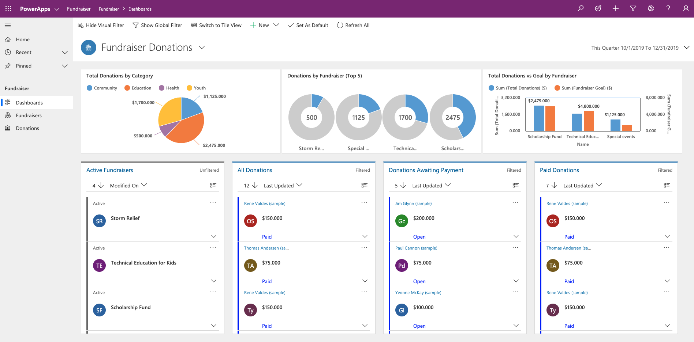
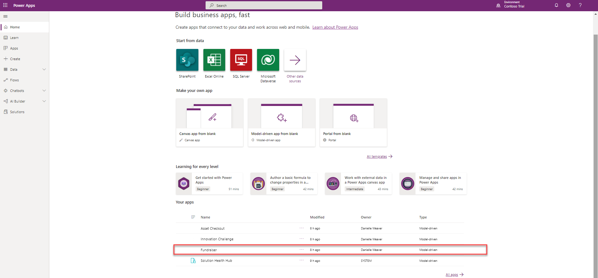

On [Power Apps](https://make.powerapps.com/?azure-portal=true), you can use a sample app to explore design possibilities. You'll also discover concepts that you can apply as you develop your own apps. Every sample app uses fictitious data to showcase a real-world scenario.

For more details, be sure to check out the documentation that's specific to each sample app.

## Get sample apps

Before you can experiment with or edit the model-driven sample apps, you must set them up in a Common Data Service database. First, create a trial environment and a database, and then select the **Include sample apps and data** check box.

> [!IMPORTANT]
> By selecting the **Include sample apps and data** check box, you will install all available sample apps in your database. Sample apps are for educational and demonstration purposes. We don't recommend installing them in production databases.

## Run a sample app

To run a sample app, follow these steps:

1. Sign in to [Power Apps](https://make.powerapps.com/?azure-portal=true) to see a list of available sample apps. For this example, select **Fundraiser**.

	

1. At the top of the page, select **Show Visual Filter** to show graphs and charts. This lets you see how donations to fundraisers are performing. In the next steps, you'll create a new fundraiser and sumbit a donation to that fundraiser.
1. On the left pane, under **Fundraiser**, select **Fundraisers**.
1. Select **+ New** to add a new fundraiser.
1. Under the **General** tab, enter the following information:

   **Name** - My Fundraiser

1. In the upper-right corner, select the drop-down arrow next to **Total Donations**.
1. From the drop-down menu, enter the following information:

   **Fundraiser Goal** - 500
   
1. On your keyboard, press **Enter**.
1. Select **Save & Close**.
1. On the left pane, under **Fundraiser**, select **Donations**.
1. Select the drop-down arrow to the right of **Other Activities**.
1. From the drop-down menu, select **Donation**.
1. Enter the following information:
	- **Subject** - My First Donation
	- **Donation Amount** - 100
	- **From** - Nancy Anderson (sample)
	- **Regarding** - My fundraiser
1. Select **Save & Close**.
1. On the left, select **Dashboards**.
1. Select **Show Visual Filter**.
1. Notice **Total Donations vs Goal by Fundraiser** shows your donation.

You have successfully run a sample model-driven app, added a new fundraiser, and added a donation to the fundraiser. While this is a quick look at an app and the related pieces, there is much more to learn about creating an app.
