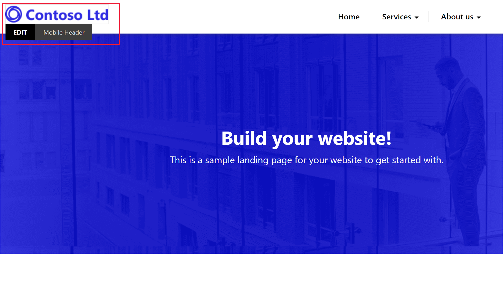
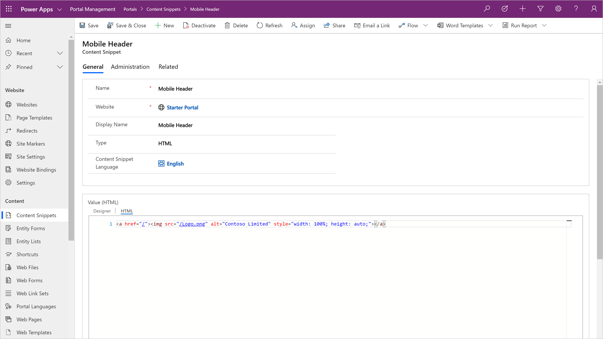
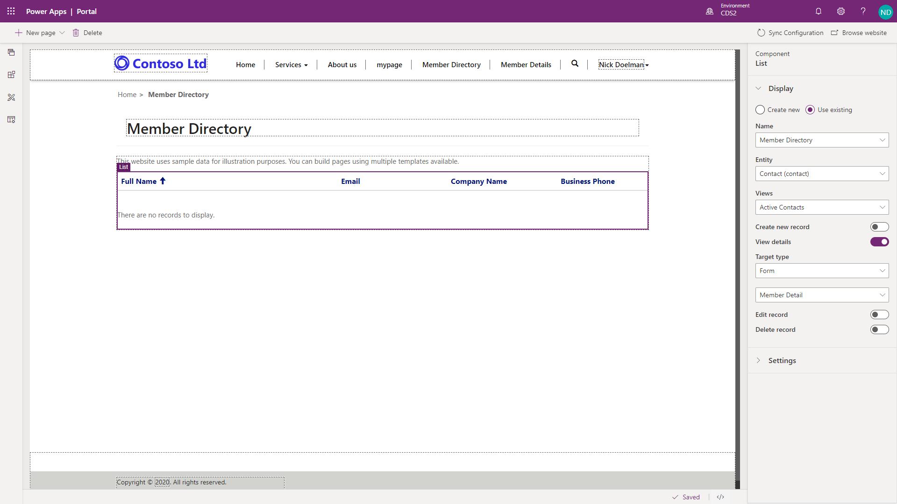

Power Apps portals store all information in Common Data Service. Portal entities define site structure, layout, content, and functionality.

The two most common questions about portals are:

- How do I manage portal content?
- How do I surface and interact with business data in the portal?

Power Apps portals have several core components that enable these scenarios. 

## Webpages

Most of a portal's content is represented by webpages. A webpage represents a particular URL in a portal's website and is one of the core entities of the portal's content management system. Through parent and child relationships to other webpages, this entity forms the hierarchy of a website, that is, its site map.

Webpages also form the basis for including other, specialized entity types in the portal site map: web files, shortcuts, forums, ideas, and blogs. Each of these records has a relationship with a parent page, which defines the URL and where the entries are located on the portal site map. 

Pages can be added and edited by using the Portal Studio, the portal front-side editor, or directly in Common Data Service by using the Portal Management app.

| Portal Studio                               | Portal Management app                                        |
| :------------------------------------------ | :----------------------------------------------------------- |
| 1. Select the portal app and select **Edit**. | 1. Open the Portal Management app.                                |
| 2. Select **New Page** on the Command bar.    | 2. Go to **Portal > Web Pages**.                              |
| 3. Choose a layout.                          | 3. Select **New**.                                            |
| 4. Enter details on the Properties pane.     | 4. Enter the page details.                                    |
| 5. The page will be saved automatically.        | 5. Select **Save**.                                           |
| **Security:** The user must be a licensed Power Apps user with the appropriate Common Data Service security privileges.                                            |  |

> [!VIDEO https://www.microsoft.com/videoplayer/embed/RE4yrkV]

Each webpage is composed of at least two portal metadata records: a *root* webpage record, which contains the main attributes of the webpage record, and a *content* webpage record that holds the language-specific content of the webpage. One *content* webpage exists for each provisioned portal language.

## Page templates

A webpage record does not define how the page looks when it is rendered on the portal. Instead, it's linked to the **Page template** record that defines the layout and the behavior.

The two types of templates that can be used in Power Apps portals are:

- **Rewrite** - These templates use specialized server-side processing to specific behavior that is required by some of the components such as polls, forums, and so on. These templates are also used to handle special pages such as an error page, site map, search, and others. You can't create new or edit existing Rewrite templates.

- **Web** - The linked layout template defines how the content of the page is rendered for output. These templates can be edited as required.

### Web template 

Web templates use the liquid templating language to define how the content is processed and rendered. Templates are flexible. A template can reuse other templates for parts of the content. A template can also be based on another template, extending the base functionality. 

Web templates can be used to define an entire webpage, a part of a page, or common elements such as the site header and footer. This approach creates a consistent appearance throughout the portal and helps makes it easy to modify the appearance.

Existing web templates can be edited in the Portals Studio.

## Web files

Web files provide access to inline or downloadable content. Though similar to webpages with similar properties, web files do not use templates. Instead, when the file is requested, the attached content is delivered.

The content can be stored as a **Note** with an attachment or in Microsoft Azure Blob storage. Using Azure storage requires additional configuration, but it is more cost-efficient if the organization deals with numerous documents.

Web files are used to deliver content such as documents (for example, an annual report). They are also used to store essential site content like Cascading Style Sheets (CSS) and JavaScript files.

Images that are displayed on portal webpages can also be stored as web files.

## Content snippets

Content snippets are reusable fragments of editable content that can be placed within a web template. Using snippets creates consistent appearance for the site, simplifies translation of multi-lingual context, and allows targeted edits of parts of a page without affecting the overall content.

Content snippets can include plain text, HTML layout, or template processing instructions, which helps enable dynamic content. 

Snippets can be edited by using Portal Studio and Common Data Service records by using the Portal Management app.

## Entity lists and entity forms

The strength of Power Apps portals is the ability to interact with information and data that is stored in Common Data Service.

Entity lists and entity forms use model-driven Power Apps views and will form definitions to create dynamic and interactive portal pages that work with Common Data Service. 

A webpage record can be linked to an entity list or an entity form. The linked list or form will be used by the template to render the page layout by using data from Common Data Service based on system or custom entities. The template might use list and form definitions to include interactivity, for example, read-write access to Common Data Service records.

### Entity lists

Entity lists define how the list of Common Data Service records is displayed on portal pages. They are defined by one or more model-driven Power Apps views and include functionality like filtering and sorting.

Entity lists can also have actions associated with them to enable Create/Edit/Read abilities and to trigger workflows. Display formats include traditional grid lists, calendar, or map and spreadsheet download.

### Entity forms

Entity forms add the ability for portal pages to interact with records in a specific entity by using a model-driven Power Apps form definition as a layout template.

**Form** mode can be read-only, insert, or edit. This mode defines if the form is used to generate a layout, capture the data, or provide full editing capabilities by using the Common Data Service entity record. Examples of the types of capabilities that are defined in **Form** mode include:

- Informational pages about employees, products, or any other Common Data Service entity.
- Data capture from either anonymous or authenticated users, for example, using a **Contact us** page to record leads in Dynamics 365 Sales or using a survey page to collect product feedback from customers. 
- Support pages that provide read-write access to the customers' cases. 
- Profile self-management for customers.
- An alternative user interface for employees that provides required functionality without the need to deploy canvas-based Power Apps.
- Any other scenario where data from Common Data Service needs to accessed, displayed, captured, and processed by using the portal.
