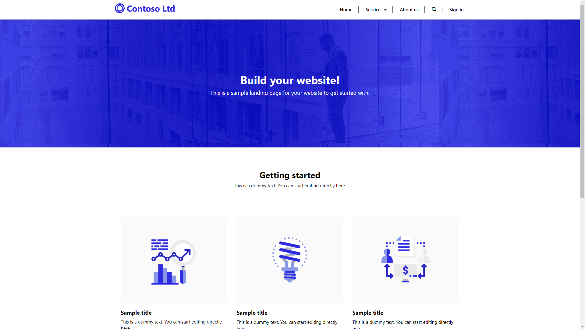

There are a number of portal templates available when provisioning a Power Apps portal in a Common Data Service environment with Dynamics 365 apps installed.  The Portal from blank is the only option available to Common Data Service environments without any first-party Dynamics 365 apps installed.

## Custom template

The Custom Portal provides organizations with a basic portal to allow creation of unique line-of-business workload features that are not addressed by Dynamics 365 based templates.

This portal is an ideal starting point for unique line-of-business applications with portal requirements. Examples of custom portals could be event and registration management, grant management, and certification management. Any custom business application built on the Power Platform can be extended to an external facing audience.

The Portal from blank provides organizations with a basic portal to allow creation of unique line of business workload features that are not addressed by Dynamics 365 based templates.

>[!NOTE]
> The blank portal will appear different if provisioned from a Dynamics 365-enabled Common Data Service environment versus one without Dynamics 365 enabled.
| Dynamics 365 enabled environment                             | Common Data Service environment                             |
| ------------------------------------------------------------ | ----------------------------------------------------------- |
|  |  |

### Community  

The Community template is meant to be used as a starting point for building an online community portal.

**Self-Service**. Community Portal extends organization's self-service capabilities including

* Knowledgebase access
* Access to blog posts that share relevant information
* Advanced search across the site content.

**Assisted Service**. Community Portal allows organization to tap into Dynamics 365 support channels: 

* Submit cases/tickets via configurable web forms
* Review, update, and comment on existing cases
* Participate in discussion / community forums

### Customer self-service

The Customer self-service template is for any organization that needs to provide customer support services. Dynamics 365 Customer Service features are extended to the portal.

Similar to the Community Portal, the features for both self-service and assisted service scenarios are included, though the emphasis is on the assisted service scenarios and some self-service features such as blogs, are not included.

### Employee self-service

The Employee self-service template provides organizations with a portal configured to assist employees with finding specific human resources and company information or resolving employee-specific issues.

By default the Employee self-service portal is configured to authenticate using Azure Active Directory, providing the employees with a single sign-on experience.

> [!NOTE]
>
> Use of Power Apps portals by internal staff requires additional licensing considerations. Please refer to latest [licensing guide](https://go.microsoft.com/fwlink/?linkid=2085130) for the specific requirements. 

### Employee self-service 

The Employee self-service template provides organizations with a portal configured to assist employees with finding specific human resources and company information or resolving employee specific issues.

By default the Employee self-service portal is configured to authenticate using Azure Active Directory, providing the employees with a single sign-on experience.

> [!NOTE] Use of Power Apps portals by internal staff requires additional licensing
> considerations. Please refer to latest licensing guide for the specific requirements.

### Partner
The Partner template provides organizations with a partner channel mechanism to allow partners to manage and collaborate on Opportunities and Customers.

Additional features can be added if the Dynamics 365 organization has Field Service or Project Service solutions installed. Selecting these options will extend portal features to these first-party applications.

### Dynamics 365 Supply Chain Management Customer Portal

The Dynamics 365 Supply Chain Management Customer portal is a template that provides portal access to Dynamics 365 Supply Chain Management data using dual-write Common Data Service entities.  The portal extends the following functionality to the external customers:

* Viewing order history
* Viewing account information
* Creating orders

