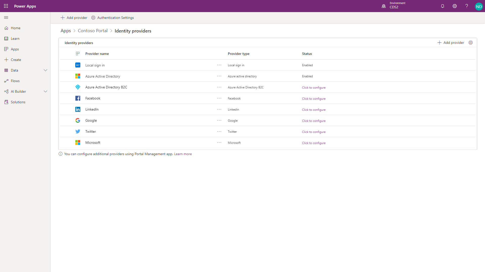
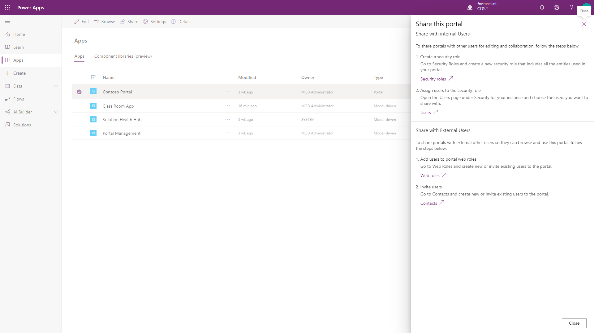

Users of Power Apps portals are tracked in Common Data Service as contacts.

The Portal Management model-driven app provides access to the contact entity and has forms to manage passwords, view portal-specific contact information, and provide registration and profile management forms for the portal.

All interactions and actions that a portal user takes (for example, leaving a comment on a page) are tied to their contact record in Common Data Service.

## Authentication

Portal users can authenticate by using the following methods:

- **Local authentication** - Common forms-based authentication with usernames and password hashtags are stored in the Common Data Service contact record.

- **External authentication** - Credentials and password management are handled by other identity providers. Supported authentication providers include:
  - OAuth2 (Microsoft, Twitter, Facebook, Google, LinkedIn, Yahoo)
  - Open ID (Azure Active Directory, Azure Active Directory B2C)
  - WS-Federation and SAML 2.0. These providers are used for integration with on-premises Active Directory and other identity services.

Portal administrators can choose to enable or disable any combination of authentication options through portal **Authentication Settings**.

> [!IMPORTANT]
> Azure Active Directory B2C is a recommended identity provider for authentication. If another provider support is required, then it can be configured in Azure Active Directory B2C.

## Authorization

After the user is authenticated and associated with a contact, Power Apps portals uses numerous entities to define authorization, that is, what a user is allowed to do. Selecting **Share** from the portal app options will provide information on how to share the portal app with internal and external users.

**Web role** allows an administrator to control user access to portal content and Common Data Service records.

A web role can be associated with the following records:

- **Website permissions** - Define what (if any) front-side editing permissions that a web role should have.
- **Webpage access rules** - Define what pages are visible to a web role and what actions can be taken.
- **Entity permissions** - Define what access a web role has to individual Common Data Service entities.

A portal contact might be assigned to one or more web roles at a time. Access rules and permissions of individual roles are combined to calculate the resulting permissions set.

One of the web roles in the portal can be marked as **Anonymous** and the other as **Authenticated**. These roles allow you to apply permissions and access rules to all portal users based on whether they are signed in or if they can access the site anonymously.
