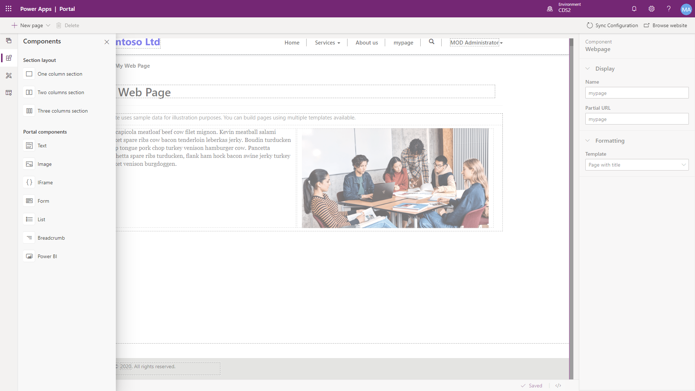
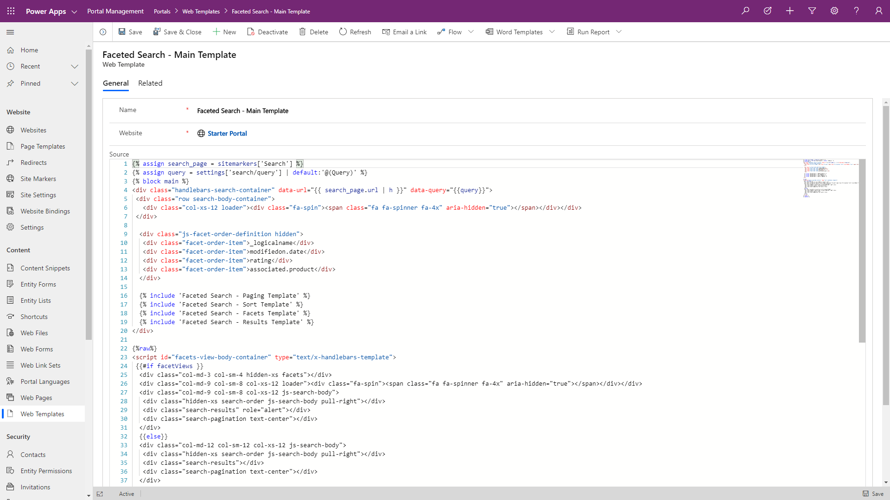
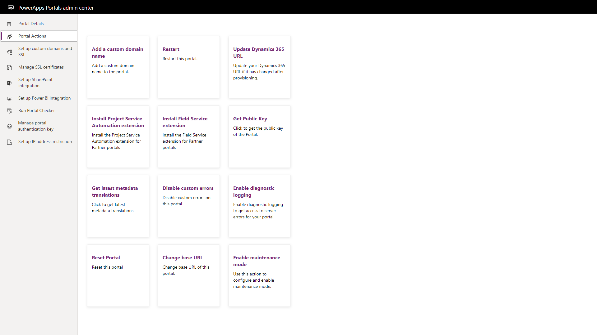

There are a number of tools available in the Power Platform to administer, configure, and fine-tune a Power Apps portal to meet specific business requirements.

## Portal Studio

The Power Apps portal Studio is a what-you-see-is-what-you-get (WYSIWYG) design tool that will allow portal makers to create web pages and content and specify specific properties of portal components.  The portal studio is accessed via the **Edit** menu after selecting the portal app in the Power Apps maker portal.

The portal studio is used for quickly defining a site structure with web page management, creating page layouts, and embedding forms and lists and theming & reviewing page templates.

## Portal management app

The Portal management app is a model-driven Power App where makers can directly create and update portal metadata and content to configure a portal.  There is a number of additional configuration options currently available in Portal management app that are not accessible in the Portal studio.  The Portal management app can be used for creating and editing content snippets, managing advanced options for entity forms and entity lists, and other advanced configuration tasks.

> [!NOTE]
> The Portal management app may be named the Dynamics 365 Portals in existing Dynamics 365 environments.

## Portal admin center

The Power Apps portal admin center allows administrators to configure and control specific administration functions of a portal such as configuring custom URLs, enabling diagnostic logging or to enable or install specific features.  

