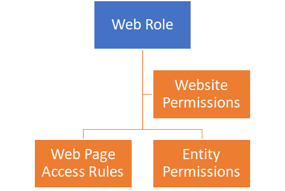

# Understanding portal security

Users of Power Apps portals are tracked in the Common Data Service as contacts.

The Portal management model-driven app provides access to the contact entity and has forms to manage passwords, view portal-specific contact information, and provide registration and profile management forms for the portal.

All interactions and actions that a portal user takes (for example, leaving comment on a page) are tied to their contact record in the Common Data Service.

## Authentication

Portal users can authenticate using the following methods:

* **Local authentication.** Common forms-based authentication with usernames and password hashes stored in the Common Data Service contact record.
* **External authentication.** Credentials and password management are handled by third-party identity providers. Supported authentication providers:
  * OAuth2 (Microsoft, Twitter, Facebook, Google, LinkedIn, Yahoo )
  * Open ID (Azure Active Directory, Azure Active Directory B2C)
  * WS-Federation and SAML 2.0. These providers are used for integration with on-premises Active Directory and third-party identity services

Portal administrators may choose to enable or disable any combination of authentication options through portal authentication settings.

> [!IMPORTANT]
> Azure Active Directory B2C is recommended identity provider for authentication. If third-party provider support is required then it can be configured in Azure Active Directory B2C.

## Authorization

After the user is authenticated and associated with a contact, Power Apps portals uses a number of entities to define authorization, that is, what a user is allowed to do.  Choosing *share* from the portal app options will provide information on how to share the portal app with internal and external users.

**Web role** allow an administrator to control user access to portal content and Common Data Service records.

Web role can be associated with the following records:

* **Website permissions** define what (if any) front-side editing permissions a web role should have.
* **Web page access rules** define what pages are visible to a web role and what actions can be taken.
* **Entity permissions** define what access a web role has to individual Common Data Service entities.

A portal contact may be assigned one or more web roles at a time. Access rules and permissions of individual roles are combined to calculate the resulting permissions set.

One of the web roles in the portal can be marked as Anonymous and another one as Authenticated. These roles allow to apply permissions and access rules to all portal users based on whether they are logged on or if they access the site anonymously.