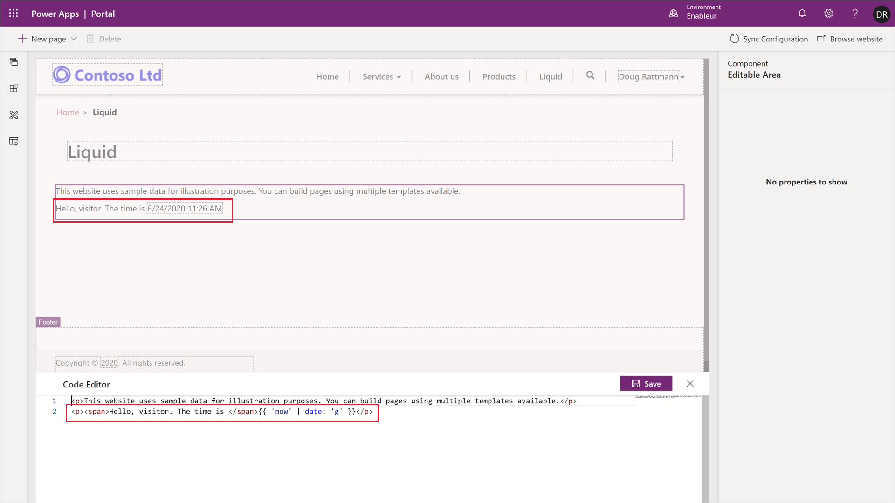

Power Apps portals generate the output based on the Common Data Service (CDS) data. The fundamental question in this architecture is:

> How can I take *this* data and insert it into *that* output?

The data in this question would commonly refer to CDS data, and the output is usually HTML or plain text.

Because Power Apps portals use Software as a Service (SaaS) model, there is no access to the server code. But the portal makers need to edit their own templates. That's where the Liquid template language comes in.

Liquid is an [open-source template language](http://dotliquidmarkup.org/?azure-portal=true) integrated natively into Power Apps portals. It basically acts as a bridge between the CDS data and the HTML or text output sent to the browser. It can be used to add dynamic content to pages, and to create a wide variety of custom templates. It is proven and it is secure as it only provides access to the data and operations explicitly allowed by the portal security settings.

### Adding Liquid code to portal web pages

Liquid code can be used anywhere in the portals where HTML or text content can be entered. That includes web templates, web pages, and content snippets.

1. Open Power Apps portal Studio. You can follow these steps:

   1. Navigate to the [Power Apps maker portal](https://make.powerapps.com/?azure-portal=true).
   1. Select the target environment using the environment selector in the top right-hand corner.
   1. From the list of Apps select the application of type **Portal**.
   1. Click **Edit** menu.

1. Click **+ New page > Fixed layouts > Page with title**.

1. Enter web page properties:

   * **Name:** Liquid
   * **Partial URL:** liquid

1. Select **Page Copy** area on the canvas, then click **</>** on the status bar to start the Source Code Editor.

1. Append the following text to the existing content:

   ```html
   <p>Hello, visitor. The time is {{ 'now' | date: 'g' }}</p>
   ```

1. Click **Save**. Note: the editor may automatically add `<span>` elements to separate the Liquid code.

1. The content displays the current time.

    > [!div class="mx-imgBorder"]
    > [](../media/liquid-start.png#lightbox)
