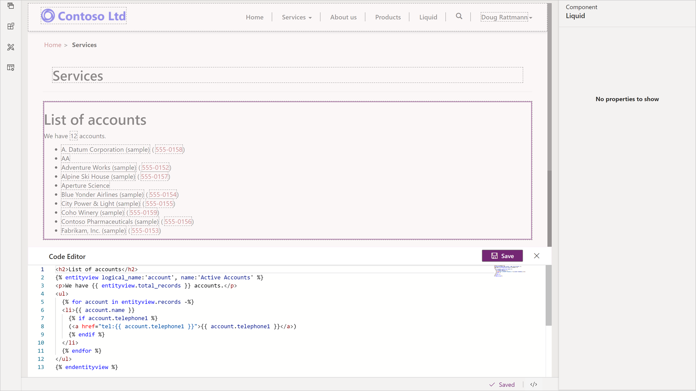

The purpose of this hands-on-lab is to access Common Data Service data using Liquid.

## Learning objectives

At the end of these exercises, you'll be able to accomplish the following:

* Enter Liquid code as part of the page content.
* Access Common Data Service using Liquid.
* Add conditional statements to display only available data.

**Estimated time to complete this exercise**: 10 to 15 minutes

## Before we begin

### Prerequisites

For this exercise you need to have the following in your environment:

1. A Power Apps portal provisioned. If you do not have a Power Apps portal available, follow the [Create Portal](https://docs.microsoft.com/powerapps/maker/portals/create-portal/?azure-portal=true) instructions to create one.
1. Access to the Power Apps maker portal.

## Scenario

### High-level steps

In this exercise, we will display selected Common Data Service records by adding some HTML and Liquid code to the web page copy section using the Portal Studio code editor.  

* Open your portal in Power Apps portal Studio.

* Open a Services web page.

* Add HTML and Liquid code listing all active accounts.

* Preview the results in the Portal Studio.

### Detailed steps

#### Launch portal Studio

1. Navigate to the [Power Apps maker portal](https://make.powerapps.com/?azure-portal=true).
1. Make sure correct environment is selected in the environment selector in the top right-hand corner.
1. From the list of Apps, locate your portal app (Type = Portal).
1. Click the ellipsis (...) and choose **Edit**.  This will launch the Portal Studio.

#### Select web page

1. From the toolbelt, click the **Pages** icon.
1. Locate the **Services** web page and click to edit.

#### Edit source code

1. Select the page copy section on the canvas.

1. Click the **Source code editor** (</>) icon.

1. Replace the existing paragraph with the following HTML and Liquid code.

   ```twig
   <h2>List of accounts</h2>
   
   <p>We have {{ entityview.total_records }} accounts.</p>
   <ul>
     
     <li>{{ account.name }}
       
       (<a href="tel:{{ account.telephone1 }}">{{ account.telephone1 }}</a>)
       
     </li>
     
   </ul>
   
   ```

1. Click **Save**.

1. You should see the list of current accounts on the canvas including hyperlinked telephone numbers where they are present.
   > [!div class="mx-imgBorder"]
   > [](../media/liquid-exercise.png#lightbox)

1. Click the Browse website button. The displayed web page should only contain the text "We have 0 accounts."

    > [!NOTE]
    > This is expected as at runtime the portal will deny access to entity records unless there is an entity permission record that allows access to the data.
