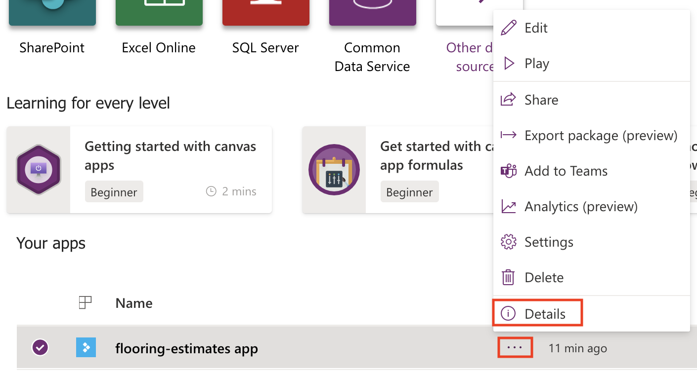

Microsoft Power Apps can help if you saved changes to an app that you shouldn't have or if something else goes wrong. For apps that you save in the cloud, Power Apps keeps a history of the changes that you make. You can view each version that you've saved and restore your app to a previous version if necessary. If you shared the app, the people whom you shared it with will also receive the restored version if you republish the app.

## View versions of your app

1. On <a href="https://make.powerapps.com" target="_blank">make.powerapps.com</a>, select **Apps** on the left pane.

2. In the list of apps, select the ellipsis (**...**) next to the app name and then select **Details**.

    

3. Select the **Versions** tab.

    The tab shows all versions of the app that you saved as you developed it.

## Restore a previous version

1. Select the ellipsis (**...**) next to the desired version and then select **Restore**.

    

2. Select **Restore** again to confirm the action.

    A new version is added to your list.

When you restore a version of an app, the newly restored version gets a new, incremented version number and appears at the top of the list. A new version never overwrites a previous version.

> [!NOTE]
> After restoring a previous version, the restored version needs to be published before users will see the new version. 
> If for some reason you are not able to restore a previous version, you can try the following:
> - Make sure the App is not open in Power Apps Studio. If the app is open, you will not be able to restore the version.
> - Verify the version you would like to restore is not older than six months. At the current time, only app versions less than six months old can be restored. 

