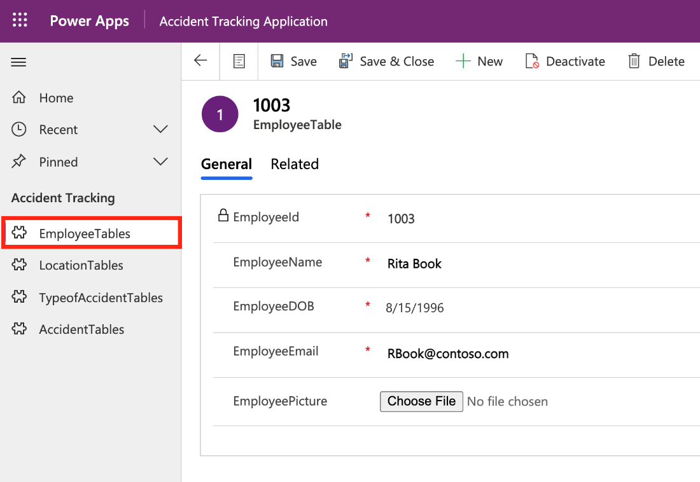
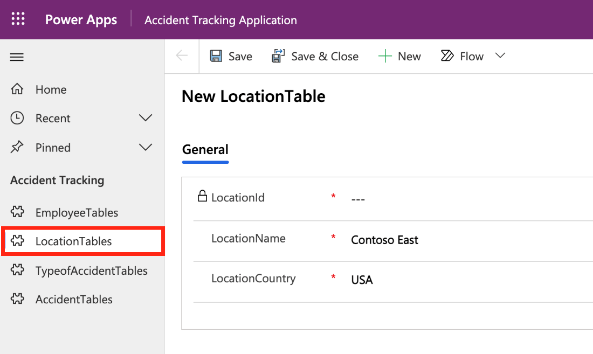
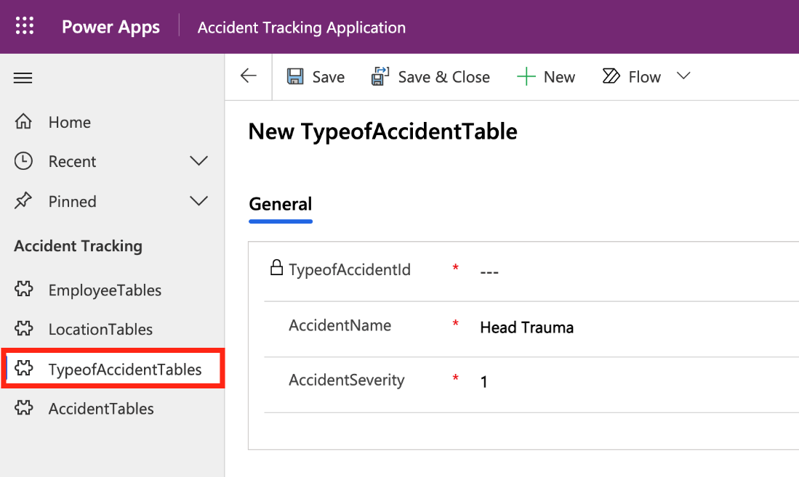
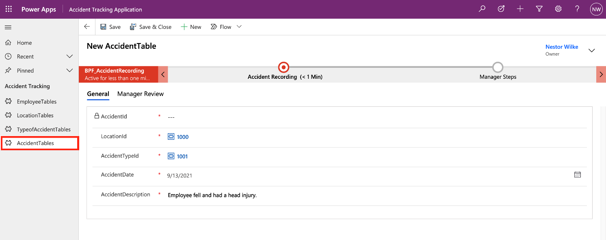

This section reviews the screens that are necessary for building out the solution. The idea is that you will have a visualization of the complete solution. As with any great artist, you need to visualize the final result to begin putting it together. 

The solution can be divided into the following components:

-   **Employee form** - Use this form to add employees (metadata) to the solution. You will need a place to track basic information about employees. Therefore, in this scenario, you will create a table to store basic employee information along with a form to enter and modify employee data.

	> [!div class="mx-imgBorder"]
	> 

-   **Location form** - Use this form to track basic information about the different Contoso locations. The same concept applies, where you will build a table, plus a form, for managers to interact with the data.

	> [!div class="mx-imgBorder"]
	> 

-   **Type of Accidents form** - Use this form to track the different types of accidents that occur. Also, you can use this form to track some information (metadata) about the accidents, such as a severity scale.

	> [!div class="mx-imgBorder"]
	> 

-   **Incident tracking form** - Use this form as the main place where managers can record information about employee accidents. This form will use data from all previous forms.

	> [!div class="mx-imgBorder"]
	> 

When building a model-driven app, you need to divide the solutions into smaller components in which tables in Microsoft Dataverse are the building blocks. Then, model-driven apps will start from your data model and build up from the shape of your business process. This section separated the process into the different tables and forms, which are needed for your accident tracking application. In the next unit, you will analyze your data model.
