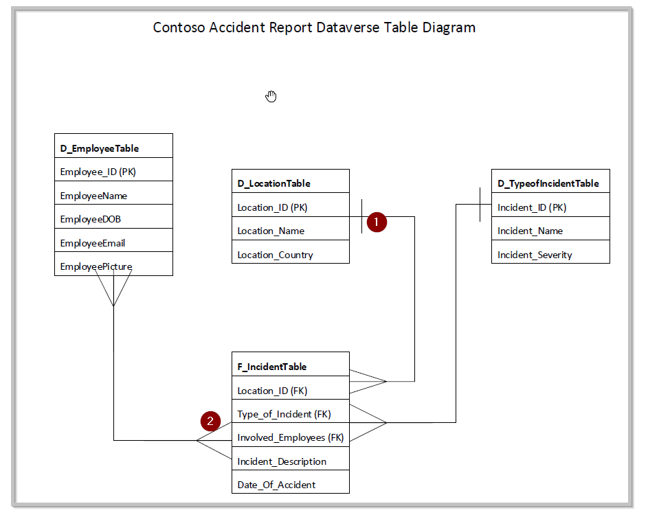

It's important to make sure the data model is structure properly before making the app. Model-driven apps automatically generate a user interface (UI) that is responsive across devices. The success of the model-driven app relies heavily on how the data is modeled in Dataverse.

It is helpful to visualize the flow of your data in a picture diagram. You can utilize any tool of your choice such as Visio, Excel or simply drawing it out. The picture below is a representation of how the tables in our data model related to each other. There will be concepts touched upon here such as one-to-many relationships that will become clearer as we build the app.

> [!div class="mx-imgBorder"]
> 

1.  Represents a one relationship

2.  Represents a many relationship

As you can see in the picture, we will be creating four different tables in Dataverse to be the base for our model-driven app data model.

-   There will be a many-to-many relationship from the employee table (D\_EmployeeTable) to our main accident table (F\_IncidentTable). This is because if you think about it, an employee can be associated with multiple accidents, and an accident can involve more than one employee.

-   There will be a one-to-many relationship from the location table (D\_LocationTable) to our main accident table (F\_IncidentTable). This is because in our scenario an accident can only happen in one location at a time

-   There will be a one-to-many relationship from the type of accident table (D\_TypeofIncidenttable) to our main accident table (F\_IncidentTable). This is because in our scenario an accident can only be of one defined type.

> [!NOTE]
> A many-to-one relationship is the inverse of a one-to-many relationship.

When designing these relationships, it is easier to put into words and ask the questions:

- Can an accident involve more than one employee?

- How many locations can accident occur on?

- Can one accident include more than one type of accident?

You can also track as much information as applicable in those tables (metadata), for our case we will keep it simple.
