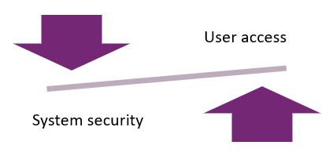

Microsoft Power Platform has many different security features in environments, data, and application deployment. Security is a fundamental component in a Microsoft Power Platform solution design. Often, security requirements are ignored until a later time during a project. By including security modeling in the solution's design, you can avoid the need for significant change later in a project.

> [!IMPORTANT]
> Security must be considered up front, rather than as an afterthought, before deployment.

The correct security strategy balances legitimate security requirements with the need for system access and cross-business collaboration. When implementing Microsoft Power Platform solutions, the solution architect needs to balance two concerns: user access and system security.

Data and system security are important. Data drives the business, data that you don't want to be obtained by a competitor. With regulations surrounding personal data, organizations can be liable for data breaches that include personal data.

Other important considerations are system usability and user adoption. If the security model is too lax, users can view and change data that they should not be able to access, creating a perception that data in the system is unreliable. If the security model is too stringent and you lock everything so that users can only see a small subset of the data in the system, or they can only perform limited operations, you will diminish the value the solution. Consequently, users will revert to their previous data silos and user adoption, which are the most important aspects of measuring success, and the solution will ultimately suffer.

As a functional consultant or developer, you might not have been exposed to the security features in Microsoft Power Platform. However, as a solution architect, you will need to understand each security feature and when to apply it in different scenarios. This module provides an in-depth review of the security aspects of Microsoft Power Platform solutions, and it contains important information that is not found in modules for other roles.

## Security architecture process

To define security for a solution, solution architects need to break down the requirements and clarify what the solution needs to look like. The solution architect will need to understand the organization's environment and their requirements around the following aspects:

- Authentication
- Network security
- Authorization

### Discovery

Discovery is about learning the organization's environment, procedures, and policies.

Solution architects need to discover what an organization currently uses for authentication by asking the following questions:

- Do they have single sign-on (SSO)?
- Are they using products from other sources or only Microsoft Azure Active Directory (Azure AD)?
- Do they use multifactor authentication?
- Do they use Conditional Access?

A single Microsoft Power Platform project is unlikely to change the organization authentication approach; therefore, the solution architect will need to:

- Map security policies and requirements to the design.
- Create an initial authentication blueprint.
- Review the design with the organization's security representatives.

Solution architects need to understand how authorization will be applied to the solution and will need to:

- Extract security-related requirements.
- Clarify security requirements for simplification.
- Create an initial authorization blueprint.
- Review with business analysts and security teams.

To better understand how the organization manages security, solution architects should ask the following questions:

- How is security managed?
- What security policies must be followed?
- What is the approval process for security architecture?
- How are application level entitlements managed?
- Which team will edit Microsoft Power Platform security?
- How are users assigned to applications?

When learning about the user environment, the solution architect also needs to discover:

- How the organization structure influences security.
- Whether people work in teams that cross organization boundaries.
- If a data classification system is in place.
- The data retention policies and privacy policies.
- The data access regulations that apply.

## Solution architect’s role in security modeling

Solution architects lead the efforts in building a comprehensive security model that covers authentication to data column level access.

The solution architect's role in relation to security consists of:

- Leading the efforts in building a comprehensive security model.
- Communicating options for security architecture at a high level and helping guide team members through the architecture design choices.
- Advocating for simplicity, keeping the security from being overcomplicated while simultaneously ensuring necessary protections.

A solution architect also needs to consider if security, regulatory, or compliance requirements will impact the solution design.

## Security requirements

The security model will be different for each solution, but you should consider the following guidelines when modeling security:

- **Restrict** - Users should only be able to edit data that is relevant to their role. However, it makes sense to be less restrictive about what data users can read because it helps users see their data in context. A solution architect should remove the ability to delete data unless necessary.
- **Simplify** - Microsoft Power Platform has many security features. A solution architect should consider the impact of the security design on how complex the management of the system will be and how difficult it will be to change.
- **Use** - Often, the security requirements that will be provided derive from apprehension or misconception about Microsoft Power Platform capabilities. A solution architect should ensure that the security design is based in legitimate business requirements. This approach might require the solution architect to understand where the security requirements have originated and to discuss alternative approaches. Trying to lock a Microsoft Power Platform solution to prevent users from performing actions can be difficult, if not expensive, if the capability to do so is not provided by the platform. The solution architect should use the security capabilities of the platform when designing security for their solution.
- **Layer** - Microsoft Power Platform has security features on apps, data, and processes. Ideally, security should be implemented at the platform layer for easier implementation and management.
- **Review** - The usage of the solution, when implemented, will not be as originally imagined, and the patterns of usage will evolve over time. Occasionally, the initial security design decisions are no longer valid and will need to be adjusted.
