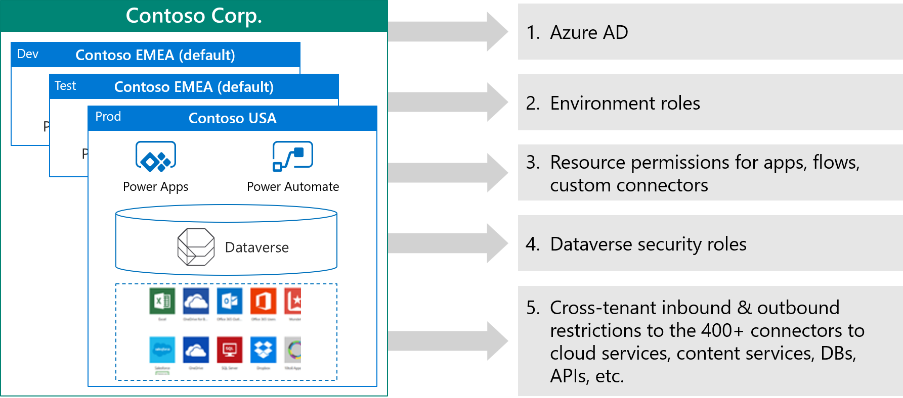
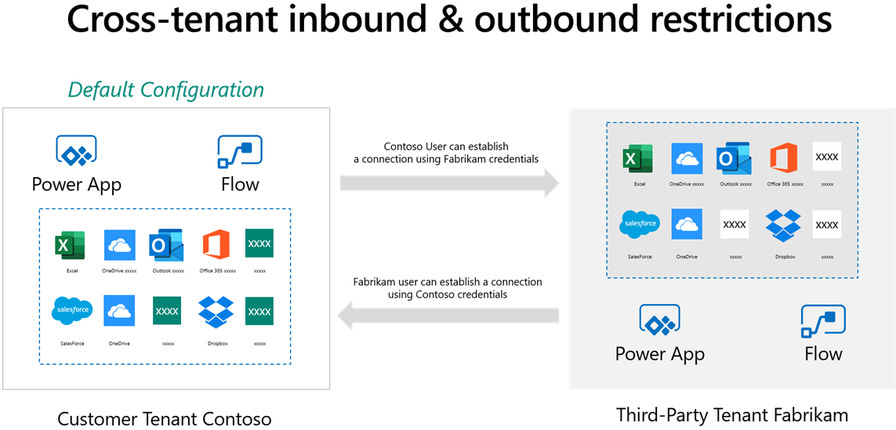
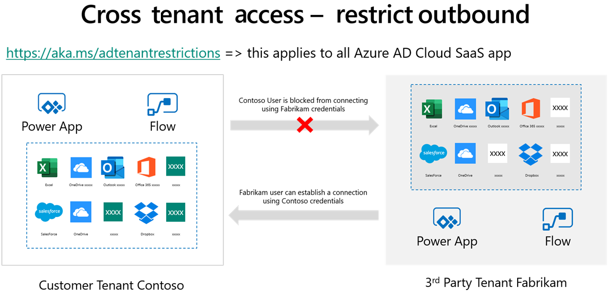
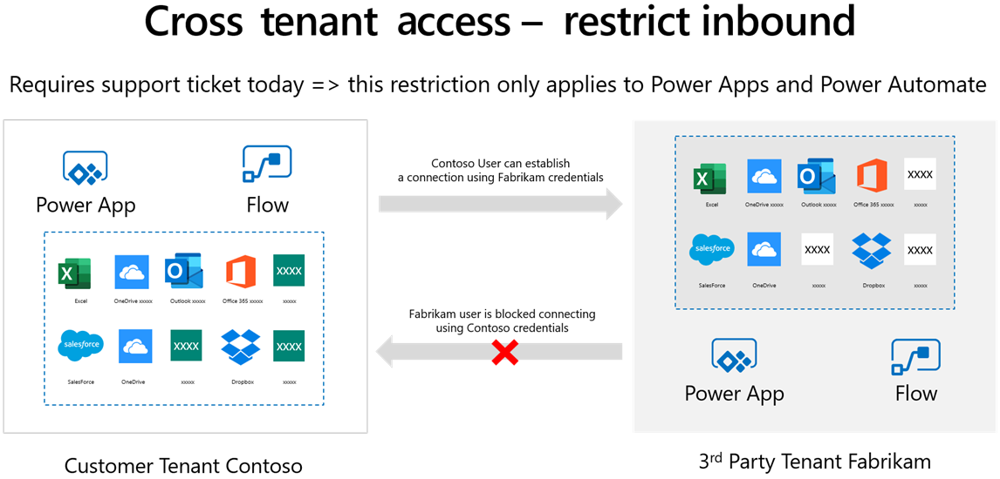
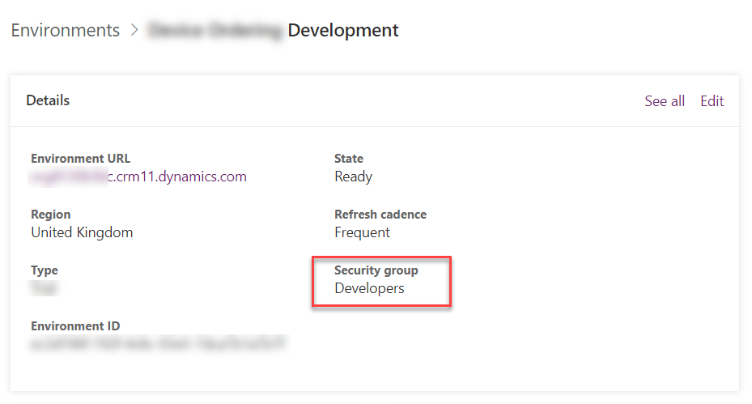
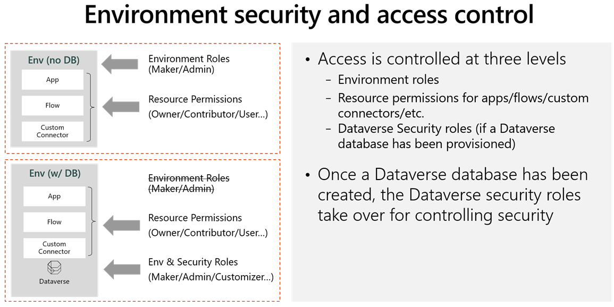

Environments are containers that administrators can use to manage apps, flows, connections, and other assets, along with permissions to allow organization users controlled access to the environment and its resources.

Apps in Microsoft Power Apps and Microsoft Power Automate flows do not provide users with access to data assets that they don't already have access to. Users should only have access to data that they require access to.

Access to environments is multilayered. Environments are contained within an Azure Active Directory (Azure AD) tenant. Access to the environment is authenticated by Azure AD. Users must have a user account in Azure AD to access any environment, and they must have a license to use Microsoft Power Platform. To access an individual environment, the user will need a Microsoft 365 role if a Microsoft Dataverse database is not available, and they'll need a Dataverse security role if a Dataverse database is available. Users also need to be given permission on resources in an environment such as apps, flows, and connectors.

An administrator can also control access to environments from other Azure AD tenants in business-to-business (B2B) scenarios.

## Azure AD

Microsoft Power Platform uses Azure AD to authenticate users.

Azure AD has several features that Microsoft Power Platform can use:

- **Identity and access management** - Manage access to apps from Power Apps.
- **Authentication** - Verify credentials when a user signs in to an app that has several users in a flow.
- **Single sign-on (SSO)** - Access apps without having to sign in separately.
- **Multifactor authentication** - Prompts a user during sign-in for other forms of identification.
- **Business-to-business (B2B)** - Manage your guest users and external partners while maintaining control over your own corporate data. Guest access is supported for Microsoft Power Platform.
- **Conditional access** - Manage access to your apps by using signals to make decisions on allowing access.
- **Device Management** - Manage how your devices access your corporate data.
- **Enterprise users** - Manage license assignment.
- **Hybrid identity** - Microsoft Azure AD Connect provides a single user identity for authentication and authorization, regardless of location (cloud or on-premises).
- **Identity governance** - Manage your organization's identity through employee, business partner, vendor, service, and app access controls.
- **Identity protection** - Detect potential vulnerabilities that affect your organization's identities.
- **Reports and monitoring** - Insights into the security and usage patterns in your environment. Microsoft Power Platform admin center provides more detailed insights than are provided by Azure AD.

Other features of Azure AD that are not currently supported with Microsoft Power Platform:

- **Business-to-consumer (B2C)** - Control how customers sign in by using their preferred social, enterprise, or local account identities.
- **Managed identities** - An identity in Azure AD that can authenticate any Azure AD-supported authentication service. Currently, this feature is not supported in Microsoft Power Platform, and service principals must be used instead.
- **Privileged identity management (PIM)** - Provides elevated administrator access in a just-in-time (JIT) manner.

An organization is likely to have chosen how it implements Azure AD and a Microsoft Power Platform solution, and it is unlikely to change this fundamentally. However, Microsoft Power Platform might provide access to users who have never had IT app access previously, such as mobile frontline workers, business partners, and external contractors who don't have identities in Azure AD. Therefore, you might need to consider Conditional access, B2B, and guest user access.

Conditional access requires an Azure AD Premium license. Conditional access policies can grant or block access to apps and data based on the following factors:

- User
- Device
- Location

Microsoft Azure Active Directory B2B (Azure AD B2B) collaboration is a feature that lets you invite guest users to collaborate with your organization. You can assign licenses to guest users to run apps that are built with Microsoft Power Platform. Currently, guests can't create or edit Power Apps.

For more information, see [Share a canvas app with guest users](/powerapps/maker/canvas-apps/share-app-guests/?azure-portal=true) and [About Power Apps per app plans](/power-platform/admin/about-powerapps-perapp/?azure-portal=true).

## Cross-tenant isolation

In B2B collaboration scenarios, you can more securely share the apps and data in your tenant with a tenant from another source. In the default configuration, each tenant can access the other tenant's resources.

Azure AD has a feature called tenant restrictions. With tenant restrictions, organizations can specify the list of tenants that their users are permitted to access. Azure AD then only grants access to these permitted tenants. Cross-tenant isolation lets you restrict the other tenants that your users can connect to. Cross-tenant isolation blocks inbound or outbound connections for canvas apps and flows.

Restricting outbound connections means that a user in your tenant is blocked from connecting to a partner or external tenant. Restricting outbound cross-tenant connections can be done by using tenant restrictions that apply to all Azure AD cloud apps that would block outbound connections for Power Apps and Power Automate flows.

Restricting inbound connections means that a user in a partner or external tenant is blocked from creating a connection to your tenant.

> [!IMPORTANT]
> Restricting inbound cross-tenant connections requires a support ticket. Then, this restriction will only apply to Power Apps and Power Automate flows.

## Help secure environments with security groups

By default, a user with a Power Apps license can potentially access all environments in a tenant, and you will be able to see all licensed users in the user table in an environment. Azure AD security groups can be used to limit access to environments. This feature has the added advantage of keeping the user table streamlined to only the users of the environment.

A security group can be associated with an environment when the environment is created, or it can be linked to the environment. In the following screenshot, a security group for the developers has been associated with the development environment.

The previous screenshot shows that the following behavior is observed:

- When users are added to the security group, they are added to Dataverse as users.
- When users are removed from the security group, they are disabled in Dataverse.
- When a security group is associated with an existing environment that contains users, the users in the environment that are not members of the security group will be disabled.
- When no security group is associated with an environment, all users with a Power Apps license will be created as users and enabled in the environment.

> [!NOTE]
> Distribution groups and Microsoft Office 365 groups can't be associated with environments.

## Roles and admin accounts

Managing environments and performing some administration activities requires one or more of these administrative roles:

- **Global admin** - A user with this role has full administration access to all services in the tenant. Global admins have access to all Microsoft Power Platform environments and will be added to all Dataverse environments with the System Administrator security role.
- **Microsoft Power Platform admin** - A user with Microsoft Power Platform admin role can create environments, manage all environments (even if the users don't belong to the security group for the environment), manage Power Apps, manage Power Automate, and manage data loss prevention policies. A Microsoft Power Platform admin can also manage support tickets and monitor service health.
- **Delegated admin** - Delegated administration is used by Microsoft Cloud Solution Provider program (CSP) partners to manage their customers through the Microsoft Partner Portal. A Delegated admin has full administration to all services in the customer's tenant.

> [!NOTE]
> The Microsoft Dynamics 365 admin role is deprecated. A user with the Dynamics 365 admin role can create environments and manage environments, but only if the user belongs to the security group for that environment. A user with the Dynamics 365 admin role will have the System Administrator security role in those environments.

These roles are not the same as security roles in an environment. Non-administrative users can be assigned a role for an environment. The roles that are used differ, depending on whether the environment contains a Dataverse database or not.

The Environment admin role is only used when a Dataverse database is not present. The Environment admin for a specific environment can allow the user with the role to add and remove users with the Environment Maker role. The Environment Maker role allows a user to create apps in that environment.

When a Dataverse database is added to the environment, a user with the Environment admin role is given the System Administrator security role in the Dataverse database, and a user with the Environment Maker role is given the Basic User security role.
