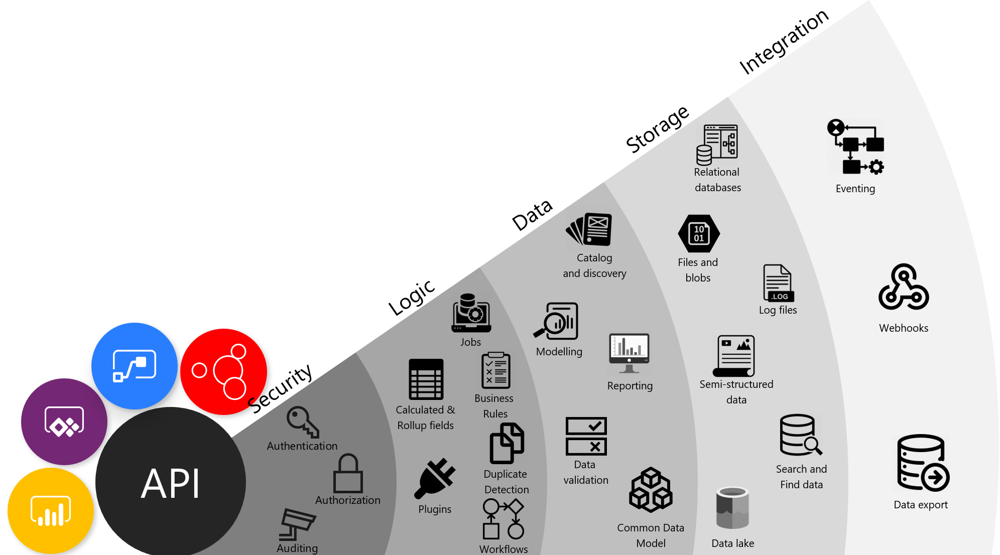
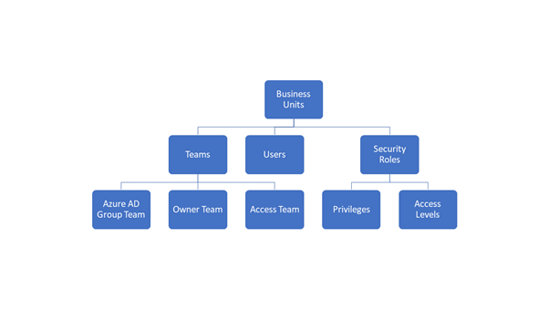
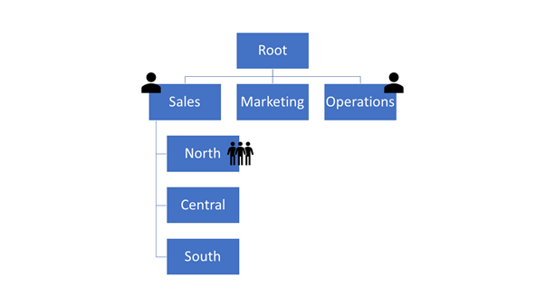
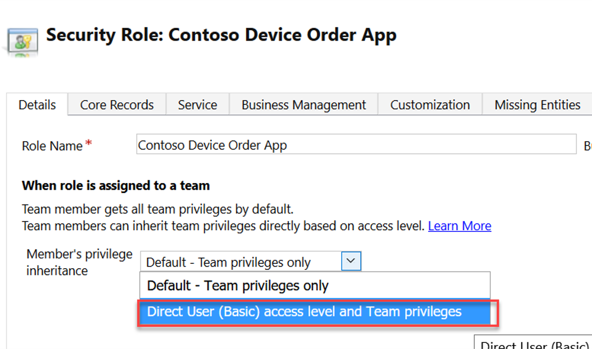
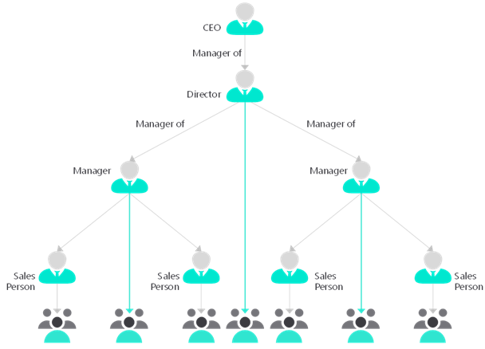
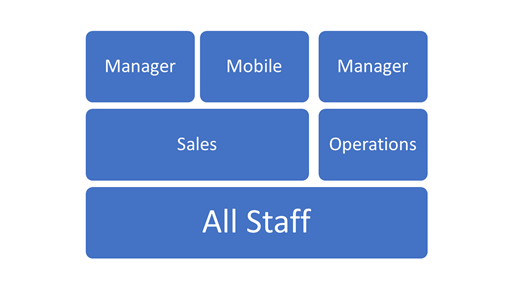

Data should always be considered a valuable asset. Therefore, it is important in security design to create a security model that ensures proper usage and access to that valuable asset. Microsoft Dataverse stores data for Microsoft Power Platform and provides services for apps. Microsoft Power Platform has layered security to control access to a Dataverse environment, but after a user has obtained access to the environment, the solution architect needs to control access within the database. One key feature of Dataverse is its rich security model that can adapt to many business usage scenarios.

## Authorization

Authorization is the function of specifying access rights, or privileges, to resources. Security design will implement authorization to access data and features. Deciding who can gain access and to what data and services is an essential part of any solution's design.

Inadequate security design can lead to poor system design, and these factors can have far-reaching impact and can be costly to fix:

- **Manageability** - Difficulty in managing individual access.
- **Performance** - For example, PrincipalAccessObject (POA) table growth when sharing.
- **Usability** - Cumbersome procedures to grant access.
- **Visibility** - Impossible to tell by looking at the record who has access to it.

Every solution has unique requirements, but common capabilities and patterns can be identified and reused.

## Common patterns

Common usage patterns within many business apps include:

- **Active involvement** - Regular, significant involvement directly with the customer/data. Informed, with existing knowledge of the customer/data and current related activity, and personal actions based on a direct relationship with the people who are involved.
- **Secondary involvement** - Informed involvement, maintaining active knowledge of activity but not directly participating or acting on the data or with the customer, such as providing cover for absence of actively involved staff. Supporting others who have a personal relationship with the customer, such as providing advice or support to the people who are actively involved or providing specialist knowledge to a specific piece of data or customer.
- **Transactional interaction** - Specific activity-oriented involvement, for example, receiving and acting on a request to update a customer’s address. No personal or on-going engagement, such as in a contact center.
- **Management oversight** - Managerial or governance responsibility across a business or geographical area. Viewing and directing involvement of others rather than specific involvement.
- **Reporting** - Aggregated business reporting. Data is organized to preserve anonymity rather than providing direct access to customers/deals.
- **Compliance** - Oversight read-only access to all records for a business area.

When designing security, the solution architect needs to understand how users work. In other words, they need to determine if the users work by themselves, work as part of a static team, or work in dynamic teams that change based on certain rules. These factors will affect the security design. After determining these factors, the solution architect needs to understand how other staff provides support. For example, the solution architect should inquire whether the users have assigned support staff and if the support staff are shared between other users. Additionally, the solution architect should ask about what would happen if support staff are unavailable, what happens overnight and during weekends, and how oversight is handled.

## Design principles

When designing security, solution architects need to follow certain principles:

- Assigned responsibility doesn't always need restricted access.
- Treat exceptions as exceptions, favor frequent access patterns.
- You can't revoke access for one record where you granted access to a broader set of data that contains it.
- Use business units for manageability and containment, not for matching organizational structure.
- Use the simplest design that performs well and meets requirements.

> [!NOTE]
> Occasionally, the organizational structure aligns with the required security structure; however, this occurrence is rare. When you are designing security, don't use only the organizational structure as the default.

## Security features

Dataverse provides many security features for accessing data:

- Table ownership
- Users
- Teams
- Business units
- Security roles
- Sharing
- Azure AD security groups
- Column-level security
- Hierarchical security
- Auditing

Solution architects need to understand each of these features and how they combine to create the security model for their solution. This unit doesn't go into detail about each of these security features, but it explains how they can be used together to create a security model for your solution.

### Table ownership

Tables in Dataverse can either be User/Team owned or Organization owned. User/Team owned tables have an owner field, and each row in the table can be assigned an owner. The owner of a row is used with the other security features to determine who has access to the row, that is, access to rows is granular and can be horizontally partitioned. Alternatively, access to individual rows on Organization owned tables can't be restricted, and users will have access to all records or none.

> [!NOTE]
> You can't change the ownership type after a table has been created. When in doubt, specify the User/Team ownership type when you are creating tables.

### Teams

Teams is a collection of users that allow users access to data. Teams is a powerful way of granting permissions to users in a broad way without micromanaging access at the individual user level. Users can be members of multiple teams.

Three types of teams are:

- **Owner** - These teams can own rows, which gives any team member direct access to that row.
- **Access** - A method for users to easily share a row with another from within a form.
- **Azure AD group** - Similar to Owner teams, but membership of the team is controlled in Azure AD.

### Security roles

Security roles are fundamental to data security in Dataverse. You don't grant discrete privileges to users, you create security roles. Dataverse uses role-based security to group together a collection of privileges.

Security roles can be assigned to users and to teams. Teams and users can have security roles that provide aggregate privileges.

> [!IMPORTANT]
> All privilege grants are accumulative, with the greatest amount of access prevailing. If you gave broad organization level read access to all contact records, you can't go back and hide a single record.

### Business units

Business units contain users and teams and act as security boundaries. Business units are the primary method for controlling access to subsets of data within a table, that is, horizontal partitioning of data. With business units, you can segment users and their data.

Every Dataverse database has a single root business unit. You can create child business units to represent groups of users in a strict hierarchy.

> [!NOTE]
> Business units have a default team that contains all users in that business unit. You can't manually add or remove users from default teams so that they can become blockers for some scenarios as the solution evolves.

> [!IMPORTANT]
> It is the combination of security roles and business units that is the foundation of the security model for Dataverse.

Business units provide an efficient way of managing numerous users and record access. Business units are not visible to the users in the applications, only to administrators. You should not only mirror an organization's org chart, but you should also design the business unit hierarchy to meet the security requirements. This approach can sometimes mean creating business units to achieve a security requirement, such as creating a business unit to parent the Sales and Marketing business units to allow some users to access those units while preventing access to the Operations business unit.

### Share rows

Individual rows can be shared with users and teams. This feature permits users to access records that are restricted by the security model that is generated by business units. Sharing allows rows to be accessed outside of the strict business unit hierarchy.

### Security roles and teams

Security roles can be associated with teams. Users can then be associated with the team; therefore, all users who are associated with the team will benefit from the role. Users will have access to the rows owned by the team and, depending on other security features, might have access to rows that are owned by other users in the team.

Options on the security role that control how the security role operates with a team are:

- Default - Team privileges only
- Direct User (Basic) access level and Team privileges

Using the **Direct User** option treats privileges as if they were directly assigned to the user. By using this option, you can avoid having to assign security roles to users and instead use teams and security roles that are assigned to teams.

> [!NOTE]
> Owner teams belong to business units. A user can only belong to one business unit at a time, but a user can be added to a team in another business unit. This feature allows users to access data in a business unit that is not in their hierarchy.

### Column-level security

The privileges that are provided by security roles operate at the row level. If a user has update privilege on a row, they can update all columns on that row. Occasionally, row-level control of access is not adequate, such as columns that contain personal identifiable information. Dataverse has a column-level security feature to allow more granular control of security at the column level.

Column-level security operates separately to security roles. Column security profiles define the read/write privilege on the columns and these profiles are assigned to users and teams.

> [!NOTE]
> If a user doesn't have the privileges to read a secured column, they can still see the column on the form but will not be able to see its contents, in other words, the value of the data. When they use code to access a secured field, the value will be null if the user does not have read privileges.

### Hierarchical security

One issue with the use of business units is their strict hierarchy. Access to data can only follow the hierarchy of the business units. In the diagram of business units, a user in Sales can be given access to the North, Central, and South business units. Conversely, a user in the Operations business unit can't access data that belongs to Sales without being given access to all data in the organization.

In hierarchical security, the user in the above position can read and write all data for their subordinates. Additionally, they can read data for the users who are lower in the hierarchy.

Hierarchical security is an alternative security model that is designed for scenarios where a user who requires management oversight is not within the same part of the business unit hierarchy. Hierarchical security is useful in situations when managers are in different countries or departments from their direct reports. 

Hierarchical security has two options:

- **Manager hierarchy** - This option uses the user hierarchy on the systemuser table. The restriction is that a manager in the same business unit or in the direct chain of business units above can't read and write data from users in different departments.
- **Positional hierarchy** - This option uses the Position table. This option is more flexible and ignores the business unit structure. Positional hierarchy also allows for more than one person in a position.

Only one of the hierarchical types can be used at the same time.

### Audit

Audit captures all data changes. Auditing can help monitor who has made what changes, and it can also help analyze how users are actually using the system. The audit functionality within Dataverse doesn't capture data reads or actions, such as exporting to Microsoft Excel.

Other available auditing is called activity logging, which is located in the Microsoft 365 Security and Compliance Center. Activity logging includes data reads and other operations. Activity logging must be enabled and helps meet compliance objectives.

### Manage security across multiple environments

Security roles and column-security profiles can be packaged into solutions and transported to other environments. Access Team templates are part of the table metadata and are included with the table when they are added to the solution. Other security features, such as business units and teams, can't be packaged in solutions and the solution architect will need to plan for their population on environments.

## Strategies for defining security roles

Three basic strategies for building security roles are:

- Position-specific
- Baseline + Position
- Baseline + Capability

The **position-specific** strategy is the creation of a single security role that contains all privileges that the job role requires. The out-of-the-box roles are position-specific and are named after job roles, for example, Salesperson. You can follow this model of role for specific job roles, but you might end up with many security roles that are similar and that you must maintain. For example, adding a new custom table will mean changing many, if not all, roles.

A more modern model is to use a layered security model. In this model, you would copy an out-of-the-box role, such as Salesperson or Basic User, and then change the access levels to the common, or minimal, levels that all users require. You might name this role Baseline. You would then create new roles and set the access levels for the few privileges that each group of users would need in addition to the base role. These minimal roles contain the other privileges that are required for the position or the required capability.

In the following diagram, the baseline role is named All Staff and all users will be assigned this role. All users in Sales will also be assigned the role named Sales, a position role, with some sales users being assigned the Mobile role, a capability role that has the Go Mobile privilege, and a manager who is being assigned the Sales role and the Manager role.

Though it might not be obvious, security roles are linked to business units. Roles that are created at the root business unit are inherited by all child business units. You can create a security role for a specific business unit if you want to limit that role to the users in that business unit. However, be aware that security roles in solutions are always added to the root business unit when the solution is imported.

## Azure AD group teams

An Azure AD group team is similar to an Owner team in that it can own records and can have security roles assigned to the team. The difference is that team membership in Dataverse is dynamically derived from the membership of the associated Azure AD group. Azure AD group membership can be manually assigned or can be further derived from rule-based assignment based on the user's attributes in Azure AD.

Combining Azure AD group teams with assigning security roles to teams with the **Direct User** option can significantly simplify the management of adding new users.

Security groups and Office 365 groups can be used for Azure AD group teams.
