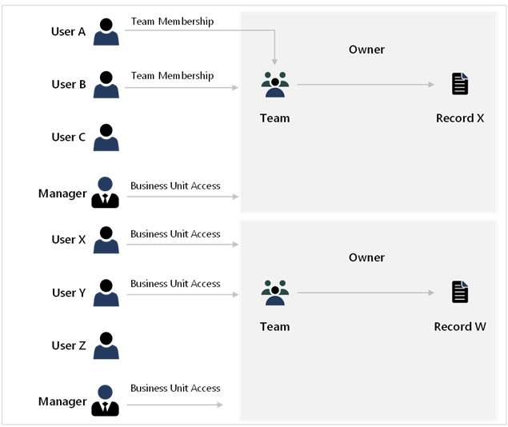
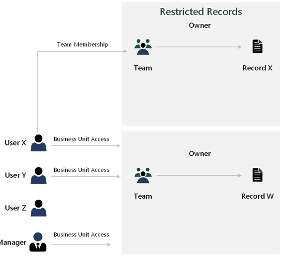

When setting up security, you can set up four different layers of security for an app:

- **App-level** - Restricts access to the app.
- **Form-level** - For model-driven apps, with this security level, you can allow only specific security groups to access specific forms. This level is useful if you want to restrict how people enter or view data by their job role.
- **Row-level** - The Dataverse security model controls access to rows.
- **Column-level** - Controls access to individual columns in a table.

Security should happen at the platform layer, not the app layer. Numerous ways are available for you to control reading and writing data in an app. You can set columns to read-only on your model-driven form, you can use JavaScript to mask columns from the user experience, and you can hide columns and fields from forms and views. None of these approaches truly implement security. They do not secure data, and users can still get to the data in other ways such as with **Advanced Find** or **Edit in Excel Online**.

Additionally, all users are entitled to use the API and can use partner and community tools to access the data. For proper security, the security features of Dataverse should be employed.

## Elevated privileges and impersonation

You should avoid giving users high levels of privileges. Plug-in .NET assemblies, classic workflows, and Power Automate cloud flows can run with elevated access to perform actions on behalf of the user. API code can impersonate another user if necessary.

## Automation

Solution architects should consider automating aspects of managing users and security. For instance, you can control many aspects from creating teams to sharing rows through the API.

You could trigger plug-ins or Power Automate flows based on events that occur in the system to change a user's security. For example, you could elevate the backup account manager automatically or share their data so that the user can manage the account while the primary account manager is on vacation.

## Performance

Solutions with larger number of users and/or data must be aware of the impact of choices, for example:

- Excessive sharing can create considerable overhead.
- Too many business units can cause slow access.
- Too many processes will run on events.
- Poor plug-in design.

Poor security design can lead to poor performance. Techniques that you can use to improve security performance include:

- Look for ways to escalate security, such as sharing with a team instead of a user.
- Minimize the number of business units.
- Use access teams instead of owner teams.
- Test with real volumes and real security scenarios to validate the design.
- Use the analytics tools in Microsoft Power Platform admin center to view API calls and high-volume processes.

The best way to improve performance is to keep the security design as simple as possible.

### Separate and optimize usage patterns

A solution architect should optimize for different usage patterns. Specifically, you need to use different security model features to provide necessary access, with different users having different ways to access the same record, as shown in the following diagram.

#### Different business areas can be modeled differently

Not all users work in the same way. The solution architect should reflect on the different working models of different parts of the business and then model each area differently to get an optimal solution, as shown in the following diagram.

### Model exceptions as exceptions

Solution architects should aim to model the common access patterns as efficiently as possible and use a more granular model where complex access is required. Sharing is a good example of exception processing. Sharing should be with teams whenever possible.

### Separate historical from active data

Infrequently accessed but high-volume historical data can impact current data access. The solution architect should consider partitioning data in the security model in separate tables and then providing a secondary mechanism for occasional access.

### Review the data model to help security

Some data model adjustments can make security modeling easier. The solution architect should determine if defining new data boundaries will simplify security modeling. For example, instead of having individual access defined to Account records, you could move financial reporting information from the Account records to a separate Financials table, which will allow everyone to view the Account table, but will keep the Financials table limited to managers only.
