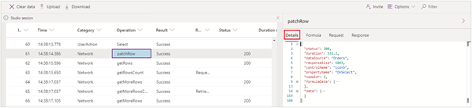

Monitor is a tool that you can launch from Microsoft Power Apps Studio to help you troubleshoot problems and improve the quality of your apps.

The key concepts that you can identify by using Monitor include:

-   Errors while using connectors

-   Large amounts of data being sent/received

-   Slow response from connectors

-   Unexpected user control interactions

-   Duplicated data actions

When Monitor is activated, it captures a stream
of events from your running app and allows you to view it. These events include user interaction
with controls and use of data sources.

The captured data includes all necessary context information to
allow you to review the data to identify problems. Some included
information is also available from your browser's developer
tools; however, they lack app context information like the control name
and formula.

By using the details, you can make changes to correct problems that are identified
and then retest without leaving Power Apps Studio or Monitor. The
following video demonstrates how to activate Monitor and review the captured data.

**Video**: Demo the Monitor tool
> [!VIDEO https://www.microsoft.com/en-us/videoplayer/embed/RWO4s1]

In addition to interactively working with Monitor, you can enable
it to be used in published applications to collaborate with remote
users.

The rest of this module will provide an in-depth explanation of how you can use
Monitor as one of your regular app-building tools.
