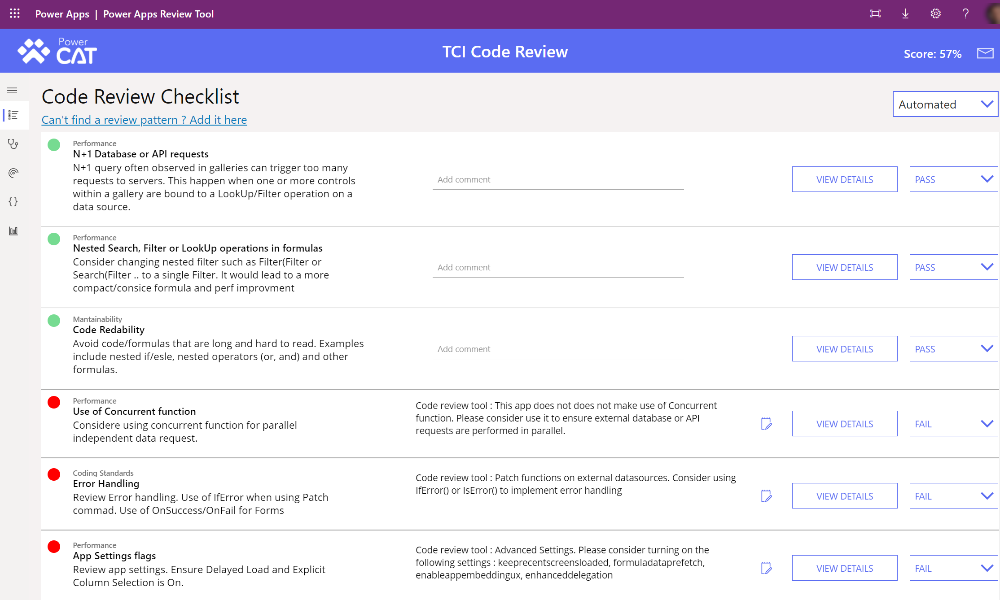
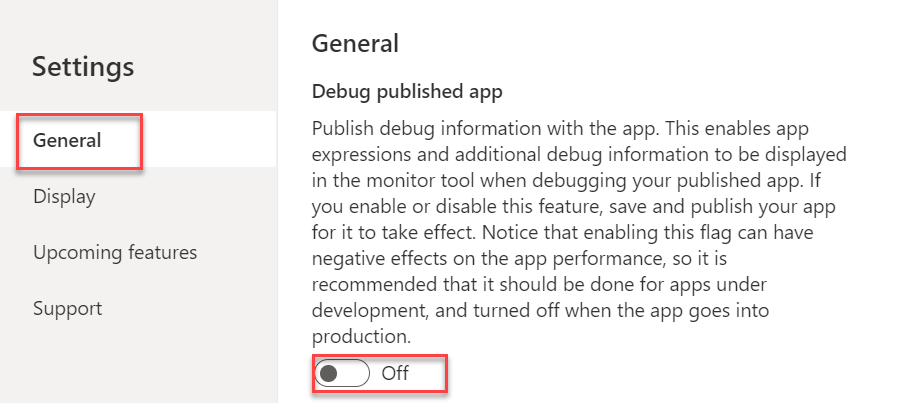
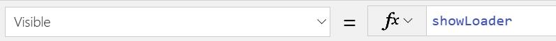
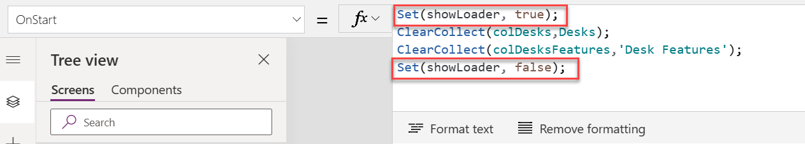

First impressions are important. The first impression users of your app get is how long it takes for the app to display the first screen or provide any other visual feedback like progress indicators. During startup, your app does a lot of work to prepare for the presentation of the first screen.

> [!div class="mx-imgBorder"]
> 

- **Authenticate** - Handles all the authentication prompts for connections configured for the app. Simply removing any connectors that aren't in use can reduce the number of prompts and speed up the process.

- **Get metadata** - Retrieves metadata, such as the version of the Power Apps platform on which the app runs and the sources from which it must retrieve data.

- **OnStart processing** - Evaluates the formulas you have configured in OnStart property. Streamlining the performance of this processing has a direct impact on improving the load time of the app.

- **Render screens** - The first screen is prepared and presented to the user. Any OnVisible formulas specified are executed first. Optimizing formulas and minimizing the number of controls on the screen can improve load time.

In this module, we'll explore how to evaluate your app load time and identify strategies for improvement.

## Evaluating your app load time

A good place to start is establishing a baseline for how long it takes for your app to load. You can do this by measuring the startup time from launching the application to the time you believe you have a usable app. You can do this by using a stopwatch to measure the time from launching the app to when you believe a user can start using it. Later in the module, we'll discuss tools that you can use to measure and drill into the performance details during the load time. A new evaluation should be done with each app update so you can compare the new version with your prior baseline and identify any significant increase in load time.

Measuring startup time helps you get actual timings; however, you should also consider observing and asking users about their perception of the app\'s performance. In some cases, you can have an app that loads in a few seconds, but users perceive it to be much longer because they do not feel they have a usable app yet. That could happen for example because the app, after displaying the first screen, continues to load data and update the information even though it is already possible to interact with it. Approaches to solving these two problems differ. If it\'s actual load time you\'re trying to improve, you can usually get imperative data that points you to where your app is spending time. If it\'s the user's perception you're trying to improve, you need to observe the user using the app to understand how they use the application and what changes might improve their perception. Small changes like adding text prompts to start the interaction or changing the starting screen to persist and reload most recent records can help improve the perception.

Commonly you will find things that slow down an app in either the app OnStart property or OnVisible property of the first screen. By optimizing or deferring work performed in these properties, you can speed up the load time. Later in this module, we will explore some of the techniques to use.

If you view the analytics for your app from the maker portal, it includes Time to first screen and Time to first screen without connection setup.

> [!div class="mx-imgBorder"]
> 

The data is provided for the last 30 days and can be helpful to provide a summary of your app's performance.

The [Power Apps Review Tool](https://github.com/microsoft/powerapps-tools/tree/master/Tools/Apps/Microsoft.PowerApps.CodeReview) is another option for evaluating apps. This open-source tool is packaged as a solution that can be imported into your Microsoft Dataverse environment. Once imported, it can be used to evaluate apps in your environment. You can upload *.msapp* files for evaluation as well. The automated review can check your app against a customizable checklist of best practices, and identify many common issues that can impact the app startup time and general performance of your apps. Upon completing the automated review, you are presented with the list of things your app is doing well and actionable items where it could improve.

> [!div class="mx-imgBorder"]
> 

In addition to viewing the results in the app, you can also email the results. This can be helpful if you are not the app maker.

The following are some of the common rules the tool can check that can impact the startup time:

- **Use of Concurrent function** - Consider using the Concurrent function for parallel independent data requests.

- **App Settings flags** - Review app settings. Ensure Delayed Load, and Explicit Column Selection is On.

- **Delegation** - Ensure ClearCollect and Filter operations are delegable.

- **Asset Optimization** - Review embedded asset compression/size optimization.

- **Data loading strategy** - Review OnStart, OnVisible data loading strategy. Avoid data calls in OnStart. Move to OnVisible when possible. Ensure only important data calls block user interaction with UI during initial load of home screen.

- **Cross-screen dependencies** - Ensure repeating UI elements are encapsulated in Components (for example, Menus, Header, Footer).

## Review your app settings

The app settings can have a significant impact on the performance of your app. It is a good idea to review the app settings and their enabled status with each app update. Older apps may not have the latest app setting options enabled automatically to ensure the new option doesn't break existing apps. You may have also enabled a setting to try to resolve a problem and forgot to turn it off. A good example would be the **Debug published app** option. Enabling this option allows more debug information to be displayed when you use the app monitor to troubleshoot the published app. When this is enabled, it can be detrimental to the performance and should not be left on for production use.

> [!div class="mx-imgBorder"]
> 

Another setting to consider is the **Data row limit**. This setting determines the most rows that will be retrieved from a server-based connection when delegation is not supported. By default, this is 500 and can be any value between 1 and 2,000. To work around [delegation issues](/powerapps/maker/canvas-apps/delegation-overview) in apps, it is not uncommon to increase this value. This may cause unexpected problems when a development environment holds much smaller sets of data than production. For example, with the data row limit set to 2,000 the following expression in App.OnStart might only preload a handful of rows in a development environment.

ClearCollect(colDesks,Desks)

The same app in a production environment with a fully populated data set could retrieve the full 2,000 rows. As a result, the app will load much slower in production than in development. In many cases working to eliminate delegation warnings is a better approach than increasing this value.

In older apps, the **Enable Navigate function in App.OnStart** setting might be enabled. This setting allows you to use the Navigate function in App.OnStart property but results in the first screen not rendering until all your expressions in App.OnStart are evaluated. In more recent apps, this is not allowed and the App.StartScreen property must be used instead. We will dive deeper into OnStart and StartScreen properties later in this module. If your app has this setting enabled, consider updating to the new approach and disabling the setting, which can improve load times.

In addition to the above settings, the **Upcoming features** category have more settings you should review. There are three sections in this category: Preview, Experimental, and Retired.

New settings start as experimental and graduate to preview as they mature. Experimental features are intended to let you try a new feature but not intended for production apps. They are off by default, and you must enable them. There is a lot of investment in improving app performance so keep an eye on this area to see upcoming features.

Settings in the preview section are commonly on by default for new apps. These features are in their final stages of testing before becoming standard settings enabled for all apps. For the existing apps, you need to opt in to enable these settings if you want to use them. In some cases, opting in might require minor formula usage changes.

If you are working on a performance issue, testing some of the upcoming features might give you insight to determine if they would help to address your challenges. If so, simply waiting for the features to mature might be an alternative to refactoring without their benefit.

## Limits and throttling

Each connector can have its own limit of data retrieved and throttling. There are also [service protection limits](/powerapps/developer/data-platform/api-limits) in place at the platform level. It is a good idea to be aware of these for the connectors you use in your app. Apps that encounter these limits during startup might exhibit slowdown in loading the app.

## Using a loading image

Using a loading image or a progress indicator during long operations in your app can improve user perception.

> [!div class="mx-imgBorder"]
> 

The easiest way to do this during the loading of your app is to use a component that has a spinning image. You can find a pre-built one in the [Power Apps tools GitHub repository](https://github.com/microsoft/powerapps-tools/blob/master/Components/Preloader%20Component.msapp). This component can be imported and placed on your initial screen on top of your other controls. You can then use a variable to control the visibility of the component. The following shows setting the visible property to the value of a variable showLoader.

> [!div class="mx-imgBorder"]
> 

Then in App.OnStart, we turn on the loading image before loading the data and turn it off after the data is loaded.

    Set(showLoader, true);

    ClearCollect(colDesks, Desks);

    ClearCollect(colDeskFeatures, \'Desk Features\');

    Set(showLoader, false);

> [!div class="mx-imgBorder"]
> 

While using a loading image doesn't speed up your application, it provides visual feedback and can help the user understand the app is doing work in the background.

In the rest of this module, we will explore other techniques to identify and improve app load performance.
