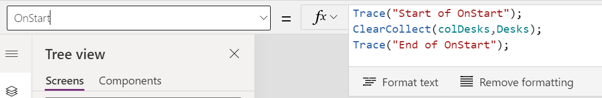
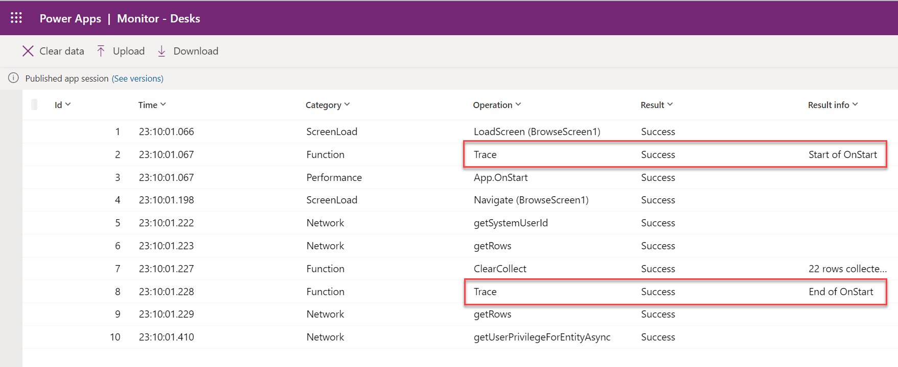

Microsoft Azure Monitor is a tool that you can launch from Microsoft Power Apps Studio to help you troubleshoot problems and improve the quality of your apps. Key elements that you can identify by using Monitor include:

- Errors in using connectors

- Extensive data being sent/received

- Slow response from connectors

- Duplicated data actions

When Monitor is activated, it captures and allows you to view a stream of events from your running app. These events include user interaction with controls and the use of data sources. Generating this log as the app starts and then analyzing it can help you understand how your app is spending its load time.

> [!div class="mx-imgBorder"]
> 

The captured data includes all necessary context information so that you can identify problems. Similar information is also available from your browser's developer tools. However, those tools lack app context information like the control name and formula.

> [!div class="mx-imgBorder"]
> 

By using the event details, you can make changes in the app to correct identified problems and then retest without leaving Power Apps Studio or Monitor.

In addition to the events being automatically captured, you can also log custom messages by using the Trace() function. The custom messages can be helpful in marking the start or end of **OnStart** or **OnVisible** logic. The following example shows the process of adding a Trace() function before and after data is preloaded from Microsoft Dataverse.

    Trace("Start of OnStart");

    ClearCollect(colDesks,Desks);

    Trace("End of OnStart");

> [!div class="mx-imgBorder"]
> 

When Monitor is run for the app, you can now view the beginning and end of the **OnStart** processing by looking for the trace messages in the event log.

> [!div class="mx-imgBorder"]
> 

When using Monitor to evaluate the startup time of your app, make sure that you run your app from a cold start and that you don't manually rerun **OnStart** or **OnVisible** from within Power Apps Studio. The cold start ensures that the events that you capture are not influenced by data caching that can occur when you rerun the **OnStart** or **OnVisible** method logic. The cold start can be ensured by following these steps:

1. Enable the **Debug published app** setting.

2. Save the app.

3. Publish the app.

4. Launch Monitor from make.powerapps.com.

The following video demonstrates how to activate Monitor and review the data that is captured during the startup of your app.
&nbsp;
> [!VIDEO https://www.microsoft.com/en-us/videoplayer/embed/RWP2DX]
