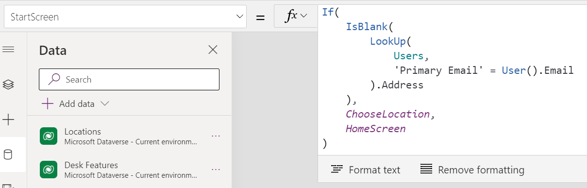
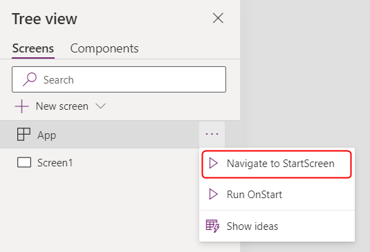
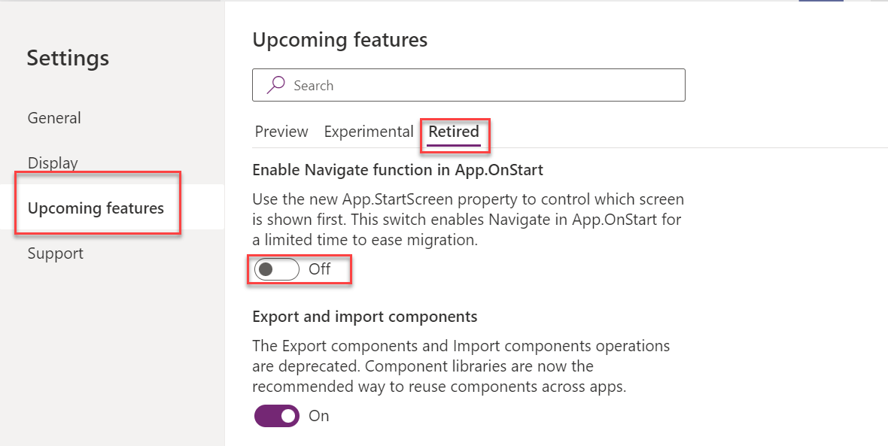

The OnStart property on the app object runs when a user starts your app. The property is commonly used to evaluate formulas for retrieving and caching data you wish to pre-load and setting global variables. App.OnStart can easily become too busy with this work and that can cause performance problems. To help reduce these types of problems alternative approaches are available or being invested in for upcoming Power Platform releases. Use available alternatives when they fit your app needs. In the rest of this topic, we'll explore some of the available alternatives.

## Navigating on app startup

A common need on app startup is to select the first screen the user sees. For example, the app could open a welcome screen on first run or implement [deep linking](https://powerapps.microsoft.com/en-us/blog/powerapps-deep-linking/) into a specific detail page. In the past adding conditional logic and using Navigate() function in App.OnStart property was common practice. Using Navigate() in OnStart has been retired and all new apps are prohibited from using Navigate from App.OnStart.

The new approach is to use the App.StartScreen property. By default, this property will be empty, and the first screen in the screen tree view is shown. If evaluating the formula provided for the StartScreen property results in an error, the first screen will fall back like the property is empty. You can use IfError function to catch any errors and redirect to an appropriate error screen.

StartScreen can be set to a specific screen to ensure that if it is moved in the tree, it is still the start screen. You can also have conditional logic like the following that looks up the user and if they don't have an address, they are sent to the ChooseLocation screen instead of the HomeScreen.

> [!div class="mx-imgBorder"]
> 

StartScreen is a data flow property that can't contain behavior functions. All data flow functions are available, the following are some common examples:

- Param function to read parameters used to start the app.

- User function to read information about the current user.

- LookUp, Filter, CountRows, Max, and other functions that read from a data source.

- Any call through a connector, but it should execute quickly.

- Signals such as Connection, Compass, and App.

Global variables and collections, including those created in OnStart, are not available in StartScreen.

The StartScreen property is evaluated once at startup. If you need to test after, you change the property you can manually force it to be reevaluated using Navigate to StartScreen context menu command for the app object.

> [!div class="mx-imgBorder"]
> 

If you have an older app, you should update your app to use the new StartScreen property. Until your app is updated, you can use **Enable Navigate function in App.OnStart** switch on the Retired tab in Upcoming features section of the app settings. By turning this switch off, you can for a limited time continue to use Navigate in OnStart.

> [!div class="mx-imgBorder"]
> 

## Using OnVisible instead of OnStart

Review the formulas you have in App.OnStart, and if they only pre-load information for a single screen then move the logic from App.OnStart to that screens OnVisible property.

## Review app settings

New app settings regularly become available with updates of Power Apps. It's a good practice to review them to see if they could be helpful. The following are some of the app settings to consider when optimizing app load functionality:

- **Enable App.OnStart property** - On by default, consider turning off if you don't need OnStart and want to discourage its use.

- **Use non-blocking OnStart rule** - In published app this setting allows App.OnStart formulas to run in concurrent with other app rules. When off, your other rules wait for App.OnStart to finish. On for new apps but must be enabled for older apps.
